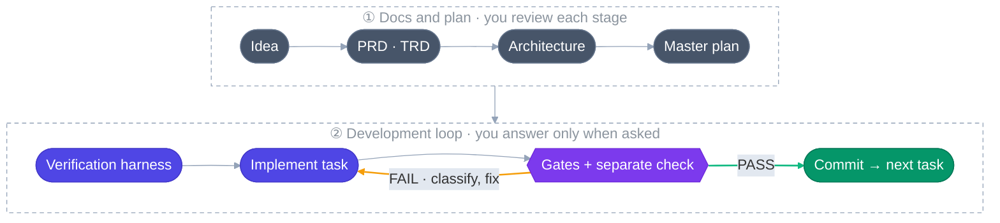

# harness-loop-fullstack

**An agent-skill plugin for Claude Code and Codex that takes a one-line idea through documents, a task plan, a verification harness, and an autonomous development loop.**

[](CHANGELOG.md)
[](LICENSE)
[](#install)
[](#install)

> **Language note**: the skills, the documents they produce, and the detailed docs are written in **Korean**. This page is an English overview. ([한국어 README](README.md))

---

## What it does

Tell the agent "I want to build this app." It writes the requirements, technical decisions, and architecture; splits the work into verifiable tasks;
sets pass criteria (gates) for every task; and then **implements, verifies, and fixes each task on its own until the gates pass.**
You review each stage, and once the loop is running you only step in **when it asks a question.**



## What makes it different

- **Files, not chat, are the input.** Each stage reads only the previous stage's documents, so work resumes after any session break.
- **The session that wrote the code never approves it.** The final gate (`task_validation`) is run by a **different session** that knows nothing about the implementation and checks the acceptance criteria against the running app.
- **Failures are classified before anything is fixed.** Real defect, stale test, environment problem, flaky test, or untestable criterion — only real defects get code changes, capped at 3 attempts. When the budget runs out, the loop stops and asks instead of lowering the bar.
- **Parallel by default, with fixed stop points.** A task DAG decides what can run at once across git worktrees. The loop stops only for an unanswered question or when everything is done.
- **It keeps going after the project ships.** Skills for adding features, fixing bugs, refactoring, and bringing an undocumented codebase into this workflow.

## Install

```
/plugin marketplace add GangJaeYu/harness_loop_full_korean
/plugin install harness-loop-fullstack@harness-loop-fullstack
```

Codex:

```bash
codex plugin marketplace add GangJaeYu/harness_loop_full_korean
codex plugin add harness-loop-fullstack@harness-loop-fullstack
```

Pin a version with `GangJaeYu/harness_loop_full_korean@v1.10.0` (both hosts). Plugin-free setup is in [Getting started](docs/getting-started.md) (Korean).

**Requirements**: a git repository and the Claude Code (or Codex) CLI. For the loop stage, depending on your stack: **Docker** (DB and other services), **Node + Playwright** (e2e), and PowerShell 7 on Windows. [Orca](docs/loop.md) (an agent development environment) is optional for parallel runs.

## The 13 skills

| Say something like | Skill | Produces |
|---|---|---|
| "I have a vague app idea" | `idea-brainstorm` | `docs/IDEA.md` |
| "Write the PRD" | `prd-generator` | `docs/PRD.md` — requirement IDs with observable acceptance criteria |
| "Pick the tech stack" | `trd-generator` | `docs/TRD.md` — technical decisions with rationale and rollback cost |
| "Design the architecture" | `architecture-generator` | `docs/ARCHITECTURE/*.md` — conflicts with earlier docs are surfaced, not hidden |
| "Plan the development" | `plan-generator` | `plan_setup/` — phases, tasks (with frontmatter), STATE, LOG |
| "Set up the harness" | `harness-setup` | `harness_setup/` — lint · unit · e2e · task_validation gate specs, `local-dev` script |
| "Update the harness" | `harness-update` | Updates the harness (usually triggered by the loop) |
| "Set up the dev loop" | `loop-setup` | `loop_setup/LOOP.md`, `DAG.md`, driver script |
| "The loop keeps stopping at the same place" | `loop-update` | Updates `LOOP.md` |
| "Document this undocumented code" | `code-to-docs` | As-is docs, a test-pinning phase, harness, loop |
| "Let's refactor" | `refactor-plan` | Appended doc sections + refactor phase |
| "I want to add feature X" | `feature-add` | Appended doc sections + feature phase |
| "X is broken in the finished app" | `bug-fix` | Repro record → regression test → fix → one commit |

See the [example project](examples/deskwork/) for real output of the full chain (Korean).

## Costs and limits (honestly)

- **It is token- and time-heavy** by design: separate implement and verify sessions per task, gates run repeatedly.
  The one real-world project so far (a web ERP, 76 tasks, ~60k lines) used about 1.77B input tokens (mostly cache reads) over 9 days.
  Version 1.10.0 removed the largest waste found in that run (a long-lived coordinator, ~30% of the total), but **the improvement has not been re-measured on a real project yet.**
- Real-world validation is **one project** so far.
- **Codex install and skill discovery are verified** (Codex CLI 0.156.1), but a full loop has not been run on Codex yet. The real-world project used Claude Code.
- The loop's driver script is written per project by the agent — **run the smoke test the setup suggests before the first run.**
- Overkill for small scripts; designed for multi-screen, multi-phase web applications.

## License

MIT
