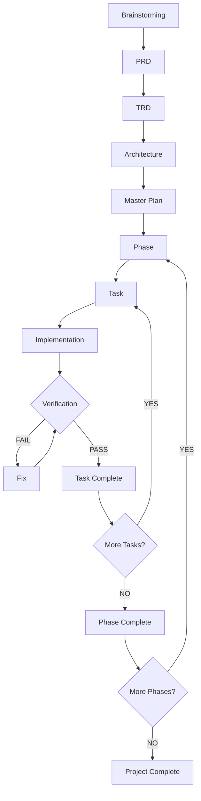

# harness-loop-fullstack (한글)

아이디어 하나를 **문서로 굳히고, 태스크로 쪼개고, 검증 관문을 세우고, 그 관문을 통과할 때까지 에이전트가 스스로 도는 규칙**까지
한 흐름으로 만들어 주는 한글 스킬 플러그인입니다. 클로드 코드와 코덱스에서 같은 파일로 동작합니다.

---

## 1. 개요 — 무엇을 위해 만들었나

이 플러그인의 출발점은 아래 그림 하나입니다. 프로젝트를 **Brainstorming → PRD → TRD → Architecture → Master Plan** 으로 문서화하고,
플랜을 **Phase → Task** 로 쪼갠 뒤, 태스크마다 **구현 → 검증 → (실패면 수정) → 완료** 를 돌리고,
phase 의 태스크가 다 끝나면 phase 를 닫고 다음 phase 로 넘어가 프로젝트가 끝날 때까지 반복하는 구조입니다.



이 그림을 에이전트가 **혼자서, 세션이 끊겨도, 기준을 낮추지 않고** 돌게 만드는 것이 목표입니다. 그래서 세 가지를 지킵니다.

- **각 레이어는 앞 레이어의 파일만 입력으로 받습니다.** 대화 맥락에 의존하지 않으므로 세션이 끊겨도 문서만 있으면 이어집니다.
- **"검증"은 도구가 판정하는 세 게이트(lint·unit·e2e)와 에이전트가 판정하는 한 게이트(task_validation)로 나뉘고**, 마지막 하나는 구현한 세션이 아닌 **다른 세션**이 판정합니다.
- **실패하면 고치기 전에 분류하고, 재수정은 3회까지입니다.** 소진하면 기준을 낮추지 않고 사람에게 보고하고 멈춥니다.

---

## 2. 설치

### 클로드 코드

```
/plugin marketplace add GangJaeYu/harness_loop_full_korean
/plugin install harness-loop-fullstack@harness-loop-fullstack
```

### 코덱스

```bash
codex plugin marketplace add GangJaeYu/harness_loop_full_korean
codex plugin marketplace list
```

브랜치나 태그를 고정하려면 `...@main` 또는 `...#v1.4.0` 을 붙입니다.
설치 후에는 어느 프로젝트에서든 "PRD 만들어줘" 같은 말에 해당 스킬이 걸립니다.

> **확인된 범위**: 클로드 코드 설치와 헤드리스 자식 세션(`claude -p`) 실행은 실제로 확인했습니다.
> 코덱스의 플러그인 설치 명령과 `skills/` 자동 탐색은 매니페스트 규격대로 두었지만 **아직 실제 설치로 확인하지 못했습니다.**
> 안 되면 아래 '대안'의 서브모듈 + `AGENTS.md` 방식이 확실합니다.

### 대안 — 플러그인을 쓰지 않을 때

- **클로드 코드**: `skills/` 안의 9개 폴더를 `~/.claude/skills/` 로 복사합니다
- **코덱스**: 저장소를 프로젝트에 두고 루트 `AGENTS.md` 에서 색인을 가리킵니다

```bash
git submodule add https://github.com/GangJaeYu/harness_loop_full_korean .agent-skills
```

```markdown
스킬 색인: .agent-skills/AGENTS.md 를 읽고, 해당하는 스킬의 SKILL.md 를 전문 읽어 따른다.
```

둘 다 즉시 되지만 갱신을 손으로 해야 합니다.

---

## 3. 전체 흐름 한눈에

```
Layer 0  idea-brainstorm        → docs/IDEA.md
Layer 1  prd-generator          → docs/PRD.md
         trd-generator          → docs/TRD.md
Layer 2  architecture-generator → docs/ARCHITECTURE/*.md
Layer 3  plan-generator         → plan_setup/PLAN.md · phase-NN/ · STATE.md · LOG.md
Layer 4  harness-setup          → harness_setup/HARNESS.md · quality_gates/ · scripts/
         harness-update           (진행에 맞춰 갱신)
Layer 5  loop-setup             → loop_setup/LOOP.md · DAG.md
         loop-update              (진행에 맞춰 갱신)
                                       ↓
              LOOP.md 가 안내하는 사이클: 태스크 병렬 구현 → 게이트 4단계 → 분리 검증 → 완료 → 다음
```

각 단계가 끝나면 스킬이 **결과를 보고하고 멈춥니다.** 사용자가 검토하고 "다음으로"라고 해야 다음 스킬로 넘어갑니다.
처음부터 다 돌릴 필요는 없습니다. 이미 PRD 가 있으면 TRD 부터, 플랜까지 있으면 하네스부터 시작하면 됩니다.

**모든 스킬은 산출물을 쓴 뒤 프로젝트 루트의 `CLAUDE.md`(클로드 코드용)와 `AGENTS.md`(코덱스용)를 같은 내용으로 함께 갱신합니다.**
스킬을 읽지 않고 시작하는 세션(직접 연 세션, 루프의 자식 세션)도 STATE.md·게이트 명령·LOOP.md 를 알고 시작하도록,
어느 세션에서든 지킬 것만 레이어별 절(제품·기술·구조·플랜·하네스·루프)에 담고 200줄을 넘기지 않습니다.
세부 규칙은 옮겨 적지 않고 해당 문서를 가리키며, 각 스킬은 자기 절만 고치고 사용자가 손으로 적은 내용은 건드리지 않습니다.
클로드 코드는 `CLAUDE.md` 만, 코덱스는 `AGENTS.md` 만 자동으로 읽으므로 어느 호스트에서 돌든 두 파일을 다 씁니다.

---

## 4. 스킬별 안내

### 4.0 `idea-brainstorm` — 모호한 아이디어를 구체화 (Layer 0, 생략 가능)

**언제**: 무엇을 만들지 아직 흐릿할 때. "앱 하나 만들고 싶은데", "이런 서비스 어때?"
**무엇을 하나**: 역질문과 선택지 제안으로 문제·타깃 사용자·핵심 가치·핵심 흐름·MVP 범위·제약·성공 기준·리스크·미결 사항을 정리합니다.
**산출물**: `docs/IDEA.md`
**예시**:

> 사용자: 프리랜서용 인보이스 앱을 만들고 싶은데 아직 막연해.
> 에이전트: (역질문) 누가 인보이스를 보내고 누가 받나요? 결제까지 다루나요, 발행까지인가요? … (선택지) MVP 범위를 A/B/C 중 고르시면 IDEA.md 초안을 쓰겠습니다.

이미 무엇을 만들지 분명하면 건너뛰고 `prd-generator` 에 직접 설명해도 됩니다.

### 4.1 `prd-generator` — 무엇을 만들 것인가 (Layer 1)

**언제**: "PRD 써줘", "요구사항 정리해줘", 브레인스토밍을 마쳤을 때.
**무엇을 하나**: 문제·사용자·유저 스토리·기능 요구사항(FR)·비기능 요구사항(NFR)을 쓰고, **요구사항마다 고유 ID 와 관찰 가능한 수용 기준**을 붙입니다. 이 ID 를 뒤의 아키텍처·플랜·게이트가 그대로 참조합니다.
**산출물**: `docs/PRD.md`
**예시**:

> 사용자: IDEA.md 로 PRD 써줘.
> 에이전트: FR-001 인보이스 발행 … 수용 기준: "발행 버튼을 누르면 PDF 가 생성되고 번호가 연속된다". P0/P1 우선순위와 미결 사항(OQ) 표를 함께 만들었습니다. 검토해 주세요.

### 4.2 `trd-generator` — 어떤 기술로 만들 것인가 (Layer 1)

**언제**: "TRD 써줘", "기술 스택 정해줘", PRD 검토를 마쳤을 때.
**무엇을 하나**: 스택·DB·API·인증·보안·테스트·배포를 **결정 단위(TD)** 로 확정하고, 각 결정에 근거가 된 요구사항·검증 방법·되돌리기 비용을 붙입니다. 테스트 절에는 **필수 커버 영역 표**, 로컬 개발 환경 절에는 **구성 요소 표**가 들어가고, 하네스가 이것을 그대로 받습니다.
**산출물**: `docs/TRD.md`

### 4.3 `architecture-generator` — 구조를 고정 (Layer 2)

**언제**: "아키텍처 설계해줘", "테이블 설계해줘", TRD 검토를 마쳤을 때.
**무엇을 하나**: `overview.md` 에 시스템 구성·경계·핵심 흐름을, 영역별 문서(`frontend.md`·`backend.md`·`database.md`·`auth.md`·`security.md` 등)에 세부 설계를 씁니다. **PRD·TRD 와 충돌하는 설계는 봉합하지 않고 충돌(CF)로 드러냅니다.**
**산출물**: `docs/ARCHITECTURE/*.md`

### 4.4 `plan-generator` — 마스터 플랜 (Layer 3)

**언제**: "개발 계획 세워줘", "태스크 나눠줘", 아키텍처 검토를 마쳤을 때.
**무엇을 하나**: 프로젝트를 **phase(검증 가능한 단계) → task(파일 하나 수정 정도의 작업 단위)** 로 쪼갭니다.
**산출물**:

```
plan_setup/
├── PLAN.md                         전체 지도. phase 구성, 태스크 색인, 차단된 태스크, 요구사항→태스크 추적표
├── phase-01/
│   ├── phase-01-foundation.md      phase 의 Goal·Dependencies·Acceptance Criteria·Tasks
│   └── phase-01-tasks/
│       ├── phase-01-task-01.md     YAML frontmatter 를 가진 실제 작업 단위
│       └── ...
├── STATE.md                        지금 어디인가 (Current Phase/Task, Phase Overview, Task Status, Last Verification, Next Action)
└── LOG.md                          무슨 일이 있었는가 (append-only)
```

태스크 문서의 frontmatter 가 뒤의 모든 자동화의 재료입니다.

```yaml
id: phase-02-task-03
phase: "02"
title: 인보이스 번호 채번
priority: P0
goal: 발행 시 연속 번호를 부여한다
depends_on: [phase-01-task-09, phase-02-task-01]
files: [src/data/invoice-number.ts, src/data/invoice-number.test.ts]
architecture: database.md §3.2
acceptance_criteria: [...]
status: pending          # pending / in_progress / blocked / failed / completed
verification: [lint, unit, e2e, task_validation]
blocked_by: []           # 미결(OQ)·충돌(CF)에 막혔으면 그 ID
```

- `depends_on` 이 DAG 의 간선, `files` 가 병렬 실행 시 충돌 검사의 재료, `verification` 이 그 태스크가 통과해야 할 게이트 목록입니다.
- 앞 문서의 미결·충돌에 걸린 태스크는 `blocked` 로 표시되고, 사용자가 미결을 풀면 루프가 `pending` 으로 엽니다.
- 루프가 "수용 기준을 다시 써야 한다", "태스크를 더 잘라야 한다"로 돌려보내면 이 스킬의 **부분 갱신**이 처리합니다. 진행 중인 태스크의 상태는 건드리지 않습니다.

### 4.5 `harness-setup` — 검증 하네스 (Layer 4)

**언제**: "하네스 세팅해줘", "품질 게이트 만들어줘", 플랜 검토를 마쳤을 때.
**무엇을 하나**: PRD·TRD·아키텍처·플랜을 읽고 **네 게이트의 정의서**와 **로컬 개발 환경 스크립트**를 만듭니다. 자세한 내용은 5절.
**산출물**: `harness_setup/HARNESS.md`, `harness_setup/quality_gates/{lint,unit,e2e,task_validation}.md`, `harness_setup/scripts/local-dev.*`

### 4.6 `harness-update` — 하네스 갱신 (Layer 4)

**언제**: 게이트가 활성 시점에 도달했을 때, 차단이 풀렸을 때, 새 의존 서비스(Redis 등)가 생겼을 때, 같은 흐름이 두 태스크에 걸쳐 실패할 때. 보통은 루프가 스스로 부릅니다.
**무엇을 하나**: 미활성 게이트를 활성으로 올리고, 대기 중이던 E2E 흐름을 켜고, `local-dev` 에 구성 요소를 더하고, 명령이 실제와 어긋난 곳을 맞춥니다. 갱신은 **①상태 반영 / ②범위 확대 / ③약화** 세 등급으로 나뉘고, ③은 사용자 확인 없이는 적용하지 않습니다.
**예시**:

> 사용자: Redis 붙였으니 local-dev 고쳐줘.
> 에이전트: 구성 요소 표에 Redis 행을 더하고 `local-dev.ps1` 에 준비 판정 블록을 넣었습니다(②범위 확대). `LOG.md` 에 한 줄 남겼습니다.

### 4.7 `loop-setup` — 개발 루프 (Layer 5)

**언제**: "개발 루프 세팅해줘", "이제 구현 시작하자", 하네스 검토를 마쳤을 때.
**무엇을 하나**: 앞으로 모든 세션이 따를 실행 규칙을 `LOOP.md` 한 문서로 고정합니다. 다음 태스크를 어떻게 고르고, 게이트를 어떤 순서로 돌리고, 실패를 어떻게 분류하고, 언제 멈춰 사람에게 묻고, `STATE.md`·`LOG.md` 를 언제 쓰고, 세션을 누가 어떻게 여는지(구동기)까지입니다. 자세한 내용은 6절.
**산출물**: `loop_setup/LOOP.md`, `loop_setup/DAG.md`(태스크 DAG 생성물), `harness_setup/scripts/dag-render.*`, 그리고 `STATE.md` 에 `Retry`·`Standing Decisions`(병렬이면 `Assignments`) 절 추가.
**세팅 때 묻는 것**: 병렬로 갈지(기본 예)·동시 에이전트 수·슬롯 격리 방식·**역할별 모델**(코디네이터/구현 워커/검증 워커 — 모르면 "추천대로": 코디네이터 최상위, 워커 보통), 미활성 게이트를 달고 완료시켜도 되는지.
모델 이름은 세팅 시점에 CLI 도움말·모델 문서에서 확인해 `LOOP.md` 8절 표 한 곳에만 적고, 클로드 코드는 `--model/--effort`, 코덱스는 `-m/-c model_reasoning_effort` 로 자식 세션에 넘깁니다.

이 스킬은 루프를 **세우기만** 하고 돌리지 않습니다. 문서를 다 쓴 뒤 "첫 사이클을 시작할까요?"라고 묻고, 그 뒤로는 스킬이 아니라 `LOOP.md` 가 안내합니다.

### 4.8 `loop-update` — 루프 갱신 (Layer 5)

**언제**: 태스크가 추가되어 DAG 가 달라졌을 때, 병렬 폭·격리 방식·역할별 모델을 바꿀 때, 루프가 같은 자리에서 반복해 멈출 때.
**무엇을 하나**: `LOOP.md` 를 부분 수정합니다. 재시도 3회·분리 세션·게이트 넷 같은 고정 규칙은 건드리지 않고, 루프를 멈추게 하는 규칙을 줄이는 갱신은 사용자 확인을 요구합니다. **게이트가 실패한 것은 이 스킬을 부를 이유가 아닙니다** — 그건 루프를 도는 일입니다.

---

## 5. 검증 하네스 — 네 개의 quality gate

태스크 하나는 `verification` 에 적힌 게이트를 **`lint → unit → e2e → task_validation` 순서로** 통과해야 완료입니다.
앞이 실패하면 뒤를 돌리지 않습니다. 하네스는 "도구를 잘 골랐는가"가 아니라 세 가지로 판정됩니다.

1. **명령 한 줄로 돌고 종료 코드로 성패가 갈리는가** — 사람이 로그를 읽어야 판정되는 게이트는 게이트가 아닙니다
2. **구현한 쪽이 스스로 통과 판정을 내릴 수 없는가** — 넷째 게이트가 분리된 세션에서 도는 이유입니다
3. **아직 못 도는 게이트가 '통과'로 보이지 않는가** — 테스트 0건 실행은 초록불이 되고, 초록불은 아무도 다시 안 봅니다

### 5.1 게이트 넷

| 순서 | 게이트 | 누가 판정 | 무엇을 보나 | 통과 |
|---|---|---|---|---|
| 1 | `lint` | 도구 | 문법·타입·아키텍처 규칙(계층 경계·의존 방향) | 종료 코드 0 |
| 2 | `unit` | 도구 | 수정된 단위. TRD 의 필수 커버 영역 | 종료 코드 0 + 커버 조건 |
| 3 | `e2e` | 도구 | 브라우저에서 사용자 흐름(FLOW-xx). PRD 유저 스토리에서 뽑음 | 종료 코드 0 |
| 4 | `task_validation` | **에이전트(다른 세션)** | 태스크의 수용 기준이 **실행 중인 앱에서 실제로 관찰되는가** | 판정 블록 `RESULT: PASS` |

각 게이트는 `harness_setup/quality_gates/<이름>.md` 정의서 하나입니다. 앞 셋은 `## 명령` 절의 한 줄을 돌려 종료 코드로 판정하고,
`task_validation.md` 에는 `## 명령` 이 없습니다 — 그건 명령이 아니라 **세션을 여는 것**입니다.

### 5.2 활성 시점 — 미활성은 통과가 아니다

코드가 0줄일 때 하네스가 서므로 처음에는 거의 모든 게이트가 돌 수 없습니다. 그래서 게이트마다 **활성 시점**(어느 태스크가 끝나야 실제로 도는가)을 적어 두고,
그전에는 결과가 무엇이든 `미활성` 으로 읽습니다. 0건 실행의 초록불도, 도구가 없어서 나는 빨간불도 판정에 쓰지 않습니다.

미활성 게이트를 달고 태스크를 완료시킬지는 **사람이 정합니다.** 루프 세팅 때 한 번 물어 `STATE.md` 의 `Standing Decisions` 에 "그 게이트가 활성될 때까지"라는 기한과 함께 적고,
게이트가 활성되는 순간 그 승인은 만료되어 루프가 스스로 지웁니다. 무기한 승인은 만들지 않습니다.

상태 어휘는 넷입니다 — `활성` / `부분 활성` / `미활성` / `대기`(차단된 태스크에 걸린 흐름).

### 5.3 task_validation — 왜 다른 세션인가

구현한 세션은 자기가 무엇을 **의도했는지** 알고 있습니다. 그래서 화면이 실제로 그렇게 동작하지 않아도 그렇게 보이고,
수용 기준의 애매한 문장을 자기 구현에 맞는 쪽으로 읽습니다. 나쁜 의도가 아니라 정보의 문제입니다. 그래서 코드 작성과 검증을 떼어 놓습니다.

검증 세션에 **주는 것**은 넷뿐입니다 — 태스크 문서 경로, 실행 중인 앱의 주소, `task_validation.md`, 판정 블록을 출력하라는 지시(필요하면 태스크의 `architecture` 가 가리키는 설계 절).
**주지 않는 것**이 이 게이트의 실질입니다 — 구현 세션의 대화·요약·"무엇을 했는지", 통과 보고, 원인 추정, 커밋 메시지·최근 변경 파일.

검증자는 **앱을 실제로 조작해 수용 기준 한 줄마다 관찰한 증거를 적습니다.** 코드를 읽고 PASS 를 주지 않고, 고치지 않고, 원인을 추정하지 않습니다.

```
TASK: phase-02-task-03
GATE: task_validation
관찰 수단: 1 | 2 | 3          (1 브라우저 조작 도구 / 2 e2e 도구로 일회성 스크립트 / 3 HTTP·DB)
RESULT: PASS | FAIL | 판정 불가 | 환경 문제
- [1] PASS — 발행 버튼을 누르자 INV-0007 이 생성되고 직전 번호와 연속됨
- [2] FAIL — 계정 B 로 A 의 인보이스 URL 을 열었더니 200 과 본문이 보임
END
```

`환경 문제` 는 앱이 안 떠서 관찰 자체를 못 한 것이고 FAIL 이 아닙니다 — 안 뜬 화면을 FAIL 로 적으면 멀쩡한 코드를 고치게 됩니다.
`판정 불가` 는 수용 기준이 관찰 가능하게 쓰이지 않은 것이고 태스크 문서(`plan-generator`)로 돌아갑니다. 마지막 줄 `END` 는 잘린 판정을 알아보는 표식입니다.

### 5.4 로컬 개발 환경 — `local-dev`

`harness_setup/scripts/local-dev.ps1`(Windows) 또는 `local-dev.sh` 하나로 DB·API·앱 서버·Redis 같은 의존 서비스를 **한 명령으로 준비**합니다.
사용자 OS 를 먼저 따르고, TRD 의 구성 요소 표와 1:1 로 관리됩니다.

- 옵션: 초기화 `-Reset`, 상태 `-Status`, 로그 `-Logs`, 내리기 `-Down`
- **종료 코드가 실패한 단계를 구별합니다** — 0 성공 / 전제(런타임·컨테이너 엔진 없음) / 환경변수 / 의존 서비스 / 스키마·시드 / 앱. 0이 아니면 그 자체가 환경 문제이고 루프는 추측하지 않습니다
- 앱 서버는 **스크립트를 부른 셸과 분리된 프로세스**로 떠서 세션이 끝나도 살아 있습니다. 검증 세션이 열릴 때마다 앱이 죽어 있으면 안 되기 때문입니다
- 포트·DB 이름은 환경변수에서 읽습니다. 병렬 슬롯마다 다른 값을 넘길 수 있게 하기 위해서입니다

### 5.5 `HARNESS.md`

하네스의 현재 상태 요약입니다. 게이트 개요 표(정의서·명령·활성 시점·현재 상태), 로컬 개발 환경(명령·종료 코드·구성 요소 표), 하네스 밖(게이트로 못 덮는 요구사항과 대신 확인하는 방법), 하네스 결정(TRD 가 비워 둔 자리를 하네스가 채운 것)이 들어갑니다.

---

## 6. 개발 루프 — `LOOP.md` 가 안내하는 사이클

`LOOP.md` 는 개발 프로세스의 **헌법**입니다. 독자는 사람이 아니라 다음 세션의 에이전트이고, 세션은 계속 끊깁니다.
세션을 열면 `LOOP.md` → `STATE.md` 를 읽고 거기 적힌 사이클을 따릅니다.

### 6.1 한 태스크는 세 토막, 토막마다 세션이 다르다

| 토막 | 하는 일 |
|---|---|
| **구현** | 태스크 선택 → 시작 전 하네스 점검 → `in_progress` 기록 → 구현 → `local-dev` → `lint`·`unit`·`e2e` → "task_validation 대기"를 적고 종료 |
| **검증** | 새 세션이 `task_validation` 만 돌려 판정 블록을 내고 종료 |
| **반영** | 판정을 `STATE.md`·`LOG.md` 로 옮김 → PASS 면 완료·커밋·phase 판정 / FAIL 이면 분류 → 수정 → 재실행 |

검증이 별도 세션이라는 것은 곧 검증 앞과 뒤도 같은 세션일 수 없다는 뜻이고, 그래서 토막이 셋입니다.
**태스크가 끝나면 세션을 닫습니다.** 이어서 다음 태스크를 하지 않습니다 — 다음 태스크의 검증 분리가 오염된 채로 시작하기 때문입니다.

### 6.2 실패 처리 — 분류가 먼저, 재시도는 3회

| 분류 | 알아보는 법 | 고칠 곳 | 재실행 |
|---|---|---|---|
| 진짜 결함 | 같은 순서를 수동으로 밟아도 같은 결과 | 코드 | 최대 3회, 처음부터 |
| 낡은 스펙 | 화면·규약이 의도적으로 바뀜 | 흐름 정의 (`harness-update`) | 1회, 실패한 게이트만 |
| 환경 문제 | `local-dev` 가 0 이 아닌 코드로 끝남 | 환경 재준비 | 1회 |
| 흔들림 | 같은 코드인데 결과가 다름 | 그 테스트 (`harness-update`) | 1회 |
| 판정 불가 | 수용 기준이 관찰 가능하지 않음 | 태스크 문서 (`plan-generator`) | 0회, 즉시 중단 |

3회는 **코드를 고치는 예산**이라 `진짜 결함` 만 셉니다. 소진하면 작업을 멈추고 `STATE.md` 의 `Next Action` 에 `질문:` 을 남기고 사용자에게 보고합니다.
사용자는 "이어서" 또는 "건너뛰라"로 답하고, 답은 `Next Action` 의 `답:` 줄로 돌아옵니다. 3회는 원본 사양이 못 박은 값이라 루프가 조정하지 않습니다.

### 6.3 기록 — `STATE.md` 와 `LOG.md`

기록은 완료 시점만이 아니라 **시작·전이·완료 세 번**입니다. 세션은 구현 중에 가장 많이 끊기기 때문입니다.
쓰는 순서는 태스크 문서 `status` → `STATE.md` → `LOG.md` → 커밋이고, 어긋나면 태스크 문서가 이깁니다.
`STATE.md` 가 "지금 어디인가"라면 `LOG.md` 는 "무슨 일이 있었는가"이고 append-only 입니다. 새 상태 파일은 만들지 않습니다.

### 6.4 세션을 누가 여는가 — 구동기

"한 태스크에 한 세션"은 누군가 세션을 계속 열어 줘야 성립합니다. `LOOP.md` 가 그 방식을 정합니다.

| 모드 | 무엇으로 | 언제 |
|---|---|---|
| ① 스크립트 구동 | `claude -p "<지시문>"` / `codex exec "<지시문>"` 을 반복하는 스크립트. 단일과 병렬 두 형태 | 오르카가 없을 때의 기본 |
| ② 오르카 오케스트레이션 | `orca orchestration worker-start --agent claude\|codex` 로 워커를 띄움 | 오르카가 있을 때의 기본 |
| ③ 서브에이전트 | 상위 세션이 Agent 도구로 띄움 | 클로드 코드 전용 대안 |

지시문은 `LOOP.md` 에 고정된 것을 그대로 씁니다. 자식 세션은 사람에게 물을 수 없으므로 물을 일이 생기면 `Next Action` 에 적고 종료하고, 구동기가 그것을 보고 멈춥니다.
권한은 허용 목록으로 주고 토막마다 다릅니다 — 검증 세션에는 쓰기와 git 을 주지 않습니다.

### 6.5 병렬 운용 — 기본값

태스크가 파일 단위로 잘려 있고 `depends_on`·`files` 가 다 적혀 있으므로 **기본은 병렬**입니다. 병렬의 단위는 **현재 phase 안의 태스크들**이고 phase 사이는 순차입니다.

- **DAG**: `harness_setup/scripts/dag-render.*` 가 태스크 frontmatter 만 읽어 `loop_setup/DAG.md` 를 만듭니다 — 머메이드 그래프(실선 `depends_on`, 점선 `files` 겹침), 구간별 폭, 순환·미존재 참조 확인, 파일 겹침 쌍. 사용자가 이 그림으로 실행 순서를 검토합니다
- **자원 충돌 사전 검사**: 파일 겹침 / 공유 런타임 자원(마이그레이션·시드·환경 설정) / 빈 `files` 를 세팅 때 검사해 처리(`단독` / `그룹 직렬` / `격리가 덮음`)를 표로 남깁니다
- **코디네이터가 배정**: 워커는 스스로 태스크를 고르지 않습니다. 진입 차수 0·차단 아님·충돌 없음인 태스크를 코디네이터가 폭만큼 나눠 줍니다. 문서(`STATE.md`·`LOG.md`·태스크 문서·하네스 문서)는 코디네이터만 주 트리에서 씁니다
- **슬롯 워크트리**: 태스크마다 만들지 않습니다. 동시에 코드를 쓰는 둘째 워커부터 슬롯 워크트리를 받고, 검증 워커와 코드를 쓰지 않는 태스크는 받지 않습니다. 저장소가 OneDrive 같은 동기화 폴더 아래면 형제 폴더 대신 저장소 안 `.wt/` 나 동기화 밖 경로를 씁니다
- **격리**: 슬롯별 포트·DB 를 환경변수로 나눕니다(방식 셋 중 세팅 때 선택). 격리 없이 앱 게이트만 직렬화하는 방식을 고르면 병렬 이득은 구현·lint·unit 까지입니다
- **오르카 혼용**: 워커마다 `--agent` 를 고르므로 구현은 클로드, 검증은 코덱스처럼 섞을 수 있습니다. 검증을 다른 에이전트로 두면 분리가 한 겹 더 강해집니다

병렬을 끄면 단일 모드로 돌고, 폭이 1인 구간은 병렬이 켜져 있어도 단일과 같습니다.

### 6.6 phase 완료와 프로젝트 완료

phase 는 태스크 전부 완료 **와** phase 수용 기준 충족 **와** phase 완료 묶음(느려서 매 태스크에서 뺀 e2e 흐름) 통과 셋 다여야 완료입니다.
현재 phase 가 완료되기 전에는 다음 phase 의 태스크를 열지 않습니다. 모든 phase 가 완료되면 구동기가 멈추고 프로젝트가 끝납니다.

---

## 7. 처음 써 보는 순서 (권장)

1. 빈 프로젝트 폴더에서 `git init` 을 하고 클로드 코드(또는 코덱스)를 엽니다
2. "인보이스 앱 아이디어 정리하자" → `idea-brainstorm` 이 `docs/IDEA.md` 를 만듭니다
3. "PRD 써줘" → "TRD 써줘" → "아키텍처 설계해줘" → "플랜 짜줘". 각 단계마다 보고를 검토하고 미결 사항에 답합니다
4. "하네스 세팅해줘" → 게이트 정의서와 `local-dev` 가 생깁니다. 관찰 수단(브라우저 도구)이 있는지, 스크립트가 실제로 돌았는지 보고에서 확인합니다
5. "루프 세팅해줘" → 병렬 여부·격리 방식·역할별 모델·미활성 승인을 답하고 `DAG.md` 로 실행 순서를 검토합니다
6. "첫 사이클 시작하자" → 그 뒤로는 `LOOP.md` 의 구동기가 세션을 열고, 사람은 `STATE.md` 의 `Next Action` 에 `질문:` 이 올라올 때만 답합니다
7. 진행 상황은 언제나 `plan_setup/STATE.md`(지금 어디)와 `LOG.md`(무슨 일이)로 봅니다

---

## 8. 저장소 구성

```
skills/
├── idea-brainstorm/        SKILL.md + references/{claude-code,codex}.md
├── prd-generator/
├── trd-generator/
├── architecture-generator/
├── plan-generator/
├── harness-setup/
├── harness-update/
├── loop-setup/
└── loop-update/
.claude-plugin/             클로드 코드 마켓플레이스·플러그인 매니페스트
.agents/plugins/            코덱스 마켓플레이스 매니페스트
plugin.json                 코덱스 플러그인 매니페스트 (agent-plugins.org 공통 표준)
AGENTS.md                   플러그인 없이 서브모듈로 쓸 때의 색인
```

**스킬 본문은 두 환경에서 같습니다.** 절차·판단 기준·산출물 형식이 `SKILL.md` 한 곳에 있고, 환경마다 다른 것만 `references/` 로 뺐습니다.

| | 클로드 코드 | 코덱스 |
|---|---|---|
| 참고 파일 | `references/claude-code.md` | `references/codex.md` |
| 선택지 묻기 | AskUserQuestion | 평문 번호 목록 |
| 분리 검증 세션 | 헤드리스 자식 세션 `claude -p` (대안: 서브에이전트) | 헤드리스 자식 세션 `codex exec` |
| 병렬 구동기 | 오르카 있으면 오케스트레이션, 없으면 스크립트 + 슬롯별 `claude -p` | 오르카 있으면 오케스트레이션, 없으면 스크립트 + 슬롯별 `codex exec` |
| 다음 스킬 연결 | 자동 호출 | 다음 단계를 텍스트로 남긴다 |

각 `SKILL.md` 끝에서 자기 환경에 맞는 참고 파일만 읽으라고 안내하므로, 쓰지 않는 쪽 파일은 열리지 않습니다.

---

## 9. 자주 묻는 것

**중간부터 시작해도 되나요?** 됩니다. 각 스킬은 앞 레이어의 파일만 읽으므로 그 파일이 있으면 됩니다. 없으면 그 레이어부터 하자고 제안합니다.

**재시도 3회를 늘릴 수 있나요?** 루프 문서에서는 바꾸지 않습니다. 세 번을 다 쓰고 멈추는 일이 반복된다면 대개 환경 문제나 흔들림이 예산을 먹은 것이고, 답은 분류를 먼저 하는 것입니다.

**task_validation 을 같은 세션에서 하면 안 되나요?** 그건 이 게이트를 돌린 것이 아닙니다. 분리 수단이 없는 환경이면 통과로 기록하지 않고 사용자에게 알립니다.

**병렬이 부담스러우면?** 루프 세팅 때 "아니요"라고 하면 단일 모드로 돌고, 나중에 `loop-update` 로 켤 수 있습니다.

**STATE.md 와 태스크 문서가 어긋나면?** 태스크 문서가 원본입니다. 세션을 열 때 루프가 태스크 문서 기준으로 `STATE.md` 를 맞추고 `LOG.md` 에 남깁니다.
