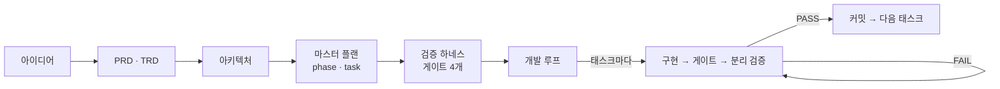

# harness-loop-fullstack

**아이디어 한 줄에서 시작해 문서 → 태스크 → 검증 하네스 → 자율 개발 루프까지 잇는 한글 에이전트 스킬 플러그인**

*A Korean agent-skill plugin for Claude Code & Codex — idea → PRD → architecture → task plan → verification harness → autonomous development loop.* ([English](README.en.md))

[](CHANGELOG.md)
[](LICENSE)
[](#설치)
[](docs/getting-started.md#코덱스)

---

## 무엇을 해 주나

"이런 앱 만들고 싶어"라고 말하면, 에이전트가 **요구사항·기술·설계 문서를 쓰고, 검증 가능한 태스크로 쪼개고,
태스크마다 통과 기준(게이트)을 세운 뒤, 그 기준을 통과할 때까지 스스로 구현·검증·수정을 반복**합니다.
사람은 단계마다 결과를 검토하고, 루프가 돌기 시작하면 **루프가 질문을 올릴 때만** 답합니다.



## 무엇이 다른가

- **대화가 아니라 파일이 입력입니다.** 각 단계는 앞 단계의 문서만 읽습니다. 세션이 끊겨도 문서만 있으면 이어집니다.
- **구현한 세션이 스스로 합격 판정을 내리지 않습니다.** 마지막 검증(task_validation)은 구현 과정을 모르는 **다른 세션**이 실행 중인 앱을 직접 조작해 판정합니다.
- **실패하면 고치기 전에 원인부터 분류합니다.** 코드 결함·낡은 테스트·환경 문제·흔들리는 테스트를 구별하고, 코드 수정은 3회까지입니다. 소진하면 기준을 낮추지 않고 멈춰 사람에게 묻습니다.
- **병렬로 돌고, 사람을 부르는 지점이 정해져 있습니다.** 태스크 의존 그래프(DAG)로 동시에 할 수 있는 태스크를 워크트리별로 나눠 돌리고, 멈추는 조건은 "답이 필요한 질문"과 "전부 완료" 둘뿐입니다.
- **완료 뒤에도 이어집니다.** 기능 추가·버그 수정·리팩토링, 그리고 문서 없이 만든 코드를 이 흐름에 올리는 스킬이 있습니다.

## 설치

```
/plugin marketplace add GangJaeYu/harness_loop_full_korean
/plugin install harness-loop-fullstack@harness-loop-fullstack
```

버전을 고정하려면 `GangJaeYu/harness_loop_full_korean@v1.10.0` 처럼 붙입니다.

코덱스:

```bash
codex plugin marketplace add GangJaeYu/harness_loop_full_korean
codex plugin add harness-loop-fullstack@harness-loop-fullstack
```

플러그인 없이 쓰는 방법은 [시작하기](docs/getting-started.md)를 보세요.

**필요한 것**: git 저장소, Claude Code(또는 Codex) CLI. 루프 단계에서는 프로젝트 스택에 따라 **Docker**(DB 등 의존 서비스), **Node·Playwright**(e2e) 가 필요하고,
Windows 에서는 PowerShell 7(`pwsh`)을 권장합니다. 병렬 운용에 [Orca](docs/loop.md#구동기--세션을-누가-여는가)(ADE)를 쓸 수 있지만 없어도 됩니다.

## 빠르게 시작하기

빈 폴더에서 `git init` 하고 에이전트를 연 뒤, 순서대로 말하면 됩니다. 각 단계가 끝나면 스킬이 보고하고 멈추므로 검토하고 다음으로 넘어갑니다.

1. **"이런 앱 아이디어가 있는데 정리해줘"** → `docs/IDEA.md`
2. **"PRD 써줘"** → **"TRD 써줘"** → **"아키텍처 설계해줘"** → 요구사항·기술·설계 문서
3. **"개발 계획 세워줘"** → `plan_setup/` (phase·task·STATE·LOG)
4. **"하네스 세팅해줘"** → 게이트 정의서와 로컬 개발 환경 스크립트
5. **"개발 루프 세팅해줘"** → `loop_setup/LOOP.md` · 실행 순서 그림 `DAG.md` · 구동 스크립트
6. **"첫 사이클 시작하자"** → 이후로는 루프가 돌고, 질문이 오면 `plan_setup/STATE.md` 에 답을 적습니다

이미 PRD 가 있으면 그다음 단계부터 시작하면 됩니다. **결과물이 어떻게 생겼는지는 [예시 프로젝트](examples/deskwork/)** 에서 볼 수 있습니다.

## 스킬 한눈에

| 이럴 때 이렇게 말하면 | 스킬 | 만들어지는 것 |
|---|---|---|
| "앱 하나 만들고 싶은데 막연해" | `idea-brainstorm` | `docs/IDEA.md` |
| "PRD 써줘" | `prd-generator` | `docs/PRD.md` — 요구사항마다 ID 와 관찰 가능한 수용 기준 |
| "기술 스택 정해줘" | `trd-generator` | `docs/TRD.md` — 결정 단위(TD)와 근거·되돌리기 비용 |
| "아키텍처 설계해줘" | `architecture-generator` | `docs/ARCHITECTURE/*.md` — 앞 문서와 충돌하면 숨기지 않고 드러냄 |
| "개발 계획 세워줘" | `plan-generator` | `plan_setup/` — phase·task(frontmatter)·STATE·LOG |
| "하네스 세팅해줘" | `harness-setup` | `harness_setup/` — lint·unit·e2e·task_validation 정의서, `local-dev` |
| "Redis 붙였으니 하네스 고쳐줘" | `harness-update` | 기존 하네스 갱신 (보통 루프가 스스로 부름) |
| "개발 루프 세팅해줘" | `loop-setup` | `loop_setup/LOOP.md`·`DAG.md`, 구동 스크립트 |
| "루프가 자꾸 같은 데서 멈춰" | `loop-update` | 기존 LOOP.md 갱신 |
| "문서 없는 이 코드를 정리해줘" | `code-to-docs` | 현재 코드 기준 문서·테스트 phase·하네스·루프 |
| "리팩토링하자" | `refactor-plan` | 문서 후미 절 + 리팩토링 phase |
| "xx 기능 추가하려는데" | `feature-add` | 문서 후미 절 + 기능 phase |
| "다 만든 앱에서 xx 가 안 돼" | `bug-fix` | 재현 기록 → 회귀 검사 → 수정 → 커밋 1회 |

스킬별 자세한 설명과 예시는 [스킬 안내](docs/skills.md)에 있습니다.

## 루프가 도는 동안

- **시작**: 루프 세팅이 끝나면 `LOOP.md` 에 적힌 구동 명령으로 구동 스크립트를 띄웁니다. 스크립트가 태스크마다 새 세션을 열고, phase 가 바뀌어도 알아서 이어 갑니다.
- **질문에 답하기**: 루프가 멈추면 `plan_setup/STATE.md` 의 `Next Action` 에 `질문:` 이 있습니다. 그 아래 `답:` 줄을 적고 구동 명령을 다시 실행합니다.
- **지켜보기**: 지금 어디인지는 `STATE.md`, 무슨 일이 있었는지는 `LOG.md`. 검증까지 끝난 결과만 기본 브랜치(`main`)에 들어옵니다.

운용과 문제 해결은 [운용 가이드](docs/operations.md)에 있습니다.

## 비용과 한계 (솔직하게)

- **토큰과 시간이 많이 듭니다.** 태스크마다 구현·검증 세션이 따로 열리고 게이트를 여러 번 돌리는 구조라서입니다.
  실사용 프로젝트(웹 ERP, 태스크 76개, 코드 약 6만 줄)는 9일 동안 입력 토큰 약 17.7억(대부분 캐시 읽기)을 썼습니다.
  그 기록을 분석해 1.10.0 에서 가장 큰 낭비(상주 코디네이터, 전체의 약 30%)를 걷어냈지만, **개선 후 실제 프로젝트로 다시 재지는 않았습니다.**
- **실사용 검증은 아직 한 프로젝트뿐입니다.** 다른 스택·환경에서의 사례를 기다리고 있습니다.
- **코덱스는 설치와 스킬 인식까지 확인했지만**(Codex CLI 0.156.1), 코덱스로 루프 전체를 돌려 보지는 않았습니다. 실사용 프로젝트는 클로드 코드로 진행했습니다.
- 구동 스크립트는 프로젝트마다 에이전트가 새로 작성합니다. **첫 구동 전에 루프 세팅이 안내하는 시험 실행(스모크 테스트)을 꼭 돌리세요.**
- 작은 스크립트 한 개짜리 작업에는 과합니다. 여러 화면·여러 phase 가 있는 웹 애플리케이션을 전제로 만들었습니다.

## 문서

| 문서 | 내용 |
|---|---|
| [시작하기](docs/getting-started.md) | 요구사항, 설치(클로드 코드·코덱스·플러그인 없이), 첫 프로젝트 따라 하기 |
| [스킬 안내](docs/skills.md) | 스킬 13개의 용도·산출물·예시 |
| [검증 하네스](docs/harness.md) | 게이트 4개, 활성 시점, 분리 검증, `local-dev` |
| [개발 루프](docs/loop.md) | 한 태스크의 흐름, 실패 분류, 구동기, 병렬과 격리, phase 완료 |
| [운용 가이드](docs/operations.md) | 루프 시작·멈춤·재개, 질문에 답하기, 문제 해결 |
| [용어집](docs/glossary.md) | 코디네이터, 슬롯, 게이트, 활성 시점 … |
| [예시 프로젝트](examples/deskwork/) | 스킬을 순서대로 실행해 나온 실제 산출물 |
| [변경 기록](CHANGELOG.md) | 버전별 변경 |

## 라이선스

MIT
