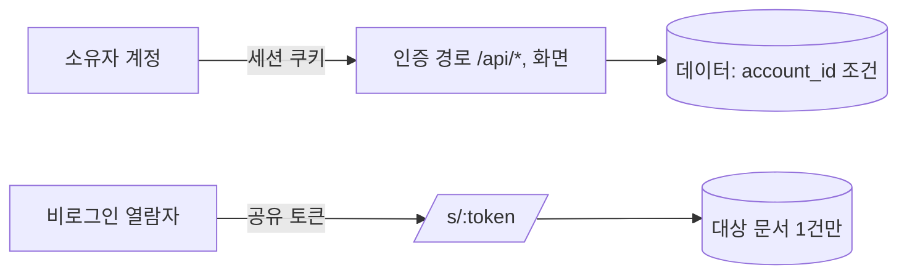

# 인증·권한 아키텍처

- **근거 문서**: docs/PRD.md (0.1), docs/TRD.md (0.1)
- **관련 기술 결정**: TD-010(서버 세션 + HttpOnly 쿠키, Argon2id, 역할 '소유자' 단일), TD-011(공유 토큰), TD-012(소유자 조건·404), TD-013(경계 검증), TD-009(메일), TD-005(논리 삭제)
- **잠정인 부분**: §3.6(계정 해지)은 **CF-004** 미해소 상태의 잠정 설계다. §3.4는 TD-009 잠정(PRD OQ-011)에 걸려 있다.

## 1. 이 문서가 정하는 것 / 정하지 않는 것

**정하는 것**: 인증 흐름(가입·로그인·로그아웃·재설정·해지), 세션의 저장 위치와 수명, 쿠키 속성, 권한 검사가 강제되는 지점, 비인증 접근 경로의 구조.

**정하지 않는 것**: 해시 알고리즘·세션 방식 선택(TD-010이 정했다), 세션 테이블의 컬럼 이상의 스키마 세부(`database.md`), 화면 구성(`frontend.md §3.1`), 신뢰 경계 전반과 비밀값 취급(`security.md`).

## 2. 구조

권한 모델은 **한 종류의 주체와 두 개의 접근 경로**로 끝난다.

역할·권한 테이블을 만들지 않는다(TD-010). 계정은 자기 데이터의 소유자이고 그것이 유일한 권한이다.

## 3. 설계 단위

### 3.1 가입

- **근거**: FR-001(가입 후 로그인 상태로 대시보드, 중복 이메일 거부, 비밀번호 8자 미만 거부), FR-024(처리방침 동의 없이는 가입 불가), NFR-006(평문 저장 금지) / TD-010, TD-013
- **설계**: `POST /api/auth/signup` 이 이메일·비밀번호·처리방침 동의를 받는다. 이메일은 소문자로 정규화하고, 비밀번호는 8자 이상을 서버에서 검증한 뒤 Argon2id로 해시해 저장한다. 동의 시각을 `accounts.privacy_agreed_at` 에 남긴다. 중복 이메일은 `VALIDATION_FAILED` 와 "이미 사용 중인 이메일" 메시지로 응답한다(UNIQUE 위반을 그대로 노출하지 않는다). 성공 시 세션을 만들고(§3.3) 대시보드로 보낸다.
- **왜 이 모양인가**: 이메일 정규화를 가입·로그인 양쪽에서 같은 함수로 하는 이유는, 한쪽만 정규화하면 `A@x.com` 으로 가입한 계정이 `a@x.com` 으로 로그인되지 않는 상태가 조용히 생기기 때문이다. 동의 시각을 저장하는 것은 FR-024가 동의를 요구하는데, 동의했다는 사실을 남기지 않으면 나중에 확인할 근거가 없어서다.
- **검증 기준**: 가입 직후 대시보드가 열리고 로그인 상태다. 같은 이메일로 다시 가입하면 계정이 생성되지 않고 "이미 사용 중인 이메일"이 반환된다. 대소문자만 다른 이메일도 중복으로 거부된다. 비밀번호 7자로 가입하면 거부되고 사유가 반환된다. 동의 없이 요청하면 거부된다. `accounts` 어느 컬럼에서도 입력한 비밀번호 문자열이 검색되지 않는다.
- **바뀔 수 있는 지점**: 없음

### 3.2 로그인·로그아웃

- **근거**: FR-001(잘못된 비밀번호 시 어느 쪽이 틀렸는지 구분하지 않음, 비로그인 시 로그인 화면으로 이동) / TD-010, TD-008
- **설계**: `POST /api/auth/login` 은 이메일 정규화 → 계정 조회 → Argon2id 검증 순으로 처리하고, 계정이 없는 경우에도 **해시 검증에 준하는 시간을 소비한 뒤** 동일한 메시지("이메일 또는 비밀번호가 올바르지 않습니다")를 돌려준다. 성공 시 세션 생성. 로그아웃은 세션 행 삭제 + 쿠키 만료. 해지된 계정(`deleted_at IS NOT NULL`)은 로그인되지 않는다.
- **왜 이 모양인가**: 메시지를 같게 해도 응답 시간이 다르면 이메일 존재 여부가 새어 나간다. FR-001이 메시지를 구분하지 말라고 한 목적이 계정 존재를 감추는 것이므로, 시간까지 맞추지 않으면 요구사항의 목적이 절반만 달성된다.
- **검증 기준**: 존재하지 않는 이메일과 존재하는 이메일+틀린 비밀번호의 응답 본문·상태 코드가 동일하다. 두 경우의 응답 시간 차이가 육안으로 구분되지 않는다(같은 자릿수). 로그아웃 후 대시보드 주소를 열면 로그인 화면으로 이동한다. 해지 예약된 계정으로 로그인하면 실패한다.
- **바뀔 수 있는 지점**: 없음

### 3.3 세션 저장과 쿠키

- **근거**: FR-001, FR-002(재설정 완료 시 기존 비밀번호 무효), NFR-006(전송 보호), NFR-004 / TD-010, TD-016(TLS)
- **설계**: 세션은 DB 테이블에 둔다 — `sessions(id uuid PK, account_id uuid NOT NULL FK, created_at, last_seen_at, expires_at)`. 쿠키에는 세션 id만 담고 속성은 `HttpOnly; Secure; SameSite=Lax; Path=/`. **수명은 14일**이며 요청마다 `last_seen_at` 을 갱신하되 만료는 연장하지 않는다(고정 만료). 다음 경우 계정의 **모든** 세션을 무효화한다: 비밀번호 재설정 완료(FR-002), 계정 해지(§3.6). 세션 조회는 요청당 1회이며 그 결과의 `account_id` 가 `backend.md §3.2` 의 소유자 조건 인자가 된다.
- **왜 이 모양인가**: TD-010이 즉시 무효화를 이유로 무상태 토큰을 배제했다. 저장 위치를 별도 세션 저장소가 아니라 같은 DB에 둔 것은 TRD 1.2절이 캐시 서버를 배제했기 때문이다 — 저장소를 늘리면 NFR-013의 가동률 예산을 쓰는 구성 요소가 하나 늘어난다. `SameSite=Lax` 는 공유 링크가 외부(메일·메신저)에서 열려도 그 화면은 세션이 필요 없기 때문에 문제가 되지 않는다.
- **검증 기준**: 로그인 응답의 쿠키에 `HttpOnly` 와 `Secure` 가 있고, JS에서 `document.cookie` 로 세션 값을 읽을 수 없다. 비밀번호 재설정을 완료하면 다른 브라우저에 남아 있던 세션으로 요청했을 때 로그인 화면으로 이동한다. 만료 시각이 지난 세션 쿠키로 요청하면 인증되지 않는다.
- **바뀔 수 있는 지점**: 없음

### 3.4 비밀번호 재설정

- **근거**: FR-002(가입 메일로 링크 발송, 미가입 이메일도 동일 안내·발송 없음, 24시간 만료, 완료 후 기존 비밀번호 무효), NFR-006 / TD-010, TD-009(잠정), TD-013
- **설계**: `password_reset_tokens(id, account_id, token_hash bytea UNIQUE, expires_at, used_at)`. 요청 시 CSPRNG 토큰을 만들어 **해시만 저장**하고 원문은 메일 링크에만 담는다. 만료는 발급 후 24시간. 미가입 이메일이면 토큰을 만들지 않고 메일도 보내지 않되 응답과 화면 안내는 동일하다. 완료 시 ①비밀번호 해시 교체 ②`used_at` 기록 ③해당 계정의 미사용 토큰 전부 만료 ④해당 계정의 모든 세션 삭제. 사용된 토큰은 재사용되지 않는다.
- **왜 이 모양인가**: 토큰을 평문으로 저장하면 DB 유출이 곧 계정 탈취가 된다 — 공유 토큰(TD-011)에 적용한 판단을 같은 이유로 여기에도 적용했다. 미가입 이메일에도 같은 안내를 하는 것은 가입 여부를 알아내는 경로를 막기 위해서다(FR-002의 수용 기준).
- **검증 기준**: 가입된 이메일로 요청하면 로컬 메일 캡처에 재설정 링크가 담긴 메일 1건이 잡힌다. 미가입 이메일로 요청하면 화면 안내는 같고 메일은 잡히지 않는다. 발급 25시간 뒤 링크를 열면 만료 안내가 표시된다. 재설정 완료 후 이전 비밀번호로 로그인하면 실패한다. 같은 링크를 두 번 사용하면 두 번째는 거부된다. DB에서 메일 링크의 토큰 문자열이 검색되지 않는다.
- **바뀔 수 있는 지점**: TD-009 잠정(PRD OQ-011). 메일 도달이 실패로 판정되면 FR-002의 경로 자체를 PRD와 함께 다시 설계한다 — 그때 이 절이 바뀐다.

### 3.5 권한 검사 지점

- **근거**: NFR-004(주소를 알아도 404), FR-003·FR-008·FR-015·FR-022(각각의 404·비노출 기준) / TD-012, TD-010
- **설계**: 검사는 **두 계층에서만** 이뤄지고 다른 곳에는 두지 않는다. ①**라우팅 경계**: 세션 유무만 판정한다(`frontend.md §3.2`). 여기서는 자원 소유를 판정하지 않는다. ②**data 계층**: 모든 함수가 `accountId` 를 받아 질의 조건에 넣는다(`backend.md §3.2`). 자원 소유 판정은 여기서만 한다. service·route·화면 컴포넌트에 `if (resource.accountId !== session.accountId)` 형태의 검사를 두지 않는다 — 조건을 질의에 넣었으므로 결과가 없으면 곧 없는 것이다.
- **왜 이 모양인가**: 검사를 여러 계층에 흩으면 어느 계층이 진짜 방어선인지 모르게 되고, 한 곳을 고칠 때 다른 곳이 낡는다. 무엇보다 "조회한 뒤 비교"는 조회 자체가 남의 데이터를 메모리에 올린 뒤라 로그·오류 메시지로 새기 쉽다. 질의 조건에 넣으면 남의 데이터는 애초에 읽히지 않는다.
- **검증 기준**: 코드 전체에서 `accountId` 를 비교하는 조건문이 data 계층 밖에 0건이다. 계정 A 세션으로 계정 B의 클라이언트·프로젝트·계약서·인보이스 상세와 두 PDF 주소에 접근하면 6경로 모두 404이고 응답에 B의 데이터가 없다. A의 검색 결과에 B의 문서가 없다.
- **바뀔 수 있는 지점**: PRD OQ-003이 '스튜디오'로 뒤집히면 소유 주체가 조직이 되고 이 절과 `database.md §3.1` 을 함께 다시 그린다.

### 3.6 계정 해지 (잠정 — CF-004)

- **근거**: FR-024(계정 삭제 화면에서 파기 시점 표시), NFR-007(계정 해지 30일 뒤 개인정보 파기) / TD-005, TD-010
- **설계**: `DELETE /api/account` 가 ①비밀번호 재확인 ②`accounts.deleted_at` 기록 ③그 계정의 모든 세션 삭제 ④그 계정의 유효한 공유 링크 전부 폐기(`revoked_at` 기록)를 한 트랜잭션에서 한다. 해지 화면에는 "30일 뒤 파기됩니다"와 파기 예정일을 표시한다. 해지 철회 경로는 만들지 않는다. 30일 뒤 물리 파기는 정기 작업이 한다(`backend.md §3.13`).
- **왜 이 모양인가**: **PRD에 계정 해지 FR이 없다.** 그런데 FR-024의 수용 기준이 "계정 삭제 화면"의 존재를 전제하고 NFR-007이 해지 후 파기를 요구한다. 화면과 경로가 없으면 두 요구사항을 만족시킬 수 없고, 흐름을 임의로 풍부하게 만들면 검토받지 않은 요구사항이 들어온다. 그래서 **두 요구사항이 문자 그대로 요구하는 최소한**(해지·파기 시점 안내)만 설계하고 CF-004로 올렸다. 해지 시 공유 링크를 폐기하는 것은, 해지 후 30일 동안 남의 손에 있는 링크가 계속 열리면 NFR-007의 취지가 무너지기 때문이다.
- **검증 기준**: 해지 후 같은 계정으로 로그인하면 실패한다. 해지 직전에 발급된 공유 링크를 해지 직후 열면 무효 안내가 표시된다. 해지 화면에 파기 예정일이 표시된다. 해지 30일 뒤 파기 작업을 돌리면 그 계정의 모든 행이 DB에서 사라진다(`audit_events` 제외 — `database.md §3.9`).
- **바뀔 수 있는 지점**: **CF-004** 미해소. PRD가 해지 FR을 신설하면 수용 기준에 맞춰 이 절과 `frontend.md §3.1` 의 `/settings/account` 를 다시 쓴다.

### 3.7 비인증 접근 경로의 구조

- **근거**: NFR-012(로그인·가입·설치 없이 열람), FR-009·FR-016, NFR-005 / TD-011
- **설계**: 비인증으로 열 수 있는 경로는 **정확히 다섯 개**다: `/login`, `/signup`, `/password/*`, `/privacy`, `/s/:token`(그 하위 `/s/:token/pdf` 포함). 이 목록은 `frontend.md §3.2` 의 공개 묶음과 같은 목록이며 두 문서가 다른 값을 갖지 않도록 여기서 정의하고 그쪽이 참조한다. 공유 경로는 세션을 읽지 않고(있어도 소유자 판정에 쓰지 않고, 열람 이력의 `actor` 판정에만 쓴다) 토큰만으로 대상 문서 1건을 연다.
- **왜 이 모양인가**: 비인증 경로 목록이 문서에 없으면 새 경로가 하나씩 조용히 열리고, 그 하나가 NFR-004 위반이 된다. 닫힌 목록으로 두면 추가는 이 절을 고치는 일이 되고, 고치는 순간 검토된다.
- **검증 기준**: 위 다섯 개 외의 경로를 로그아웃 상태로 열면 로그인 화면으로 이동하거나 401을 받는다. 공유 경로는 세션 쿠키가 없어도 200을 반환한다. 소유자가 로그인 상태로 자기 공유 링크를 열면 문서는 보이되 열람 횟수는 늘지 않는다.
- **바뀔 수 있는 지점**: 없음

## 4. 이 영역이 만족시키는 요구사항

| 요구사항 | 설계 단위 |
|---|---|
| FR-001 | §3.1, §3.2, §3.3 |
| FR-002 | §3.4, §3.3 |
| FR-003, FR-008, FR-015, FR-022 | §3.5 |
| FR-009, FR-016 | §3.7 |
| FR-023 | §3.5 (삭제 대상 소유 판정) |
| FR-024 | §3.1(동의), §3.6(해지 — 잠정) |
| NFR-004 | §3.5 |
| NFR-005 | §3.7, `database.md §3.8` |
| NFR-006 | §3.1, §3.3, §3.4 |
| NFR-007 | §3.6 |
| NFR-012 | §3.7 |
