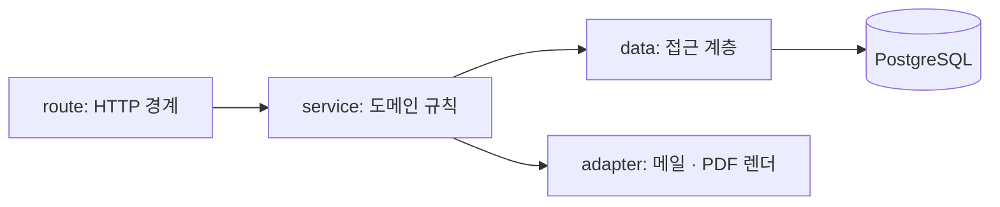

# 백엔드 아키텍처

- **근거 문서**: docs/PRD.md (0.1), docs/TRD.md (0.1)
- **관련 기술 결정**: TD-002(Next.js 단일 배포 단위), TD-003(관계형 DB·단일 접근 계층), TD-004(계산 단일 지점), TD-005(정기 파기), TD-006(PDF 미저장), TD-007(감사 이력), TD-008(HTTP+JSON·단일 오류 형식), TD-009(메일 어댑터), TD-012(소유자 조건), TD-013(경계 검증), TD-016(스케줄 실행), TD-017(헤드리스 렌더)
- **잠정인 부분**: §3.10(PDF 생성)은 TD-017·OQ-014에 걸려 있다. §3.8(집계)은 CF-002·OQ-015에 걸려 있다. §3.3의 계정 해지 경로는 CF-004에 걸린 잠정 설계다.

## 1. 이 문서가 정하는 것 / 정하지 않는 것

**정하는 것**: 계층 구조와 의존 방향, 모듈 분할과 책임, 요청 처리 경로(엔드포인트 목록과 요청·응답 모양), 오류 처리 규약, 정기 작업, 외부 연동 지점.

**정하지 않는 것**: 프레임워크·런타임 선택(TD-001·TD-002), 테이블 정의(`database.md`), 화면 구성(`frontend.md`), 인증 흐름 자체(`auth.md`), 신뢰 경계와 비밀값 취급(`security.md`), 구현 순서(Layer 3), 품질 게이트(Layer 4).

## 2. 구조

TD-002가 화면과 서버 로직을 한 배포 단위에 두기로 했으므로, 서버 쪽은 **네 계층**으로 나눈다.



| 계층 | 책임 | 책임지지 않는 것 |
|---|---|---|
| route | 요청 파싱, 스키마 검증(TD-013), 세션 확인, 응답·오류 직렬화 | 도메인 규칙, 금액 계산, 질의 |
| service | 도메인 규칙, 트랜잭션 경계, 상태 전이, 감사 이력 기록 | HTTP 개념(상태 코드·쿠키), SQL |
| data | 질의·저장, 소유자 조건과 삭제 필터의 기본 적용 | 도메인 규칙, 검증 |
| adapter | 외부 세계(메일 발송, HTML→PDF 렌더) | 도메인 규칙 |

**의존 방향**: route → service → data → DB, service → adapter. 역방향과 건너뛰기를 모두 금지한다(`overview.md §3`).

## 3. 설계 단위

### 3.1 계층 분할과 모듈 경계

- **근거**: NFR-004(모든 접근 경로에 소유자 조건), NFR-008(계산이 한 곳), FR 전반 / TD-002, TD-003, TD-012, TD-004
- **설계**: 도메인 모듈은 `accounts` · `clients` · `projects` · `contracts` · `invoices` · `sharing` · `notifications` · `search` 여덟 개다. 각 모듈은 route/service/data 세 파일 묶음을 갖는다. 모듈 간 호출은 **service → 다른 모듈의 service** 만 허용하고, 다른 모듈의 data를 직접 부르지 않는다. 공용 요소는 `money`(계산, §3.7), `errors`(§3.4), `audit`(§3.15), `session`(`auth.md §3.2`) 네 개뿐이며 이들은 도메인 모듈을 부르지 않는다.
- **왜 이 모양인가**: 계층을 넷으로 줄인 것은 개발 인원 1명·3개월이라는 여건(TRD 1.3절) 때문이다. 리포지터리·유스케이스·엔티티를 따로 두면 태스크마다 파일 네다섯 개를 오가게 되고, 그 비용을 요구사항이 요구한 적이 없다. 반대로 route에서 바로 SQL을 쓰지 않는 이유는 소유자 조건(TD-012)과 삭제 필터(TD-005)를 강제할 지점이 사라지기 때문이다.
- **검증 기준**: `route` 파일에서 SQL 문자열이나 DB 클라이언트 호출이 발견되지 않는다. 한 모듈의 `data` 를 다른 모듈에서 import 한 곳이 0건이다. `money` · `errors` · `audit` 이 도메인 모듈을 import 한 곳이 0건이다.
- **바뀔 수 있는 지점**: 없음

### 3.2 data 계층의 기본 조건 — 소유자와 삭제 필터

- **근거**: NFR-004(주소를 알아도 404), FR-022(검색 결과에 타 계정 문서 미포함), NFR-007·FR-023(삭제된 것은 조회되지 않음) / TD-012, TD-005, TD-003
- **설계**: data 계층의 모든 조회·수정·삭제 함수는 첫 인자로 `accountId` 를 받는다. 이 인자가 없는 함수 시그니처를 만들지 않는다. 함수 안에서는 `account_id = :accountId AND deleted_at IS NULL` 을 항상 포함한다. 예외는 두 가지이며 각각 이름으로 구분한다: 공유 토큰 조회(`findByShareToken*`, 소유자 조건 대신 토큰 조건 — `sharing` 모듈 안에만 존재), 정기 작업용 조회(`sweep*`, 삭제 필터를 일부러 뒤집는다 — `jobs` 안에만 존재). 결과가 0건이면 service는 "없음"을 반환하고 route는 404로 응답한다(§3.4).
- **왜 이 모양인가**: TD-012가 "어느 계층에서 강제하는가"를 이 문서로 넘겼다. 미들웨어에 두면 경로별로 자원 종류를 알아야 하고, DB 정책에 두면 로컬·테스트 환경까지 세션 변수를 흘려야 한다. **함수 시그니처에 두면 빠뜨린 곳이 타입 검사에서 걸린다** — TD-001이 언어를 하나로 정한 덕에 얻는 것이 이것이다. 예외를 이름 규칙으로 묶은 것은 "소유자 조건이 없는 함수"의 목록을 검색 한 번으로 만들 수 있게 하기 위해서다.
- **검증 기준**: data 계층 함수 중 첫 인자가 `accountId` 가 아닌 것은 `findByShareToken*` 과 `sweep*` 뿐이고, 그 목록의 파일이 각각 `sharing` · `jobs` 안에 있다. 계정 A 세션으로 계정 B의 클라이언트·프로젝트·계약서·인보이스 상세와 두 PDF 생성 주소(총 6경로)에 접근하면 모두 404이고 파일이 생성되지 않는다. 계정 A의 검색 결과에 계정 B의 문서가 없다.
- **바뀔 수 있는 지점**: 없음

### 3.3 요청 처리 경로 — 엔드포인트 목록

- **근거**: FR-001~FR-024 전반, NFR-004, NFR-012 / TD-008(HTTP+JSON, 자체 클라이언트 전용, 버전 정책 없음), TD-002
- **설계**: 경로는 `/api/*` 아래에 두고 화면 경로(`frontend.md §3.2`)와 겹치지 않게 한다. 서버 렌더 화면은 data/service를 직접 호출하고 자기 자신에게 HTTP 요청을 하지 않는다.

| 메서드·경로 | 하는 일 | 근거 FR |
|---|---|---|
| `POST /api/auth/signup` | 가입 + 로그인 | FR-001, FR-024 |
| `POST /api/auth/login` · `POST /api/auth/logout` | 로그인·로그아웃 | FR-001 |
| `POST /api/auth/password-reset` · `POST /api/auth/password-reset/confirm` | 재설정 요청·완료 | FR-002 |
| `DELETE /api/account` | 계정 해지 예약 (**잠정 — CF-004**) | FR-024, NFR-007 |
| `GET/POST /api/clients`, `GET/PATCH/DELETE /api/clients/:id` | 클라이언트 CRUD | FR-003 |
| `GET/POST /api/projects`, `GET/PATCH/DELETE /api/projects/:id` | 프로젝트 CRUD, 대금 조건 포함 | FR-004, FR-023 |
| `GET /api/projects/:id/summary` | 총 계약금액·청구·입금·미수금 | FR-005 |
| `GET /api/contract-templates` | 템플릿 목록 | FR-006 |
| `POST /api/projects/:id/contracts` | 계약서 생성(템플릿 또는 빈 문서) | FR-006 |
| `GET/PATCH/DELETE /api/contracts/:id` | 조회·조항 저장·삭제 | FR-007, FR-023 |
| `POST /api/contracts/:id/versions` | 발송본에서 새 버전 생성 | FR-007 |
| `POST /api/contracts/:id/send` | 상태를 발송으로 | FR-007 |
| `GET /api/contracts/:id/pdf` | PDF 생성·응답 | FR-008 |
| `POST /api/projects/:id/invoices` | 인보이스 생성(회차 승계) | FR-012, FR-013 |
| `GET/PATCH/DELETE /api/invoices/:id` | 조회·항목/과세 저장·삭제 | FR-013, FR-014, FR-023 |
| `POST /api/invoices/:id/status` | 상태 전이 | FR-018 |
| `GET /api/invoices/:id/pdf` | PDF 생성·응답 | FR-015 |
| `POST /api/invoices/:id/mail` | 메일 발송 | FR-017 |
| `POST /api/share-links` · `DELETE /api/share-links/:id` | 발급·폐기 | FR-009, FR-016 |
| `GET /s/:token` · `GET /s/:token/pdf` | **비인증** 공유 열람·PDF | FR-009, FR-016, NFR-012 |
| `GET /api/dashboard` | 미수금·연체 목록·진행 중 프로젝트 | FR-020 |
| `GET /api/notifications` · `POST /api/notifications/:id/read` | 알림 | FR-021 |
| `GET /api/search?q=` | 검색 | FR-022 |

  요청·응답 본문은 JSON이며 필드명은 camelCase, 금액은 정수(원), 날짜는 `YYYY-MM-DD`, 시각은 ISO-8601 UTC 문자열이다(`overview.md §5`). 목록 응답은 `{ items: [...] }` 형태이고 페이지네이션은 두지 않는다 — 데이터 규모(프로젝트 200·인보이스 1,000)에서 요구사항이 요구하지 않았다. PDF 응답만 JSON이 아니다(`application/pdf`).
- **왜 이 모양인가**: 인보이스 생성만 `/api/projects/:id/invoices` 아래에 둔 것은 FR-012의 "프로젝트를 거치지 않는 인보이스 생성 진입점이 존재하지 않는다"를 경로 구조로 못박기 위해서다. 경로가 곧 그 제약의 증거가 된다. 공유 경로만 `/api` 밖의 `/s/:token` 에 둔 것은 사람이 복사해 전달하는 주소이고(FR-009) 서버 렌더 HTML을 돌려주기 때문이다(NFR-012).
- **검증 기준**: `POST /api/invoices` (프로젝트 없는 생성 경로)는 존재하지 않아 404를 반환한다. 로그인하지 않은 상태로 `/api/*` 의 임의 경로를 호출하면 401 또는 로그인 화면 리다이렉트가 되고, `/s/:token` 만 200을 돌려준다. 모든 목록 응답이 `items` 키를 갖는다.
- **바뀔 수 있는 지점**: `DELETE /api/account` 는 **CF-004** 미해소 상태의 잠정 경로다 — PRD에 계정 해지 FR이 없다. PRD OQ-009가 뒤집히면 `/s/:token` 아래에 열람자 행동 경로가 추가된다.

### 3.4 오류 처리 규약

- **근거**: FR-003·FR-004·FR-013·FR-014(다수 수용 기준이 "해당 입력란에 오류가 표시된다"), FR-001(로그인 실패 시 어느 쪽이 틀렸는지 구분하지 않음), NFR-004(권한 위반 404) / TD-008, TD-012, TD-013
- **설계**: 모든 오류 응답은 하나의 형식을 쓴다.

```json
{ "error": { "code": "VALIDATION_FAILED",
             "message": "사업자등록번호는 숫자 10자리여야 합니다.",
             "fields": [ { "field": "bizRegNo", "message": "숫자 10자리로 입력해 주세요." } ] } }
```

| code | HTTP | 언제 |
|---|---|---|
| `VALIDATION_FAILED` | 400 | 스키마·도메인 규칙 위반. `fields` 필수 |
| `UNAUTHENTICATED` | 401 | 세션 없음 |
| `NOT_FOUND` | 404 | 없거나 남의 것(구분하지 않는다 — TD-012) |
| `CONFLICT` | 409 | 인보이스 번호 중복(FR-013), 이미 청구된 회차 확인(FR-012), 금지된 상태 전이(FR-018) |
| `RATE_OR_STATE_BLOCKED` 대신 위 셋으로 표현 | | 새 코드를 늘리지 않는다 |
| `EXTERNAL_FAILED` | 502 | 메일 발송 실패(FR-017) |
| `INTERNAL` | 500 | 그 외 |

  `message` 는 한국어 한 문장이고 화면이 그대로 띄운다. `fields[].field` 는 요청 본문의 필드 경로이며 화면의 입력란 식별자와 같다(`frontend.md §3.7`). **403을 쓰지 않는다** — 자원의 존재를 알리기 때문이다(TD-012). 로그인 실패는 `VALIDATION_FAILED` 에 `fields` 없이 단일 메시지로 응답한다(FR-001).
- **왜 이 모양인가**: 형식이 경로마다 갈리면 화면마다 오류 파싱 코드를 다시 쓰게 되고, "해당 입력란에 표시" 요구가 화면마다 다르게 구현된다(TD-008). 코드 목록을 일곱 개 이하로 묶은 것은 늘어난 코드마다 화면 분기가 하나씩 생기기 때문이다.
- **검증 기준**: 사업자등록번호를 9자리로 보내면 400과 함께 `fields[0].field == "bizRegNo"` 가 반환된다. 남의 인보이스 상세를 요청하면 404이고 본문에 그 인보이스의 어떤 값도 없다. 존재하지 않는 인보이스 요청도 동일한 상태 코드·코드 값을 돌려준다. 인증·검증·권한·서버 오류 네 응답이 모두 `error.code`·`error.message` 키를 갖는다. 잘못된 비밀번호로 로그인하면 이메일·비밀번호 중 무엇이 틀렸는지 응답에서 알 수 없다.
- **바뀔 수 있는 지점**: 없음

### 3.5 트랜잭션 경계와 감사 이력 기록 지점

- **근거**: FR-013(동시 생성), FR-018(상태 변경과 이력이 함께), FR-023(프로젝트와 인보이스 동반 삭제), NFR-009 / TD-003, TD-007
- **설계**: 트랜잭션은 service 함수 하나가 연다. route와 data는 트랜잭션을 열지 않는다. 한 트랜잭션 안에서 처리하는 묶음은 다음과 같다: ①인보이스 생성 = 채번 + 인보이스 + 항목, ②상태 전이 = 상태·시각 갱신 + `audit_events` 1건, ③공유 링크 발급/폐기 = `share_links` 변경 + 이력 1건, ④프로젝트 삭제 = 프로젝트·계약서·인보이스의 `deleted_at` 동시 기록, ⑤계약서 저장 = 조항 전체 교체 + 번호 재부여. 공유 열람 기록(`share.viewed`)만 예외로 응답 이후 별도 트랜잭션에서 기록한다 — 이력 기록 실패가 열람 자체를 막으면 NFR-012가 깨진다.
- **왜 이 모양인가**: 이력을 별도 트랜잭션에 두면 "상태는 바뀌었는데 이력이 없는" 행이 생기고, NFR-009의 검증 기준(3회 바꾸면 3건)이 간헐적으로 실패한다. 반대로 열람 기록까지 같은 트랜잭션에 묶으면 기록 실패가 곧 열람 실패가 된다 — 그쪽은 FR-010(P1)보다 NFR-012(P0)가 무겁다.
- **검증 기준**: 상태 전이 중 이력 삽입을 강제로 실패시키면 인보이스 상태도 바뀌지 않는다. 열람 이력 삽입을 강제로 실패시켜도 공유 화면은 정상 표시된다. 프로젝트 삭제 후 그 프로젝트의 인보이스 `deleted_at` 이 프로젝트와 같은 값이다.
- **바뀔 수 있는 지점**: 없음

### 3.6 프로젝트 대금 조건 검증

- **근거**: FR-004(비율 합 100% / 금액 합 = 총 계약금액 / 차액 표시), FR-012(회차 승계) / TD-013, TD-004
- **설계**: 회차 집합 검증은 `projects` service에서 저장 직전에 한 번 한다. 비율은 만분율 합이 정확히 10000, 금액은 합이 `total_amount` 와 정확히 같아야 한다. 실패 시 `VALIDATION_FAILED` 와 함께 `fields[].message` 에 **현재 합계 또는 차액을 숫자로** 담는다(FR-004의 수용 기준이 그 숫자를 요구한다). 비율과 금액의 혼용은 거부한다. 회차 0건은 통과다.
- **왜 이 모양인가**: 개별 회차에 CHECK를 걸 수는 있어도 집합 합계는 DB 제약으로 표현하기 어렵고(트리거가 필요하다), 무엇보다 "현재 합계를 응답에 담는다"는 요구를 DB 제약이 만족시킬 수 없다.
- **검증 기준**: 비율 5000/3000/1000으로 저장하면 거부되고 응답 메시지에 `90%` 또는 `9000` 에 해당하는 현재 합계가 포함된다. 금액 합이 총액보다 10,000원 적으면 거부되고 차액 10000이 응답에 포함된다. 비율 회차와 금액 회차를 섞어 보내면 거부된다.
- **바뀔 수 있는 지점**: 없음

### 3.7 금액·세액 계산 모듈

- **근거**: FR-014(항목 금액 = 수량×단가, 공급가액 합, 부가세 10% 원 단위 절사, 원천징수 3.3% 원 단위 절사, 실수령액, 음수 금지), NFR-008(오차 없음), NFR-016(KRW 단일) / TD-004, TD-014
- **설계**: `money` 모듈이 순수 함수 네 개를 노출한다: `lineAmount(quantity, unitPrice)`, `supplyTotal(items)`, `taxOf(supply, mode)`, `settle(supply, mode) → { tax, billed, net }`. 전부 정수 연산이며 부동소수를 쓰지 않는다. 절사는 `Math.trunc` 한 지점에서만 한다(부가세 = `trunc(supply * 10 / 100)`, 원천징수 = `trunc(supply * 33 / 1000)`). service는 이 결과를 `database.md §3.6` 의 네 컬럼에 저장하고, 화면·PDF·집계는 저장값을 읽기만 한다. **화면과 PDF에 계산 코드를 두지 않는다.**
- **왜 이 모양인가**: TD-004가 "계산은 서버 한 지점"을 정했고, 이 절은 그 지점을 함수 네 개로 고정한다. 3.3%를 `0.033` 부동소수로 쓰지 않고 `33/1000` 정수 연산으로 쓰는 것은 `1000003 * 0.033` 이 환경에 따라 33000.099로 떨어질 수 있어서다 — NFR-008이 금지한 오차가 정확히 그 자리에서 생긴다.
- **검증 기준**: 공급가액 1,000,003원에 원천징수를 적용하면 `{tax: 33000, billed: 1000003, net: 967003}` 이 나온다. 같은 인보이스의 화면 값·PDF 값·프로젝트 상세 집계 값이 문자열 단위로 같다. 부가세 모드에서 공급가액 1,000,005원이면 부가세 100,000원(절사)·청구 1,100,005원이다. 수량 또는 단가가 음수인 입력은 `money` 함수 호출 전 검증에서 거부된다.
- **바뀔 수 있는 지점**: PRD OQ-004(세금 처리 범위)가 "금액만"으로 오면 `taxOf`·`settle` 이 사라진다.

### 3.8 대시보드·프로젝트 집계 질의

- **근거**: FR-005, FR-020, NFR-001(P95 1.5초) / TD-003, TD-002, TD-004
- **설계**: 화면당 질의 수를 고정한다. **대시보드는 3개**(① 미수금·청구·입금 합계 1개 ② 연체 목록 1개 ③ 진행 중 프로젝트 + 프로젝트별 미수금 1개), **프로젝트 상세는 3개**(① 프로젝트+클라이언트 ② 계약서 목록 ③ 인보이스 목록 + 집계). 목록 안에서 행마다 추가 질의를 하지 않는다. 집계 정의는 `database.md §3.10` 을 따르며 여기서 다시 정의하지 않는다. 연체 판정 조건도 `database.md §3.12` 의 조건식을 그대로 쓴다.
- **왜 이 모양인가**: NFR-001을 깨는 가장 흔한 방식은 목록 렌더 중 행마다 질의가 하나씩 붙는 것이고, 그건 코드만 봐서는 안 보인다. 화면당 질의 수를 숫자로 못박아 두면 Layer 4가 셀 수 있는 검증 대상이 된다.
- **검증 기준**: 프로젝트 200건·인보이스 1,000건 시드에서 대시보드 1회 렌더에 실행된 질의가 3개이고 응답 P95가 1.5초 이내다. 프로젝트 상세도 질의 3개, P95 1.5초 이내다. 인보이스 50건인 프로젝트에서도 질의 수가 늘지 않는다.
- **바뀔 수 있는 지점**: **CF-002**(집계에 쓰는 금액 기준) 미해소. OQ-015 스파이크가 실패하면 `database.md §3.10` 과 함께 저장 집계로 다시 그린다.

### 3.9 인보이스 생성과 상태 전이 서비스

- **근거**: FR-012(값 승계, 이미 청구된 회차 경고 후 진행, 직접 입력 가능), FR-013, FR-018(전이 규칙·이력), FR-014(항목 0개 발송 금지) / TD-003, TD-007
- **설계**: 생성은 ①프로젝트 소유 확인 ②회차 지정 시 해당 회차로 발행된 인보이스 존재 검사 → 있으면 `CONFLICT` 로 응답하고, 요청에 `confirmed: true` 가 있으면 진행 ③클라이언트 스냅샷 채우기 ④채번 ⑤항목·금액 저장 순으로 한 트랜잭션에서 한다. 상태 전이는 `POST /api/invoices/:id/status` 하나가 받고 `{ to: 'sent'|'paid' }` 를 받아 `database.md §3.12` 의 표를 그대로 적용한다. 허용되지 않는 전이는 `CONFLICT` 와 한국어 사유를 돌려준다.
- **왜 이 모양인가**: 전이 경로를 상태별 엔드포인트(`/send`, `/pay`, `/unpay`)로 흩으면 규칙이 세 곳에 나뉘고, 금지 전이(초안→입금완료)를 어디서 막을지가 애매해진다. 한 경로에서 표 하나를 보게 하면 규칙이 한 곳에만 있다. 재청구 경고를 서버가 `CONFLICT` 로 돌려주고 확인 플래그로 재요청받는 것은, 화면만 경고를 알면 API 직접 호출에서 그 규칙이 사라지기 때문이다.
- **검증 기준**: 이미 청구된 회차로 인보이스를 만들면 409와 "이미 청구된 회차입니다"가 반환되고, `confirmed: true` 로 다시 보내면 생성된다. 항목이 없는 인보이스를 `to: 'sent'` 로 보내면 409와 사유가 반환된다. 초안 인보이스를 `to: 'paid'` 로 보내면 409다. `paid → sent` 로 되돌리면 `paid_at` 이 비고 미수금 합계가 그 금액만큼 늘어난다.
- **바뀔 수 있는 지점**: 없음

### 3.10 PDF 생성 경로

- **근거**: FR-008(계약서 PDF·페이지 나눔·"n / m" 쪽 번호), FR-015(인보이스 PDF·항목 20개 초과 분할·합계는 마지막 페이지), NFR-002(10초·3초 초과 시 진행 표시), NFR-014(모든 페이지 고지), NFR-004(생성 전 권한 검사) / TD-017, TD-006, TD-012
- **설계**: 요청 처리 순서는 ①세션·소유자 확인 또는 공유 토큰 확인 → ②문서 데이터 조회 → ③인쇄용 HTML 템플릿 렌더 → ④헤드리스 브라우저 어댑터가 PDF 바이트 생성 → ⑤`application/pdf` 로 응답. **파일로 저장하지 않는다**(TD-006). 브라우저 인스턴스는 프로세스당 하나를 재사용하고 페이지만 새로 연다. **동시 생성은 2건으로 제한**하고, 초과 요청은 대기시킨다 — TD-016이 단일 인스턴스를 정했으므로 무제한 동시 렌더는 NFR-001의 응답 시간을 함께 무너뜨린다. 쪽 번호·머리말·꼬리말(고지 문구)은 인쇄 CSS가 만든다. 한글 폰트는 컨테이너 이미지에 포함한다(TD-017).
  진행 표시(NFR-002)는 로그인 화면에서 fetch로 요청해 응답 대기 중 표시로 처리한다(`frontend.md §3.9`). **JS를 쓰지 않는 공유 열람 화면에서는 진행 표시를 제공할 수 없다 — CF-005.**
- **왜 이 모양인가**: 권한 검사를 렌더 뒤에 두면 남의 문서에 대해서도 렌더 비용을 치르고, NFR-004의 "파일이 생성되지 않는다"를 문자 그대로 만족시키지 못한다. 동시 실행 상한을 둔 것은 헤드리스 브라우저가 이 배포 단위에서 가장 무거운 소비자이기 때문이다(TRD 9.5절이 메모리 상향 가능성을 이미 지적했다).
- **검증 기준**: 조항 30개 계약서와 항목 20개 인보이스의 PDF 생성 시간을 각 5회 재면 중앙값이 10초 이내다. 생성된 PDF의 모든 페이지에 고지 문구와 `n / m` 쪽 번호가 있다. 항목 25개 인보이스의 합계 영역이 마지막 페이지에만 있다. 다른 계정의 PDF 주소로 요청하면 404이고 렌더가 시작되지 않는다(브라우저 페이지 열림 횟수 0). PDF 생성 3건을 동시에 요청하면 세 번째가 대기한 뒤 성공하고, 같은 시각의 대시보드 응답이 1.5초를 넘지 않는다.
- **바뀔 수 있는 지점**: **TD-017이 스파이크 필요(OQ-014)** 상태다. 10초를 넘거나 호스팅 컨테이너에서 헤드리스 브라우저가 뜨지 않으면 PDF 작성 라이브러리로 교체되며, 그때 이 절과 `frontend.md §3.9` 의 인쇄 템플릿 설계를 다시 그린다. **CF-005**(무JS 진행 표시)도 미해소다.

### 3.11 공유 링크 서비스

- **근거**: FR-009·FR-016(발급·폐기·존재 비노출·초안 인보이스 공유 금지), FR-010(열람 기록), FR-023, NFR-005, NFR-012 / TD-011, TD-007
- **설계**: 발급은 128비트 CSPRNG 값을 URL 안전 문자열로 인코딩해 사용자에게 한 번만 보여 주고, DB에는 해시만 저장한다(`database.md §3.8`). 초안 인보이스에 대한 발급 요청은 `CONFLICT` 로 거부한다(FR-016). 열람 처리는 ①토큰 해시로 링크 조회 ②`revoked_at IS NULL` ③대상 문서 `deleted_at IS NULL` ④문서 데이터 조회(소유자의 다른 데이터는 조회하지 않는다) ⑤응답 후 `share.viewed` 이력 기록(로그인 세션이 있으면 `actor='owner'` 로 기록하고 열람 횟수 집계에서 제외). ②③④ 어디서 걸려도 **같은 404 화면**을 돌려준다.
- **왜 이 모양인가**: 폐기·삭제·부재의 응답을 다르게 만들면 그 차이만으로 문서의 존재를 알 수 있고, FR-009의 마지막 수용 기준이 그것을 금지한다. 응답을 한 곳에서 만들면 분기마다 실수할 자리가 사라진다.
- **검증 기준**: 폐기된 토큰, 삭제된 문서의 토큰, 존재하지 않는 토큰 세 경우의 응답 상태 코드와 본문이 동일하다. 초안 인보이스의 공유 링크 발급 요청이 409와 "발송 상태로 바꾼 뒤 공유할 수 있습니다"를 돌려준다. 공유 화면 HTML에 소유자의 다른 프로젝트·클라이언트·인보이스로 가는 링크나 식별자가 없다.
- **바뀔 수 있는 지점**: PRD OQ-009 미해소 — "확인 버튼"이 추가되면 열람자 쓰기 경로가 처음 생기고 이 절과 `security.md §3.1` 의 신뢰 경계를 다시 그린다.

### 3.12 메일 발송 어댑터

- **근거**: FR-002(재설정 메일), FR-017(인보이스 메일, 실패 시 상태 불변·사유 표시, 수신자 형식 검증), NFR-015 / TD-009(잠정), TD-018(로컬 메일 캡처)
- **설계**: `mailer` 어댑터 인터페이스 하나(`send({to, subject, body})`)를 두고 구현체를 환경별로 주입한다(로컬=캡처, 운영=제공자). service는 인터페이스만 안다. 인보이스 메일은 **본문에 공유 링크만 담고 PDF를 첨부하지 않는다**(TD-006이 파일을 만들지 않기로 했고, 첨부는 개인정보를 메일 제공자에게 더 많이 넘긴다 — NFR-015). 발송 실패는 `EXTERNAL_FAILED` 로 그대로 올리고 인보이스 상태를 바꾸지 않는다. 성공 시 발송 시각·수신자 주소를 인보이스에 기록한다.
- **왜 이 모양인가**: TD-009가 잠정(OQ-011 대기)이므로 제공자가 바뀔 것을 전제로 한다. 인터페이스가 하나면 교체가 구현체 하나로 끝난다. 실패를 삼키지 않는 것은 FR-017의 수용 기준이 "실패 사실과 사유가 표시되고 상태는 바뀌지 않는다"이기 때문이다.
- **검증 기준**: 로컬 메일 캡처 환경에서 비밀번호 재설정을 요청하면 재설정 링크가 담긴 메일 1건이 잡힌다. 어댑터가 예외를 던지도록 강제하면 화면에 사유가 표시되고 인보이스 상태·발송 시각이 그대로다. 수신자 이메일이 비어 있으면 어댑터를 호출하기 전에 400으로 거부된다.
- **바뀔 수 있는 지점**: TD-009 잠정. PRD OQ-011 실험 결과로 제공자가 바뀌면 구현체만 교체한다(이 절의 구조는 유지).

### 3.13 정기 작업 (하루 1회)

- **근거**: NFR-007(30일 경과 파기), NFR-009(이력 1년), FR-019(연체), FR-021(연체 알림 1건, 중복 없음) / TD-005, TD-016(호스팅 스케줄 실행), TD-007
- **설계**: 스케줄 실행이 호출하는 경로 하나(`POST /internal/jobs/daily`, 호출자 인증은 공유 비밀값 — `security.md §3.3`)가 다음을 순서대로 한다. ①연체 알림 생성: 연체 조건을 만족하는 인보이스에 대해 `notifications` 를 UNIQUE 충돌 무시로 삽입 ②논리 삭제 30일 경과분 물리 파기 ③해지 30일 경과 계정 파기 ④`audit_events` 1년 경과분 삭제. 각 단계는 독립 트랜잭션이며 실패해도 다음 단계를 진행하고 결과를 로그에 남긴다. **연체 '판정' 자체는 이 작업이 하지 않는다** — 판정은 조회 시점의 파생 조건이다(`database.md §3.12`).
- **왜 이 모양인가**: 배치가 판정까지 맡으면 배치가 안 돈 날 화면이 틀린 값을 보여 준다. 배치에 남기는 것은 "기록이 필요한 것"(알림·파기)뿐이다. 단계별 독립 트랜잭션은 파기 실패가 알림 생성을 되돌리지 않게 하기 위해서다.
- **검증 기준**: 기한이 지난 인보이스가 3건일 때 작업을 실행하면 알림 3건이 생기고, 다시 실행해도 3건 그대로다. `deleted_at` 을 31일 전으로 만든 문서가 작업 후 DB에서 사라진다. 인증 비밀값 없이 `/internal/jobs/daily` 를 호출하면 404가 반환된다. 작업 실행 기록이 로그에 1줄 남는다.
- **바뀔 수 있는 지점**: TD-016 잠정(OQ-010·OQ-013) — 호스팅이 바뀌면 스케줄 호출 방식만 바뀌고 이 경로는 유지된다.

### 3.14 검색

- **근거**: FR-022(클라이언트명·프로젝트명 부분 일치, 대소문자 무시, 종류별 묶음, 빈 검색어면 실행 안 함, 타 계정 제외) / TD-003, TD-012
- **설계**: `GET /api/search?q=` 하나가 프로젝트·계약서·인보이스를 종류별로 묶어 돌려준다. 매칭 대상은 클라이언트명과 프로젝트명 두 필드이며, 계약서·인보이스는 소속 프로젝트가 매칭되면 결과에 포함된다. 질의는 `ILIKE '%' || :q || '%'` 이고 `account_id` 와 `deleted_at IS NULL` 을 포함한다. `q` 가 공백만이면 400으로 거부한다(질의를 실행하지 않는다). 종류별 상한은 각 50건이며 그 이상은 "더 좁혀 검색하세요"를 함께 돌려준다.
- **왜 이 모양인가**: TRD 1.2절이 전문 검색 인프라를 명시적으로 배제했고, 계정당 데이터가 수백 건 규모라 스캔이 성능 문제가 되지 않는다. 계약서·인보이스 자체 본문을 검색 대상에 넣지 않은 것은 FR-022가 "클라이언트명 또는 프로젝트명으로 찾는다"만 요구했기 때문이다 — 본문 검색을 넣으면 요구사항 신설이다.
- **검증 기준**: 대문자로 검색해도 소문자 프로젝트명이 결과에 나온다. 이름 중간 두 글자로 검색해도 결과에 나온다. 다른 계정의 같은 이름 프로젝트는 결과에 없다. 빈 문자열·공백으로 요청하면 400이고 질의가 실행되지 않는다. 결과가 없으면 세 묶음이 모두 빈 배열이다.
- **바뀔 수 있는 지점**: 없음

### 3.15 감사 이력 기록 지점

- **근거**: NFR-009, FR-010, FR-018 / TD-007
- **설계**: `audit` 공용 모듈이 `record(event)` 하나를 노출하고, 이를 호출하는 곳은 정확히 네 군데다 — 인보이스 상태 전이(§3.9), 공유 링크 발급·폐기(§3.11), 공유 링크 열람(§3.11). 다른 곳에서 `audit_events` 에 직접 쓰지 않는다. 이력에 담는 필드는 `database.md §3.9` 가 정의한 것뿐이며 **개인정보를 담지 않는다**.
- **왜 이 모양인가**: 기록 지점이 흩어지면 "어떤 사건이 이력에 남는가"의 답이 코드 전체 검색이 되고, NFR-009가 요구한 세 종류가 실제로 다 남는지 아무도 판정할 수 없다.
- **검증 기준**: `record(` 호출 지점이 4개이고 전부 위 세 기능 안에 있다. `audit_events` 에 대한 INSERT가 `audit` 모듈 밖에 없다. 상태를 3회 바꾸면 이력 3건이 남는다.
- **바뀔 수 있는 지점**: 없음

## 4. 이 영역이 만족시키는 요구사항

| 요구사항 | 설계 단위 |
|---|---|
| FR-001, FR-002 | §3.3, §3.4 (흐름은 `auth.md`) |
| FR-003 | §3.2, §3.3, §3.4 |
| FR-004 | §3.6 |
| FR-005 | §3.8 |
| FR-006, FR-007 | §3.3, §3.5 |
| FR-008, FR-015 | §3.10 |
| FR-009, FR-016 | §3.11 |
| FR-010 | §3.11, §3.15 |
| FR-011 | §3.10 (PDF 고지), `frontend.md §3.6` |
| FR-012, FR-013 | §3.9, §3.5 |
| FR-014 | §3.7 |
| FR-017 | §3.12 |
| FR-018 | §3.9, §3.15 |
| FR-019, FR-021 | §3.13, §3.8 |
| FR-020 | §3.8 |
| FR-022 | §3.14 |
| FR-023 | §3.5, §3.13 |
| FR-024 | §3.3 (해지 경로 — 잠정) |
| NFR-001 | §3.8, §3.10(동시 제한) |
| NFR-002 | §3.10 |
| NFR-004 | §3.2, §3.4 |
| NFR-005, NFR-012 | §3.11 |
| NFR-007 | §3.13 |
| NFR-008 | §3.7 |
| NFR-009 | §3.15, §3.5 |
| NFR-014 | §3.10 |
| NFR-015 | §3.12 (첨부 없음), §3.15 |
| NFR-016 | §3.7 |
