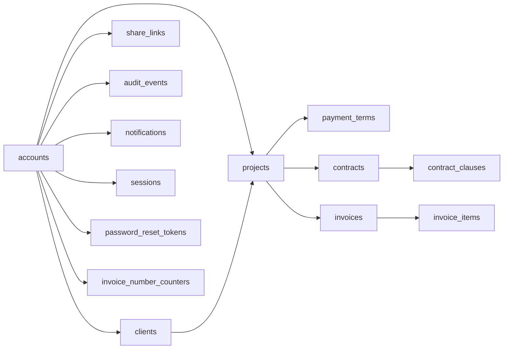

# 데이터베이스 아키텍처

- **근거 문서**: docs/PRD.md (0.1), docs/TRD.md (0.1)
- **관련 기술 결정**: TD-003(관계형 DB 1개), TD-004(금액 정수·계산 단일 지점), TD-005(논리 삭제 + 30일 파기), TD-006(PDF 미저장), TD-007(추가 전용 감사 이력), TD-010(서버 세션), TD-011(공유 토큰 해시 저장), TD-012(소유자 조건), TD-013(DB 제약 이중화)
- **잠정인 부분**: §3.6(금액 컬럼)과 §3.10(집계 정의)은 CF-002 결과에 따라 집계 해석이 바뀔 수 있다. §3.14(인덱스)는 OQ-015 스파이크 결과에 걸려 있다. §3.5(계약서·템플릿)는 PRD OQ-007 미해소로 본문 내용이 비어 있는 상태의 구조만 고정한다.

## 1. 이 문서가 정하는 것 / 정하지 않는 것

**정하는 것**: 개체와 관계, 테이블·컬럼·타입·제약, 인덱스와 그 근거 질의, 상태값과 전이 규칙, 논리 삭제·파기의 구현 방식, 마이그레이션 규칙.

**정하지 않는 것**: 어떤 DB를 쓸지(TD-003이 정했다), 접근 계층 라이브러리 선택(TD-003에 흡수), 질의를 어느 모듈이 호출하는지(`backend.md §3.1`), 화면 표시 형식(`frontend.md`), 개발 순서·마이그레이션 작성 순서(Layer 3).

이름은 모두 snake_case, 단수 개체의 복수형 테이블명을 쓴다. 시각 컬럼은 전부 `timestamptz` 이며 UTC로 저장한다(TD-003).

## 2. 구조

`accounts` 가 모든 소유 관계의 뿌리다. `clients` 와 `projects` 를 제외한 문서성 테이블도 전부 `account_id` 를 직접 갖는다 — 조인을 거치지 않고 소유자 조건을 걸기 위해서다(§3.2).

## 3. 설계 단위

### 3.1 소유 경계와 account_id 비정규화

- **근거**: NFR-004(타인 데이터는 주소를 알아도 404), FR-022(검색 결과에 타 계정 문서 미포함) / TD-012(모든 접근에 소유자 조건), TD-003
- **설계**: `clients` · `projects` · `contracts` · `invoices` · `share_links` · `audit_events` · `notifications` 는 모두 `account_id uuid NOT NULL REFERENCES accounts(id)` 를 직접 갖는다. `contract_clauses` · `invoice_items` · `payment_terms` 는 부모를 통해서만 접근하며 `account_id` 를 갖지 않는다 — 이 세 테이블은 단독 조회 경로가 없다(`backend.md §3.3` 의 엔드포인트 목록에 단독 경로가 없다). 부모–자식 관계에는 `ON DELETE CASCADE` 를 건다(물리 파기 시점에만 발동한다, §3.13).
- **왜 이 모양인가**: `invoices → projects → clients → accounts` 를 매번 조인해 소유자를 확인하면, 조인 하나를 빠뜨린 경로가 곧 NFR-004 위반이 된다. 소유자 조건을 모든 상위 테이블에서 **같은 이름의 컬럼 하나**로 표현하면 빠뜨린 곳을 기계적으로 찾을 수 있다. 자식 테이블까지 비정규화하지 않은 것은 단독 조회 경로가 없어 조건을 걸 자리 자체가 없기 때문이다.
- **검증 기준**: 계정 A의 세션으로 계정 B의 클라이언트·프로젝트·계약서·인보이스 상세 주소에 접근하면 네 경로 모두 404가 반환되고 응답 본문에 대상 데이터가 없다. `account_id` 컬럼을 가진 테이블 목록과 위 여섯 개가 일치한다.
- **바뀔 수 있는 지점**: PRD OQ-003이 '스튜디오'로 뒤집히면 소유 주체가 계정에서 조직으로 바뀌고 이 절과 `auth.md §3.5` 를 다시 그린다.

### 3.2 accounts

- **근거**: FR-001(이메일 가입·로그인), FR-024(계정 삭제 후 파기 시점), NFR-006(비밀번호 평문 금지), NFR-007(계정 해지 30일 뒤 파기) / TD-010(Argon2id), TD-005
- **설계**:

| 컬럼 | 타입 | 제약 |
|---|---|---|
| `id` | uuid | PK |
| `email` | text | NOT NULL, 소문자 정규화 후 UNIQUE |
| `password_hash` | text | NOT NULL (Argon2id 인코딩 문자열) |
| `privacy_agreed_at` | timestamptz | NOT NULL (FR-024) |
| `created_at` / `updated_at` | timestamptz | NOT NULL |
| `deleted_at` | timestamptz | NULL이면 활성 (해지 시각) |

  이메일 유일성은 애플리케이션 검증(TD-013)과 UNIQUE 제약 양쪽에 건다. 해지된 계정의 이메일은 물리 파기 전까지 재사용되지 않는다(UNIQUE가 그대로 살아 있다).
- **왜 이 모양인가**: 역할 컬럼을 두지 않는다 — TD-010이 역할을 '소유자' 단일로 정했고, 쓰이지 않는 역할 컬럼은 Layer 5에서 권한 분기를 만들어 낸다. 비밀번호 해시를 별도 테이블로 분리하지 않은 것은 계정당 자격 증명이 하나뿐이기 때문이다(소셜 로그인은 PRD 범위 밖).
- **검증 기준**: 가입 후 `accounts` 어느 컬럼에서도 입력한 비밀번호 문자열이 검색되지 않는다. 같은 이메일로 두 번 가입하면 두 번째는 저장되지 않고 UNIQUE 위반이 아니라 "이미 사용 중인 이메일" 응답이 반환된다. 대소문자만 다른 이메일로 가입하면 중복으로 거부된다.
- **바뀔 수 있는 지점**: CF-004(계정 해지 흐름 미정의)가 해소되면 해지 예약·철회 컬럼이 추가될 수 있다.

### 3.3 clients

- **근거**: FR-003(상호·담당자·연락처·사업자등록번호·주소·메모, 상호 필수, 사업자번호 10자리, 연결 프로젝트가 있으면 삭제 불가), FR-022(클라이언트명 검색), NFR-015(개인정보 국내 저장) / TD-003, TD-005, TD-013
- **설계**:

| 컬럼 | 타입 | 제약 |
|---|---|---|
| `id` | uuid | PK |
| `account_id` | uuid | NOT NULL, FK |
| `name` | text | NOT NULL, 공백만인 값 금지(CHECK) |
| `contact_name` | text | NULL |
| `email` | text | NULL |
| `phone` | text | NULL |
| `biz_reg_no` | char(10) | NULL, CHECK(숫자 10자리) |
| `address` | text | NULL |
| `memo` | text | NULL |
| `created_at`/`updated_at`/`deleted_at` | timestamptz | |

  사업자등록번호는 하이픈 없는 숫자 10자리로 정규화해 저장하고 표시 시점에만 하이픈을 넣는다(`frontend.md §3.8`). 삭제 제한은 DB 제약이 아니라 서비스 계층에서 검사한다 — 연결 프로젝트 **개수**를 응답에 담아야 하기 때문이다(FR-003).
- **왜 이 모양인가**: 상호 외 전부 NULL 허용은 FR-003의 "상호 외 항목은 비워도 저장된다"를 그대로 옮긴 것이다. 사업자등록번호를 `char(10)` 으로 고정한 것은 형식 오류를 저장 직전에 DB가 한 번 더 잡게 하기 위해서다(TD-013의 이중화).
- **검증 기준**: 상호만 입력해 저장하면 목록에 나타난다. 상호를 공백 한 칸으로 저장하면 거부된다. 사업자등록번호에 `123-45-6789` 를 보내면 정규화되어 `1234567890` 로 저장되고, 9자리를 보내면 저장되지 않는다. 프로젝트 2건이 연결된 클라이언트 삭제를 요청하면 삭제되지 않고 응답에 `2` 가 포함된다.
- **바뀔 수 있는 지점**: 없음

### 3.4 projects 와 payment_terms

- **근거**: FR-004(프로젝트·총 계약금액·기간·대금 조건·상태, 비율 합 100% / 금액 합 일치 / 날짜 순서 / 음수 금지 / 대금 조건 비워도 저장), FR-005(프로젝트 상세 집계), FR-012(회차 승계), NFR-008(금액 정수) / TD-003, TD-004, TD-013
- **설계**:

`projects`

| 컬럼 | 타입 | 제약 |
|---|---|---|
| `id` | uuid | PK |
| `account_id` | uuid | NOT NULL, FK |
| `client_id` | uuid | NOT NULL, FK(clients) |
| `name` | text | NOT NULL |
| `total_amount` | bigint | NOT NULL, CHECK(>= 0) — 원 단위 정수 |
| `start_date` / `end_date` | date | NULL, CHECK(end_date IS NULL OR start_date IS NULL OR end_date >= start_date) |
| `status` | text | NOT NULL, CHECK IN ('planned','active','done','onhold') |
| `created_at`/`updated_at`/`deleted_at` | timestamptz | |

`payment_terms` (회차)

| 컬럼 | 타입 | 제약 |
|---|---|---|
| `id` | uuid | PK |
| `project_id` | uuid | NOT NULL, FK, ON DELETE CASCADE |
| `position` | int | NOT NULL, UNIQUE(project_id, position) |
| `label` | text | NOT NULL, CHECK IN ('deposit','interim','balance') |
| `ratio_bp` | int | NULL, CHECK(0 < ratio_bp <= 10000) — 만분율 |
| `amount` | bigint | NULL, CHECK(>= 0) |
| CHECK | | `ratio_bp` 와 `amount` 중 정확히 하나만 NOT NULL |

  한 프로젝트의 회차는 전부 비율이거나 전부 금액이다(혼용 금지). 합계 검사(비율 10000, 금액 = `total_amount`)는 회차 집합 전체에 대한 규칙이므로 DB CHECK가 아니라 서비스 계층의 트랜잭션 안에서 수행한다(`backend.md §3.6`). 회차가 0건인 프로젝트는 정상 상태다.
- **왜 이 모양인가**: 비율을 백분율 소수가 아니라 **만분율 정수**로 둔 것은 NFR-008 때문이다. `33.33%` 를 부동소수로 두면 세 회차 합이 100이 되는지 판정하는 것부터 오차에 걸린다. 회차를 컬럼(착수금·중도금·잔금)이 아니라 행으로 둔 것은 FR-012가 "선택한 회차"를 인보이스에서 가리켜야 하고, 이미 청구된 회차를 판정해야 하기 때문이다(§3.8의 `payment_term_id`).
- **검증 기준**: 비율 회차 3건을 5000/3000/1000(=90%)으로 저장하면 거부되고 응답에 현재 합계가 포함된다. 금액 회차 합이 총 계약금액과 1원 다르면 거부되고 차액이 응답에 포함된다. `end_date` 가 `start_date` 보다 앞서면 DB 제약에서 거부된다. `total_amount` 에 -1을 넣으면 저장되지 않는다. 회차 없이 프로젝트를 저장하면 성공한다.
- **바뀔 수 있는 지점**: 없음

### 3.5 contracts · contract_clauses · contract_templates

- **근거**: FR-006(템플릿 선택과 변수 채움, 미입력 항목은 "[미입력]", 생성 후 프로젝트 변경이 본문에 반영되지 않음), FR-007(조항 편집·추가·삭제·순서, 저장 시 번호 재부여, 발송된 계약서는 새 버전, 조항 0개 저장 금지), FR-011(고지) / TD-003, TD-002
- **설계**:

`contracts`

| 컬럼 | 타입 | 제약 |
|---|---|---|
| `id` | uuid | PK |
| `account_id` / `project_id` | uuid | NOT NULL, FK |
| `title` | text | NOT NULL |
| `template_code` | text | NULL (빈 계약서면 NULL) |
| `status` | text | NOT NULL, CHECK IN ('draft','sent') |
| `version` | int | NOT NULL, 기본 1 |
| `root_contract_id` | uuid | NOT NULL, 최초 버전은 자기 id |
| `party_snapshot` | jsonb | NOT NULL — 생성 시점의 공급자·클라이언트·금액·기간 값 사본 |
| `sent_at` | timestamptz | NULL |
| `created_at`/`updated_at`/`deleted_at` | timestamptz | |

`contract_clauses`: `id`, `contract_id`(FK, CASCADE), `position int NOT NULL`, `heading text`, `body text NOT NULL`, UNIQUE(contract_id, position).

`contract_templates`: `code`(PK), `title`, `body_source`(조항 배열 jsonb), `version`, `is_active`. **템플릿 본문 내용은 PRD OQ-007이 막고 있으므로 이 문서는 구조만 고정하고 내용은 비운다.**

- **왜 이 모양인가**: `party_snapshot` 이 있는 이유는 FR-006의 "초안 생성 후 프로젝트의 금액을 바꿔도 계약서 본문은 바뀌지 않는다" 하나 때문이다. 참조로 두면 이 기준을 만족시킬 수 없다. 새 버전을 별도 행 + `root_contract_id` 로 둔 것은 FR-007이 발송본을 불변으로 요구하는데, 같은 행을 갱신하면 발송된 문서와 화면이 달라지기 때문이다. 조항을 텍스트 한 덩어리가 아니라 행으로 나눈 것은 순서 변경과 번호 재부여가 요구사항이기 때문이다.
- **검증 기준**: 템플릿으로 초안을 만든 뒤 프로젝트의 총 계약금액을 바꾸고 계약서를 다시 열면 본문 금액이 그대로다. 조항 3건의 순서를 바꿔 저장하면 `position` 이 1,2,3으로 다시 매겨진다. 조항을 모두 지우고 저장하면 거부된다. `status='sent'` 인 계약서의 조항 수정 요청은 거부되고 새 버전 생성 안내가 반환된다.
- **바뀔 수 있는 지점**: PRD OQ-007이 "공개 표준계약서를 쓸 수 없다"로 오면 `contract_templates` 의 행이 비게 되고 FR-006의 템플릿 선택 화면이 사라진다 — 구조는 남지만 `template_code` 가 항상 NULL이 된다. PRD OQ-001(전자서명)이 뒤집히면 서명 개체가 추가되고 이 절 전체를 다시 그린다.

### 3.6 invoices 와 invoice_items

- **근거**: FR-012(값 승계·회차 연결), FR-013(번호), FR-014(항목·과세 방식·절사), FR-015(PDF 항목), FR-018(상태), FR-019(연체 판정), FR-020(미수금) / TD-003, TD-004, TD-007
- **설계**:

`invoices`

| 컬럼 | 타입 | 제약 |
|---|---|---|
| `id` | uuid | PK |
| `account_id` / `project_id` | uuid | NOT NULL, FK |
| `number` | char(9) | NOT NULL, `YYYY-NNNN` 형식 CHECK, UNIQUE(account_id, number) |
| `payment_term_id` | uuid | NULL, FK(payment_terms) |
| `issue_date` | date | NOT NULL |
| `due_date` | date | NULL (NULL이면 연체 판정 대상이 아니다 — FR-019) |
| `status` | text | NOT NULL, CHECK IN ('draft','sent','paid') |
| `tax_mode` | text | NOT NULL, CHECK IN ('vat','withholding','none') |
| `supply_amount` | bigint | NOT NULL, CHECK(>= 0) |
| `tax_amount` | bigint | NOT NULL, CHECK(>= 0) — 부가세 또는 원천징수액 |
| `billed_amount` | bigint | NOT NULL — 청구 금액 |
| `net_amount` | bigint | NOT NULL — 실수령액 |
| `client_snapshot` | jsonb | NOT NULL — 발행 시점 공급받는자 정보 |
| `bank_account` | text | NULL |
| `sent_at` / `paid_at` | timestamptz | NULL |
| `created_at`/`updated_at`/`deleted_at` | timestamptz | |

`invoice_items`: `id`, `invoice_id`(FK, CASCADE), `position int`, `description text NOT NULL`, `quantity int NOT NULL CHECK(>=0)`, `unit_price bigint NOT NULL CHECK(>=0)`, `amount bigint NOT NULL`. UNIQUE(invoice_id, position).

  네 금액을 모두 저장한다: `tax_mode='vat'` 이면 `billed = supply + tax`, `net = billed`. `tax_mode='withholding'` 이면 `tax` 는 원천징수액, `billed = supply`, `net = supply - tax`. `tax_mode='none'` 이면 `tax=0`, `billed = net = supply`. 계산과 절사는 `backend.md §3.7` 의 계산 모듈 한 곳에서만 하고 DB는 결과를 받는다(TD-004). **집계(미수금)가 어느 금액을 쓰는지는 CF-002 미해소 — 잠정으로 `net_amount` 를 쓴다(§3.10).**
- **왜 이 모양인가**: 파생값을 저장하지 않고 매번 계산하면 화면·PDF·목록 집계 세 곳에서 절사 시점이 갈릴 수 있고, 그것이 정확히 NFR-008이 금지한 사고다. 네 값을 모두 컬럼으로 두면 CF-002가 어느 쪽으로 결정되어도 집계 질의 한 곳만 바뀐다 — 이것이 CF-002를 'P0 뼈대 아니오'로 판정한 근거다. `client_snapshot` 은 FR-012의 값 승계가 발행 시점 정보의 고정을 뜻하기 때문이다(클라이언트 주소가 바뀌어도 이미 보낸 인보이스는 그대로여야 한다).
- **검증 기준**: 공급가액 1,000,003원·원천징수 인보이스를 저장하면 `tax_amount=33000`, `net_amount=967003`, `billed_amount=1000003` 이 저장되고 조회 시 동일하다. 단가에 -1을 보내면 저장되지 않는다. 같은 계정에서 같은 `number` 를 가진 행 두 개를 넣으려 하면 UNIQUE 위반으로 거부된다. `due_date` 가 NULL인 인보이스는 연체 질의(§3.14)의 결과에 나오지 않는다.
- **바뀔 수 있는 지점**: CF-002가 "미수금은 청구 금액 기준"으로 결정되면 §3.10의 집계 질의가 `billed_amount` 를 쓰도록 바뀐다(컬럼 변경 없음). PRD OQ-004(세금 처리 범위)가 "금액만"으로 오면 `tax_mode`·`tax_amount` 가 사라진다.

### 3.7 인보이스 번호 채번

- **근거**: FR-013(생성 시 `YYYY-NNNN` 자동 부여, 연도 내 1부터 증가, 계정 내 유일, 삭제해도 재사용 금지, 수동 입력 시 중복 거부) / TD-003(DB가 유일성을 지킨다), TD-013(DB 제약 이중화), TD-014
- **설계**: `invoice_number_counters(account_id uuid, year int, last_seq int NOT NULL DEFAULT 0, PRIMARY KEY(account_id, year))`. 인보이스 생성 트랜잭션 안에서 `INSERT ... ON CONFLICT (account_id, year) DO UPDATE SET last_seq = invoice_number_counters.last_seq + 1 RETURNING last_seq` 로 번호를 얻고, 같은 트랜잭션에서 `invoices` 를 삽입한다. 연도는 KST 기준 발행일의 연도다(`overview.md §5` 시간 규칙). 최종 방어선은 `UNIQUE(account_id, number)` 다. 사용자가 번호를 직접 수정하는 경우 카운터는 건드리지 않고 UNIQUE 위반만 검사한다 — 수동 번호가 카운터보다 앞서가면 이후 자동 채번이 UNIQUE에 걸릴 수 있으므로, 자동 채번은 충돌 시 카운터를 다음 값으로 밀어 최대 3회 재시도한다.
- **왜 이 모양인가**: `MAX(number)+1` 방식은 동시에 두 건이 생성될 때 같은 번호를 만든다. 카운터 행에 대한 원자적 갱신 한 지점으로 몰면 동시성 제어가 DB의 행 잠금 하나로 끝난다. 삭제된 인보이스의 번호가 재사용되지 않는 것도 카운터가 인보이스 행과 독립이기 때문에 자동으로 성립한다 — 논리 삭제든 물리 파기든 `last_seq` 는 줄지 않는다.
- **검증 기준**: 한 계정에서 인보이스 20건을 동시에 생성하면 번호 20개가 모두 다르고 1~20에 빈 번호가 없다. 마지막 인보이스를 삭제한 뒤 새로 만들면 삭제된 번호가 아니라 다음 번호가 부여된다. 이미 존재하는 번호를 수동으로 입력해 저장하면 거부되고 사유가 반환된다. 연도가 바뀌면 첫 인보이스가 `NNNN=0001` 로 시작한다.
- **바뀔 수 있는 지점**: TD-003(관계형 DB)이 뒤집히면 원자적 채번 지점을 다시 정한다.

### 3.8 share_links

- **근거**: FR-009·FR-016(공유 링크 발급·폐기, 존재 여부 비노출), FR-010(열람 기록), FR-023(삭제된 문서의 링크 접근 불가), NFR-005(128비트 난수·폐기 즉시), NFR-012 / TD-011
- **설계**:

| 컬럼 | 타입 | 제약 |
|---|---|---|
| `id` | uuid | PK |
| `account_id` | uuid | NOT NULL, FK |
| `doc_type` | text | NOT NULL, CHECK IN ('contract','invoice') |
| `doc_id` | uuid | NOT NULL (다형 참조, FK 없음) |
| `token_hash` | bytea | NOT NULL, UNIQUE |
| `created_at` | timestamptz | NOT NULL |
| `revoked_at` | timestamptz | NULL |

  토큰 원문은 저장하지 않는다. 조회는 `token_hash` 단일 인덱스로 하고, 그 뒤에 문서의 `deleted_at IS NULL` 과 `revoked_at IS NULL` 을 함께 확인한다(`backend.md §3.11`). 한 문서에 여러 링크를 발급할 수 있고 폐기는 행 삭제가 아니라 `revoked_at` 기록이다 — NFR-009가 발급·폐기 이력을 요구하기 때문이다.
- **왜 이 모양인가**: `doc_id` 에 FK를 걸지 않은 것은 계약서와 인보이스 두 테이블을 가리키기 때문이다. 대신 `doc_type` 을 CHECK로 좁히고 조회 시 반드시 해당 테이블과 조인한다. 토큰을 해시로 저장하는 것은 TD-011의 결정을 그대로 따른 것이다 — DB가 유출돼도 링크가 그대로 열리지 않는다.
- **검증 기준**: 링크를 발급하면 DB에서 토큰 원문 문자열이 검색되지 않는다. 폐기한 링크의 주소를 열면 문서가 표시되지 않고, 존재하지 않는 토큰의 응답과 상태 코드·본문이 동일하다. 문서를 삭제하면 그 문서의 유효한 링크로도 문서가 표시되지 않는다.
- **바뀔 수 있는 지점**: PRD OQ-009가 "확인 버튼" 또는 "코멘트"로 오면 링크에 열람자 행동 테이블이 붙는다.

### 3.9 audit_events (추가 전용)

- **근거**: NFR-009(인보이스 상태 변경·링크 발급/폐기·링크 열람을 시각과 함께 1년 보존), FR-010(최초·최근 열람 시각과 총 횟수, 소유자 열람 제외), FR-018(상태 변경 이력) / TD-007
- **설계**:

| 컬럼 | 타입 | 제약 |
|---|---|---|
| `id` | bigserial | PK |
| `account_id` | uuid | NOT NULL |
| `occurred_at` | timestamptz | NOT NULL |
| `event_type` | text | NOT NULL, CHECK IN ('invoice.status_changed','share.issued','share.revoked','share.viewed') |
| `target_type` | text | NOT NULL, CHECK IN ('invoice','contract','share_link') |
| `target_id` | uuid | NOT NULL |
| `actor` | text | NOT NULL, CHECK IN ('owner','anonymous') |
| `before_state` / `after_state` | text | NULL (상태 변경에만 사용) |

  이 테이블에 대한 UPDATE·DELETE 경로를 애플리케이션 코드에 만들지 않는다(`security.md §3.5`). **개인정보(열람자 IP·User-Agent·이메일·클라이언트 정보)를 넣지 않는다** — NFR-007의 파기 대상과 NFR-009의 1년 보존이 같은 행에서 부딪히지 않게 하기 위해서다. 보존 기간 경과분 삭제는 정기 작업이 하고(§3.13), 이것이 유일한 삭제 경로다.
- **왜 이 모양인가**: 로그 파일이 아니라 DB에 두는 것은 FR-010이 열람 횟수를 화면에 표시하도록 요구하기 때문이다(TD-007). `actor` 를 남기는 것은 FR-010의 "소유자 본인 열람은 횟수에 포함하지 않는다"를 질의로 판정하기 위해서다 — 기록 시점에 판정해 넣지 않으면 나중에 구분할 방법이 없다.
- **검증 기준**: 인보이스를 발송→입금완료→발송으로 바꾸면 이력 3건이 각각 전후 상태와 함께 남는다. 공유 링크를 로그아웃 상태에서 5회 열면 `actor='anonymous'` 이력이 5건 쌓이고, 소유자가 로그인 상태로 같은 문서를 열어도 열람 횟수는 5로 유지된다. 문서를 삭제해도 그 문서의 이력 행은 남아 있다. 애플리케이션 코드 전체에 `audit_events` 를 UPDATE 하는 구문이 없다.
- **바뀔 수 있는 지점**: 없음

### 3.10 대시보드·프로젝트 집계 정의

- **근거**: FR-005(총 계약금액·청구 합계·입금 합계·미수금 합계, 미수금은 발송·연체 인보이스 금액의 합), FR-020(미수금 합계·연체 목록·진행 중 프로젝트별 미수금), NFR-001(P95 1.5초), NFR-008 / TD-003, TD-004, TD-002
- **설계**: 집계는 저장하지 않고 질의로 구한다. 정의를 한 곳에 고정한다.
  - **청구 합계** = `status IN ('sent','paid')` 인 인보이스의 금액 합
  - **입금 합계** = `status='paid'` 인 인보이스의 금액 합
  - **미수금 합계** = `status='sent'` 인 인보이스의 금액 합 (연체는 `sent` 의 부분집합이다, §3.12)
  - 합계에 쓰는 금액 컬럼은 **`net_amount`(실제로 들어올 돈)** 로 잠정 고정한다 — **CF-002 미해소**
  - 모든 집계는 `deleted_at IS NULL` 과 `account_id = :session_account` 를 포함한다
  - 프로젝트 상세는 이 집계를 프로젝트 범위로, 대시보드는 계정 범위로 같은 정의로 구한다
- **왜 이 모양인가**: 저장 집계(프로젝트에 미수금 컬럼)를 두면 인보이스 상태가 바뀔 때마다 갱신 지점이 늘고, 하나라도 빠지면 FR-005의 "미수금 합계는 발송·연체 인보이스 금액의 합과 일치한다"가 조용히 깨진다. 데이터 규모(프로젝트 200·인보이스 1,000)에서 질의로 감당할 수 있다는 것이 TD-003의 판단이다. 연체를 별도 상태로 두지 않으므로 미수금 정의가 한 조건으로 끝난다.
- **검증 기준**: 발송 3건(각 100만)·입금 1건(50만)·초안 2건인 프로젝트에서 청구 합계 350만, 입금 합계 50만, 미수금 300만이 표시된다. 입금 완료 1건을 발송으로 되돌리면 미수금이 그 금액만큼 늘어난다. 삭제한 인보이스는 어느 합계에도 포함되지 않는다. 프로젝트 200건·인보이스 1,000건 시드에서 대시보드 집계 질의의 P95가 1.5초 이내다.
- **바뀔 수 있는 지점**: **CF-002**(미수금 기준 금액) 미해소. OQ-015 스파이크가 P95 1.5초를 못 맞추면 TRD 11절의 대응대로 저장 집계로 바꾸며, 그때 이 절과 `backend.md §3.8` 을 다시 그린다.

### 3.11 notifications

- **근거**: FR-021(새 연체 발생 시 알림 1건, 읽지 않은 개수 표시, 누르면 읽음, 중복 생성 금지) / TD-003, TD-016(정기 작업)
- **설계**: `notifications(id uuid PK, account_id uuid NOT NULL, type text NOT NULL CHECK IN ('invoice.overdue'), invoice_id uuid NOT NULL, created_at timestamptz NOT NULL, read_at timestamptz NULL)`, `UNIQUE(account_id, type, invoice_id)`. 생성은 정기 작업 한 곳에서만 한다(`backend.md §3.13`). 읽지 않은 개수는 `read_at IS NULL` 개수다.
- **왜 이 모양인가**: 중복 방지를 코드가 아니라 UNIQUE 제약으로 처리하면, 정기 작업이 두 번 돌아도(재시도·중복 실행) 알림이 두 번 생기지 않는다. FR-021의 "중복 알림이 생성되지 않는다"를 만족시키는 가장 짧은 경로다.
- **검증 기준**: 기한이 지난 인보이스에 대해 정기 작업을 두 번 연속 실행해도 알림은 1건이다. 알림을 읽으면 읽지 않은 개수가 1 줄어든다. 인보이스를 입금 완료로 바꾼 뒤 작업을 돌려도 새 알림이 생기지 않는다.
- **바뀔 수 있는 지점**: 없음

### 3.12 상태값과 전이 규칙

- **근거**: FR-018(초안→발송→입금완료, 되돌리기, 초안→입금완료 금지, 이력 기록), FR-019(연체 판정과 해제), FR-007(계약서 발송 후 편집 금지), FR-014(항목 0개면 발송 불가), FR-016(초안 인보이스는 공유 불가) / TD-003, TD-007
- **설계**:

  - 인보이스 상태는 `draft` · `sent` · `paid` **셋뿐이다. 연체는 상태가 아니라 파생 조건**이다: `status='sent' AND due_date IS NOT NULL AND due_date < (현재 시각의 KST 날짜)`. 초과 일수 = KST 오늘 − `due_date`.
  - `draft→paid` 는 금지한다(FR-018). `sent` 진입 조건: 항목 1건 이상(FR-014).
  - `sent` 진입 시 `sent_at`, `paid` 진입 시 `paid_at` 기록, `paid→sent` 시 `paid_at`을 NULL로 되돌린다.
  - 모든 전이는 `audit_events` 에 1건을 남긴다(§3.9).
  - 계약서 상태는 `draft` · `sent` 이고 `sent` 에서 본문 편집 경로가 없다(§3.5).
- **왜 이 모양인가**: 연체를 저장 상태로 두면 "기한이 지났지만 아직 배치가 안 돈" 구간에서 화면과 실제가 어긋나고, 입금 처리 시 상태를 되돌리는 분기가 하나 더 생긴다. 파생으로 두면 FR-019의 네 수용 기준이 조건식 하나로 판정된다. 저장이 필요한 것은 알림 중복 방지뿐이고 그건 §3.11이 따로 맡는다.
- **검증 기준**: 초안 인보이스를 입금 완료로 바꾸려 하면 거부되고 사유가 반환된다. 항목이 없는 인보이스를 발송으로 바꾸려 하면 거부된다. 기한이 어제인 발송 인보이스는 목록에서 연체로 표시되고 초과 일수 1이 함께 나온다. 그 인보이스를 입금 완료로 바꾸면 연체 표시가 사라진다. 기한이 비어 있는 발송 인보이스는 연체로 나오지 않는다.
- **바뀔 수 있는 지점**: 없음

### 3.13 논리 삭제와 파기

- **근거**: NFR-007(삭제 문서 30일 복구 가능 후 자동 파기, 계정 해지 30일 뒤 개인정보 파기), FR-023(삭제 확인·목록/검색/대시보드에서 사라짐·공유 링크 접근 불가·프로젝트 삭제 시 인보이스 동반 삭제), FR-024(파기 시점 안내), NFR-009(이력은 1년) / TD-005, TD-007
- **설계**: `deleted_at` 을 가진 테이블: `accounts`, `clients`, `projects`, `contracts`, `invoices`. 모든 조회는 `deleted_at IS NULL` 을 포함한다(누락을 막기 위해 접근 계층에서 기본 조건으로 건다, `backend.md §3.2`).
  - 프로젝트 삭제는 그 프로젝트의 계약서·인보이스에 같은 `deleted_at` 을 함께 기록한다(같은 트랜잭션). 삭제 전에 대상 인보이스 건수를 세어 확인 창에 쓴다(FR-023).
  - 계정 해지는 `accounts.deleted_at` 을 기록하고 그 계정의 모든 세션을 무효화한다.
  - 정기 작업이 하루 1회: ① `deleted_at < now() - 30일` 인 행을 물리 삭제(자식은 FK CASCADE) ② `accounts.deleted_at < now() - 30일` 이면 그 계정의 모든 데이터를 물리 삭제 ③ `audit_events.occurred_at < now() - 1년` 인 행 삭제.
  - **파기 대상에서 `audit_events` 는 ①②에 포함되지 않는다** — 개인정보를 담지 않기로 했기 때문이다(§3.9).
- **왜 이 모양인가**: 즉시 물리 삭제는 NFR-007의 30일을 만족할 수 없다(TD-005). 이력을 문서와 함께 지우면 NFR-009의 1년 보존이 깨지므로, 이력에서 개인정보를 빼는 쪽으로 두 NFR을 동시에 만족시켰다 — 이것이 이력에 IP·이메일을 남기지 않는 실질적인 이유다.
- **검증 기준**: 인보이스 2건이 있는 프로젝트를 삭제하면 확인 응답에 `2` 가 포함되고, 삭제 후 목록·검색·대시보드·공유 링크 어디에서도 해당 문서가 나오지 않으며 DB에는 `deleted_at` 이 채워진 행이 남아 있다. `deleted_at` 을 31일 전으로 조작한 뒤 파기 작업을 실행하면 그 행과 자식 행이 DB에서 사라지고, 같은 문서의 `audit_events` 행은 남아 있다. 계정 해지 직후 그 계정의 세션으로 요청하면 로그인 화면으로 이동한다.
- **바뀔 수 있는 지점**: **CF-003**(NFR-007의 "복구 가능"에 대응하는 복구 기능이 PRD에 없다) 미해소. 복구 FR이 신설되면 복구 엔드포인트와 화면이 추가된다(현재 설계는 복구 경로를 만들지 않는다).

### 3.14 인덱스와 근거 질의

- **근거**: NFR-001(P95 1.5초), FR-020(대시보드), FR-005(프로젝트 상세), FR-022(검색), FR-013(번호 유일), NFR-005(토큰 조회) / TD-003
- **설계**: 아래가 전부다. **근거 질의가 없는 인덱스를 만들지 않는다.**

| 인덱스 | 근거 질의 |
|---|---|
| `invoices(account_id, status, due_date)` | 대시보드 미수금 합계·연체 목록(FR-020) |
| `invoices(project_id) WHERE deleted_at IS NULL` | 프로젝트 상세 인보이스 목록·집계(FR-005) |
| `invoices(account_id, number)` UNIQUE | FR-013 유일성 |
| `projects(account_id, status) WHERE deleted_at IS NULL` | 대시보드 진행 중 프로젝트 목록(FR-020) |
| `projects(client_id) WHERE deleted_at IS NULL` | 클라이언트 상세, 삭제 시 연결 개수 확인(FR-003) |
| `contracts(project_id) WHERE deleted_at IS NULL` | 프로젝트 상세 계약서 목록(FR-005) |
| `clients(account_id) WHERE deleted_at IS NULL` | 클라이언트 목록 |
| `share_links(token_hash)` UNIQUE | 공유 열람 조회(NFR-005·NFR-012) |
| `audit_events(target_type, target_id, occurred_at)` | 열람 횟수·상태 이력 조회(FR-010, FR-018) |
| `notifications(account_id) WHERE read_at IS NULL` | 읽지 않은 알림 개수(FR-021) |

  **검색(FR-022)에는 인덱스를 두지 않는다.** 계정 범위가 이미 좁고(클라이언트 수십·프로젝트 수백) `ILIKE '%검색어%'` 로 충분하다는 것이 TD-003의 데이터 규모 판단이다. 전문 검색 인프라를 넣지 않는 것은 TRD 1.2절이 명시했다.
- **왜 이 모양인가**: 인덱스는 쓰기 비용과 마이그레이션 대상을 늘린다. NFR-001이 지목한 두 화면(대시보드·프로젝트 상세)의 질의에서 출발해 필요한 것만 만들었다. 부분 인덱스(`WHERE deleted_at IS NULL`)를 쓴 것은 모든 조회가 그 조건을 포함하기 때문이다(§3.13).
- **검증 기준**: 프로젝트 200건·인보이스 1,000건 시드에서 대시보드와 프로젝트 상세 조회를 각 20회 측정해 P95가 1.5초 이내다. 위 목록에 없는 인덱스가 마이그레이션에 존재하지 않는다. 검색어 2글자로 검색했을 때 응답이 1.5초 이내다.
- **바뀔 수 있는 지점**: OQ-015 스파이크에서 P95를 못 맞추면 인덱스를 추가하거나 §3.10을 저장 집계로 바꾼다.

### 3.15 마이그레이션 규칙

- **근거**: NFR-013(가동률 99%, 롤백 가능해야 한다), NFR-007(파기 작업이 스키마에 의존한다) / TD-003(마이그레이션 파일로만 스키마 변경), TRD 9.2절(되돌릴 수 있는 마이그레이션만 운영에 올린다)
- **설계**: 스키마 변경은 순번이 붙은 마이그레이션 파일로만 하고, 각 파일은 적용과 되돌리기를 모두 갖는다. 운영에 올리는 마이그레이션은 되돌릴 수 있어야 한다 — 컬럼 삭제·타입 축소처럼 되돌릴 수 없는 변경은 ①새 컬럼 추가 → ②쓰기 양쪽 → ③읽기 이전 → ④옛 컬럼 삭제의 네 배포로 나눈다. 시드 데이터(개발용)는 마이그레이션이 아니라 별도 스크립트다(TD-018).
- **왜 이 모양인가**: 롤백이 "직전 이미지로 되돌리기"인데(TRD 9.2절) 되돌릴 수 없는 마이그레이션이 하나라도 올라가면 그 순간부터 롤백 수단이 사라진다. 그것이 NFR-013의 가동률 예산을 직접 갉아먹는다.
- **검증 기준**: 빈 DB에 전체 마이그레이션을 처음부터 적용하면 오류 없이 끝나고, 마지막 마이그레이션을 되돌린 뒤 다시 적용해도 오류가 없다. 되돌리기가 정의되지 않은 마이그레이션 파일이 0개다.
- **바뀔 수 있는 지점**: 없음

## 4. 이 영역이 만족시키는 요구사항

| 요구사항 | 설계 단위 |
|---|---|
| FR-001 | §3.2 |
| FR-002 | §3.2 (`password_reset_tokens` 는 `auth.md §3.4` 가 정의) |
| FR-003 | §3.3, §3.13, §3.14 |
| FR-004 | §3.4 |
| FR-005 | §3.10, §3.14 |
| FR-006, FR-007 | §3.5 |
| FR-010 | §3.9 |
| FR-012 | §3.4, §3.6 |
| FR-013 | §3.7 |
| FR-014 | §3.6 |
| FR-016, FR-009 | §3.8 |
| FR-018 | §3.6, §3.12, §3.9 |
| FR-019 | §3.12, §3.14 |
| FR-020 | §3.10, §3.14 |
| FR-021 | §3.11 |
| FR-022 | §3.14 |
| FR-023 | §3.13 |
| FR-024 | §3.2, §3.13 |
| NFR-001 | §3.10, §3.14 |
| NFR-004 | §3.1 |
| NFR-005 | §3.8 |
| NFR-006 | §3.2 |
| NFR-007 | §3.13 |
| NFR-008 | §3.4, §3.6 |
| NFR-009 | §3.9, §3.13 |
| NFR-015 | §3.9 (이력에 개인정보 미기록), `security.md §3.6` |
| NFR-016 | §3.6 (통화 컬럼 없음) |
