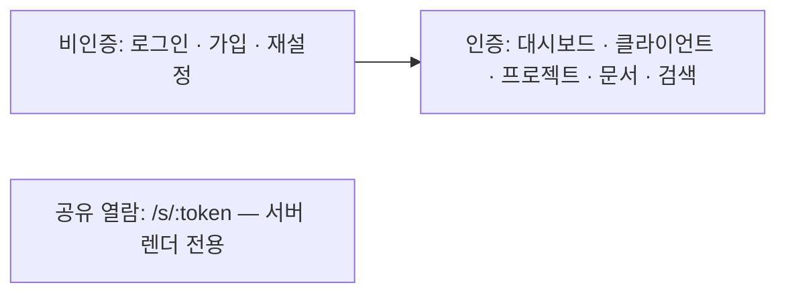

# 프론트엔드 아키텍처

- **근거 문서**: docs/PRD.md (0.1), docs/TRD.md (0.1)
- **관련 기술 결정**: TD-002(Next.js·서버 렌더·유틸리티 CSS), TD-008(단일 오류 형식), TD-011(공유 열람), TD-013(화면 검증은 편의용), TD-015(브라우저 자동화), TD-017(인쇄 템플릿)
- **잠정인 부분**: §3.3(프로젝트 상세 레이아웃)은 **CF-001** 미해소 상태의 잠정 설계다. §3.9(PDF 진행 표시)는 **CF-005** 에 걸려 있다. §3.1의 `/settings/account`(계정 해지 화면)는 **CF-004** 에 걸린 잠정 설계다.

## 1. 이 문서가 정하는 것 / 정하지 않는 것

**정하는 것**: 화면 목록과 각 화면이 만족시키는 FR, 라우팅 구조, 상태를 어디에 두는가, 서버와 주고받는 지점, 공통 UI 규칙(로딩·오류·빈 상태), 반응형 기준, 인쇄(PDF) 템플릿의 구조.

**정하지 않는 것**: 프레임워크·스타일링 도구 선택(TD-002), 화면 비주얼 디자인과 카피 문구(고지 문구 위치는 정하지만 문구 확정은 PRD OQ-007), 엔드포인트 정의(`backend.md §3.3`), 개발 순서(Layer 3), E2E가 덮을 흐름 목록(Layer 4).

## 2. 구조

화면은 **세 갈래**다. 갈래마다 렌더 방식과 상태 취급이 다르다.

| 갈래 | 렌더 | 상태 |
|---|---|---|
| 비인증 폼 | 서버 렌더 + 폼 제출 | 폼 로컬 상태만 |
| 인증 화면 | 데이터가 많은 화면은 서버 렌더, 편집 화면은 클라이언트 상호작용 | 서버 데이터는 서버가, 편집 중 값만 클라이언트 |
| 공유 열람 | 서버 렌더 전용, **JS 없이도 본문이 보인다** | 없음 |

## 3. 설계 단위

### 3.1 화면 목록

- **근거**: FR-001~FR-024 전반 / TD-002
- **설계**: 아래가 이번 버전의 화면 전부다. 이 목록에 없는 화면을 만들지 않는다.

| 화면 | 경로 | 만족시키는 FR |
|---|---|---|
| 로그인 | `/login` | FR-001 |
| 가입 (처리방침 동의 포함) | `/signup` | FR-001, FR-024 |
| 비밀번호 재설정 요청·완료 | `/password/reset`, `/password/reset/:token` | FR-002 |
| 대시보드 | `/` | FR-020, FR-021 |
| 클라이언트 목록·상세·편집 | `/clients`, `/clients/:id` | FR-003 |
| 프로젝트 목록 | `/projects` | FR-004 |
| **프로젝트 상세** | `/projects/:id` | FR-005, FR-006, FR-012 |
| 계약서 편집 | `/contracts/:id` | FR-006, FR-007, FR-009, FR-010, FR-011 |
| 인보이스 편집·상세 | `/invoices/:id` | FR-012~FR-018 |
| 검색 결과 | `/search?q=` | FR-022 |
| 공유 열람 (계약서·인보이스 공통) | `/s/:token` | FR-009, FR-016, FR-011, NFR-012 |
| 알림 목록 | `/notifications` | FR-021 |
| 개인정보 처리방침 | `/privacy` | FR-024 |
| 계정 설정·해지 (**잠정 — CF-004**) | `/settings/account` | FR-024, NFR-007 |

  인보이스 생성 진입점은 프로젝트 상세에만 둔다(FR-012). 전역 '인보이스 만들기' 버튼을 만들지 않는다.
- **왜 이 모양인가**: 화면을 FR에 1:1로 매달아 두면 Layer 3이 화면 태스크를 만들 때 무엇을 만족시키는지 다시 추측하지 않는다. 목록을 닫힌 집합으로 선언한 이유는, 열린 목록에서는 Layer 5가 "여기 관리자 화면이 있어야겠는데"를 태스크 안에서 만들어 내기 때문이다.
- **검증 기준**: 위 표에 없는 경로로 접근하면 404 화면이 나온다. 프로젝트 상세를 거치지 않고 인보이스를 만드는 UI 진입점이 앱 어디에도 없다. 각 화면에서 표에 적힌 FR의 수용 기준이 화면 요소로 확인된다.
- **바뀔 수 있는 지점**: **CF-004** 가 해소되면 `/settings/account` 의 범위가 확정된다. **CF-003**(복구 기능)이 "복구 FR 신설"로 결정되면 휴지통 화면이 추가된다.

### 3.2 라우팅과 접근 제어

- **근거**: FR-001(비로그인 상태로 대시보드 주소 접근 시 로그인 화면으로 이동), NFR-012(공유는 로그인 없이), NFR-004 / TD-002, TD-010, TD-011
- **설계**: 경로를 세 묶음으로 나누고 묶음 단위로 접근 규칙을 건다. ①공개 폼(`/login`, `/signup`, `/password/*`, `/privacy`) ②공유(`/s/:token`) ③그 외 전부는 인증 필수. 인증 필수 경로에 세션 없이 접근하면 `/login` 으로 이동하고, 원래 가려던 경로를 쿼리로 보존해 로그인 후 되돌린다. 로그인 상태에서 `/login` 에 접근하면 `/` 로 보낸다. 이 규칙은 화면 코드가 아니라 라우팅 경계 한 곳에 둔다.
- **왜 이 모양인가**: 화면마다 로그인 검사를 두면 새 화면을 만들 때 빠뜨리는 것이 기본값이 된다. 묶음 단위 규칙이면 새 경로는 기본이 '인증 필수'가 되고, 공개로 열려면 명시적으로 목록에 넣어야 한다 — 실수가 '열림'이 아니라 '닫힘' 쪽으로 나게 만든 것이다.
- **검증 기준**: 로그인하지 않고 `/`, `/projects/:id`, `/invoices/:id` 를 열면 모두 `/login` 으로 이동한다. 로그인 후 원래 가려던 경로로 되돌아온다. 로그인하지 않은 새 브라우저 세션에서 `/s/:token` 을 열면 문서가 표시된다. 인증 필수 목록에 없는 새 경로를 추가해도 기본이 인증 필수다.
- **바뀔 수 있는 지점**: 없음

### 3.3 프로젝트 상세 — 한 화면 배치

- **근거**: FR-005(계약서 목록·인보이스 목록·집계가 뷰포트 900px에서 스크롤 없이 한 화면, 빈 상태 표시, 문서 이동 후 복귀), FR-012(인보이스 만들기 진입점), NFR-001 / TD-002
- **설계**: 상단에 요약 4개(총 계약금액·청구 합계·입금 합계·미수금)를 가로로, 그 아래 좌우 2열로 계약서 목록과 인보이스 목록을 둔다. **각 목록은 최근 항목 5건까지 화면에 직접 표시하고, 6건째부터는 목록 영역 안에서만 스크롤한다.** 목록 헤더에 전체 건수를 적는다. 페이지 자체는 900px 높이에서 세로 스크롤이 생기지 않는다. 문서 상세로 이동한 뒤 뒤로 가기로 돌아오면 같은 프로젝트 상세가 표시된다(서버 렌더이므로 별도 상태 복원이 필요 없다).
- **왜 이 모양인가**: FR-005의 "스크롤 없이 같은 화면"은 문서 수가 늘면 어떤 배치로도 만족시킬 수 없다 — **CF-001** 로 올렸다. 조용히 "스크롤 되게" 바꾸면 사용자는 자기가 적은 기준이 사라진 줄 모르고, 그대로 두면 Layer 4가 검증할 수 없는 기준이 된다. 그래서 "페이지는 스크롤하지 않고 목록 내부만 스크롤한다"를 잠정 해석으로 두고 CF에 남겼다.
- **검증 기준**: 계약서 2건·인보이스 3건인 프로젝트를 뷰포트 900px에서 열면 요약 4개와 두 목록이 모두 보이고 페이지 세로 스크롤바가 없다. 인보이스 20건인 프로젝트에서도 페이지 세로 스크롤바가 없고 인보이스 목록 영역 안에만 스크롤이 생기며 헤더에 20이 표시된다. 계약서가 0건이면 그 자리에 "아직 없습니다"와 생성 버튼이 표시된다. 인보이스 한 건을 눌러 상세로 갔다가 뒤로 가기를 하면 같은 프로젝트 상세로 돌아온다.
- **바뀔 수 있는 지점**: **CF-001** 미해소. PRD가 FR-005의 기준을 다시 쓰면 이 절의 목록 표시 규칙이 바뀐다.

### 3.4 상태를 어디에 두는가

- **근거**: NFR-001(응답 시간), FR-007(저장하지 않고 이탈 시 확인 창), FR-014(항목 입력 중 실시간 합계 표시) / TD-002
- **설계**: 세 종류만 둔다. ①**서버 데이터**: 서버 렌더로 내려온 값. 클라이언트 전역 저장소에 복사하지 않는다. 변경 후에는 해당 경로를 다시 요청해 갱신한다. ②**편집 중 폼 값**: 계약서 조항, 인보이스 항목, 각종 폼. 해당 화면 컴포넌트 안에서만 산다. ③**UI 상태**: 모달 열림, 목록 접힘 등. 컴포넌트 지역 상태. **전역 상태 관리 라이브러리를 도입하지 않는다** — 요구사항이 화면 간 공유 상태를 요구한 곳이 없다(알림 개수는 서버 렌더 시점의 값이면 충분하다, FR-021).
- **왜 이 모양인가**: 서버 데이터를 클라이언트 저장소에 복사하는 순간 무효화 규칙이 필요해지고, 그 규칙은 요구사항에 근거가 없는 설계다(§근거가 비면 지운다는 원칙). 인보이스 항목 합계는 화면에서 **표시만** 미리 보여 주되 저장 값은 서버 계산 결과를 쓴다(`backend.md §3.7`) — 화면 계산을 신뢰하면 NFR-008이 깨진다.
- **검증 기준**: 인보이스 항목의 수량을 바꾸면 화면 합계가 즉시 바뀌고, 저장 후 다시 열었을 때 서버가 계산한 값과 일치한다. 전역 상태 관리 라이브러리 의존성이 프로젝트에 존재하지 않는다. 인보이스를 입금 완료로 바꾼 뒤 대시보드로 이동하면 갱신된 미수금이 표시된다.
- **바뀔 수 있는 지점**: 없음

### 3.5 서버와 주고받는 지점

- **근거**: FR 전반, NFR-001 / TD-002, TD-008
- **설계**: 화면이 서버 데이터를 얻는 경로는 둘뿐이다. ①**서버 렌더 시 직접 조회**(대시보드·프로젝트 상세·문서 상세·공유 열람·검색 결과) — 이 경우 화면 초기 표시에 `fetch` 를 쓰지 않는다. ②**사용자 동작에 의한 변경**은 `/api/*` 호출(`backend.md §3.3`) 후 경로 재요청. 화면에서 API를 부르는 코드는 모듈별 클라이언트 함수 한 곳에 모으고 컴포넌트가 직접 `fetch` 를 쓰지 않는다 — 오류 형식 해석(§3.7)을 한 곳에 두기 위해서다.
- **왜 이 모양인가**: 초기 표시를 클라이언트 fetch로 하면 화면마다 왕복이 하나씩 더 붙어 NFR-001의 1.5초 예산을 스스로 깎는다. TD-002가 서버 렌더를 고른 이유가 그것이다.
- **검증 기준**: 대시보드와 프로젝트 상세의 초기 표시에 `/api/*` 요청이 0건이다(첫 HTML에 데이터가 들어 있다). 컴포넌트 파일에서 직접 `fetch(` 를 호출한 곳이 0건이다.
- **바뀔 수 있는 지점**: 없음

### 3.6 공통 UI 규칙 — 로딩·오류·빈 상태

- **근거**: FR-005(빈 목록에 "아직 없습니다"와 생성 버튼), FR-020(신규 계정에 0원과 시작 안내), FR-022(결과 없음 + 입력한 검색어), FR-010("아직 열람되지 않음"), NFR-002(3초 초과 시 진행 표시) / TD-008, TD-002
- **설계**: 세 상태를 공통 컴포넌트로 고정한다. ①**빈 상태**: 한 줄 설명 + 다음 행동 버튼. 목록이 있는 모든 자리에 반드시 정의한다(프로젝트 상세의 두 목록, 대시보드 연체 목록·프로젝트 목록, 클라이언트 목록, 검색 결과, 알림 목록, 열람 기록). ②**오류 상태**: 서버 오류 형식(`backend.md §3.4`)의 `message` 를 그대로 띄운다. 전체 화면 오류와 인라인 필드 오류 두 가지만 쓴다. ③**로딩**: 서버 렌더가 기본이므로 화면 진입 로딩은 없고, 사용자가 누른 동작(저장·발송·PDF)에만 버튼 비활성 + 진행 표시를 둔다.
- **왜 이 모양인가**: 빈 상태를 화면마다 즉흥적으로 만들면 신규 계정의 첫 화면이 빈 표 여러 개가 되고, PRD가 "클라이언트 등록부터 시작하세요"까지 적어 둔 이유가 사라진다. 목록이 있는 자리를 열거해 둔 것은 Layer 3이 빠뜨리지 않게 하기 위해서다.
- **검증 기준**: 데이터가 없는 신규 계정으로 로그인하면 미수금 0원과 "클라이언트 등록부터 시작하세요"가 표시된다. 위에 열거한 7개 자리 전부에 빈 상태 문구와(해당되면) 생성 버튼이 있다. 검색 결과가 없으면 "검색 결과가 없습니다"와 입력한 검색어가 함께 표시된다. 서버가 400을 돌려주면 해당 입력란 아래에 메시지가 표시된다.
- **바뀔 수 있는 지점**: 없음

### 3.7 폼 검증과 오류 표시

- **근거**: FR-003(사업자등록번호 형식), FR-004(합계·차액·날짜), FR-014(음수 금지), FR-001(비밀번호 8자, 실패 메시지 비구분), FR-007(미저장 이탈 확인) / TD-013(화면 검증은 편의용, 서버가 진짜)
- **설계**: 화면 검증은 즉시 피드백용이며 서버 검증을 대체하지 않는다. 서버 오류 응답의 `fields[].field` 값과 화면 입력란의 `name` 을 **같은 문자열**로 맞춘다 — 응답을 받은 클라이언트 함수가 필드명으로 입력란을 찾아 메시지를 붙인다. 저장되지 않은 변경이 있는 편집 화면(계약서 조항, 인보이스 항목)에서 이탈을 시도하면 확인 창을 띄운다.
- **왜 이 모양인가**: 필드명 규약이 없으면 화면마다 서버 필드→입력란 매핑 표를 따로 만들게 되고, FR-003·FR-004의 "해당 입력란에 오류가 표시된다"가 화면마다 다르게 구현된다(TD-008이 지적한 바로 그 문제).
- **검증 기준**: 사업자등록번호를 9자리로 입력해 저장하면 그 입력란 아래에 메시지가 표시된다(화면 검증을 우회해 서버에서 온 응답으로도 동일하게 표시된다). 대금 조건 비율 합이 90%면 합계 숫자가 포함된 메시지가 표시된다. 조항을 수정한 뒤 저장하지 않고 다른 화면으로 이동하려 하면 확인 창이 뜬다. 잘못된 비밀번호로 로그인하면 이메일·비밀번호 어느 쪽이 틀렸는지 화면에서 알 수 없다.
- **바뀔 수 있는 지점**: 없음

### 3.8 표시 규약 — 금액·날짜·사업자번호·상태

- **근거**: NFR-008(표시에서도 오차 없음), NFR-016(한국어·KRW 단일), FR-019(초과 일수), FR-018(상태), FR-003 / TD-004, TD-003(UTC 저장·KST 표시)
- **설계**: 금액은 서버가 준 정수를 천 단위 구분 + "원"으로 표시하고 화면에서 재계산하지 않는다. 통화 선택 UI를 두지 않는다. 시각은 KST로 변환해 `YYYY-MM-DD HH:mm` 으로, 날짜는 `YYYY-MM-DD` 로 표시한다. 사업자등록번호는 저장은 숫자 10자리, 표시는 `000-00-00000`. 인보이스 상태 표시는 초안·발송·입금완료 세 가지에 **연체 배지**가 얹히는 형태다(연체는 별도 상태가 아니다 — `database.md §3.12`). 연체 배지에는 초과 일수를 함께 적는다.
- **왜 이 모양인가**: 표시 규칙을 화면마다 정하면 같은 금액이 대시보드와 PDF에서 다르게 보이고, 그것이 NFR-008이 금지한 것이다. 연체를 배지로 둔 것은 데이터 모델(상태 3개)과 화면 표현을 어긋나지 않게 하기 위해서다.
- **검증 기준**: 1,000,003원이 목록·상세·PDF 세 곳에서 "1,000,003원"으로 같게 표시된다. 통화를 고르는 UI 요소가 앱 전체에 없다. 기한이 3일 지난 발송 인보이스에 "연체 3일" 배지가 표시되고, 입금 완료로 바꾸면 배지가 사라진다. 열람 시각이 KST로 표시된다.
- **바뀔 수 있는 지점**: 없음

### 3.9 인쇄(PDF) 템플릿과 진행 표시

- **근거**: FR-008(쪽 번호 "n / m", 페이지 나눔), FR-015(항목 20개 초과 분할, 합계는 마지막 페이지), FR-011·NFR-014(모든 페이지 고지), NFR-002(3초 초과 시 진행 표시), NFR-016 / TD-017, TD-002
- **설계**: PDF는 화면과 같은 코드베이스의 **인쇄 전용 템플릿**(계약서용·인보이스용 2종)으로 렌더한다. 페이지 나눔·반복 머리말/꼬리말·쪽 번호는 인쇄 CSS가 처리하고, 고지 문구는 꼬리말에 고정한다. 템플릿은 서버가 준 값만 표시하며 계산하지 않는다(§3.4). 진행 표시는 로그인 화면에서 PDF 버튼을 눌렀을 때 버튼을 비활성화하고 3초 후 진행 표시를 노출하는 방식으로 한다.
  **공유 열람 화면(§3.10)은 JS 없이 동작해야 하므로 진행 표시를 제공할 수 없다 — CF-005.** 현재는 공유 화면의 PDF 버튼을 일반 링크로 두고 진행 표시 없이 다운로드된다.
- **왜 이 모양인가**: 화면과 PDF를 두 벌의 코드로 만들면 "PDF에 화면과 동일하게 포함된다"(FR-008·FR-015)를 두 곳에서 유지하게 된다(TD-017이 든 이유와 같다). 고지를 데이터가 아니라 템플릿 꼬리말에 두는 것은 사용자가 지울 수 없어야 하기 때문이다(NFR-014).
- **검증 기준**: 조항 30개 계약서 PDF의 모든 페이지 하단에 "n / m" 과 고지 문구가 있다. 항목 25개 인보이스 PDF에서 합계 영역이 마지막 페이지에만 있다. 사용자가 조항 본문에 고지와 같은 문자열을 넣거나 지워도 꼬리말 고지는 그대로다. 로그인 화면에서 PDF 버튼을 누르면 버튼이 비활성화되고 3초 후 진행 표시가 나타난다.
- **바뀔 수 있는 지점**: **CF-005** 미해소(무JS 공유 화면의 진행 표시). **TD-017 스파이크(OQ-014)** 결과에 따라 인쇄 CSS 방식 자체가 바뀔 수 있다.

### 3.10 공유 열람 화면

- **근거**: FR-009·FR-016(본문·당사자 정보만, 소유자의 다른 정보 비노출, 무효 링크 안내, 404), FR-011(고지 표시), NFR-012(로그인·가입·설치 없이), NFR-011(375px) / TD-011, TD-002
- **설계**: `/s/:token` 은 서버 렌더 전용이며 **JS 없이도 문서 본문과 고지가 보인다**. 화면 요소는 문서 본문, 당사자 정보, 고지, PDF 내려받기 링크뿐이다. 소유자의 다른 프로젝트·클라이언트·인보이스로 가는 링크, 로그인 유도, 앱 내비게이션을 두지 않는다. 무효·폐기·삭제·부재는 **같은 안내 화면** 하나로 처리한다(`backend.md §3.11`).
- **왜 이 모양인가**: 클라이언트 담당자는 "링크 클릭 이상을 요구하면 이탈한다"(PRD 2절). 네비게이션이나 로그인 유도를 넣는 순간 그 화면은 우리 앱의 일부가 되고, 동시에 소유자 정보 노출 경로가 하나 생긴다.
- **검증 기준**: JS를 끈 브라우저에서 공유 링크를 열면 계약서 본문과 고지 문구가 표시된다. 화면 HTML에 소유자의 다른 문서·클라이언트 식별자가 없다. 폐기된 링크와 존재하지 않는 링크가 같은 화면을 보여 준다. 폭 375px에서 가로 스크롤 없이 본문을 읽을 수 있다.
- **바뀔 수 있는 지점**: PRD OQ-009 미해소 — "확인 버튼"이 추가되면 이 화면에 처음으로 쓰기 동작이 생긴다.

### 3.11 반응형 기준

- **근거**: NFR-011(폭 375px에서 대시보드 확인·인보이스 목록 확인·입금 완료 표시·공유 열람이 가로 스크롤 없이. 문서 편집은 데스크톱 전용 가능), NFR-010(브라우저 3종), FR-005(뷰포트 높이 900px) / TD-002(유틸리티 CSS), TD-015
- **설계**: 브레이크포인트는 **하나**(768px)만 둔다. 768px 미만에서 다열 배치를 1열로 접고 표는 카드형으로 바꾼다. **375px에서 반드시 동작해야 하는 화면**: 대시보드, 인보이스 목록·상세(입금 완료 버튼 포함), 공유 열람. **데스크톱 전용으로 두는 화면**: 계약서 편집, 인보이스 항목 편집 — 좁은 폭에서는 "이 화면은 데스크톱에서 편집해 주세요" 안내를 표시한다(NFR-011이 허용한다).
- **왜 이 모양인가**: 브레이크포인트를 여럿 두면 375px 검증 대상이 화면마다 달라진다. 필수 4개 화면과 예외 2개를 문서에 못박아 두면 Layer 4가 무엇을 375px로 돌려야 하는지 목록으로 갖게 된다.
- **검증 기준**: 폭 375px에서 대시보드·인보이스 목록·인보이스 상세·공유 열람을 열면 문서 폭이 뷰포트 폭을 넘지 않는다(가로 스크롤바 없음). 375px에서 인보이스를 입금 완료로 표시하는 동작이 성공한다. 375px에서 계약서 편집 화면을 열면 데스크톱 안내가 표시된다. 같은 검증이 Chromium 2종·WebKit 1종에서 통과한다.
- **바뀔 수 있는 지점**: 없음

### 3.12 고지 문구와 처리방침 노출

- **근거**: FR-011(편집 화면 상단·PDF 전 페이지·공유 화면, 사용자가 숨기거나 삭제 불가), FR-024(가입 화면 링크와 동의, 로그인 후 모든 화면 하단 접근), NFR-014 / TD-002, TD-017
- **설계**: 고지 문구는 **문자열 상수 한 곳**에 두고 세 자리(계약서 편집 화면 상단, 인쇄 템플릿 꼬리말, 공유 열람 화면)가 그것을 참조한다. 사용자 입력 데이터에서 오지 않으므로 편집·삭제 경로가 없다. 처리방침 링크는 앱 공통 레이아웃 하단과 가입 화면에 둔다. 가입은 동의 체크 없이 제출되지 않는다. **고지 문구의 최종 문안은 PRD OQ-007 미해소로 확정하지 않는다** — 위치와 불변성만 고정한다.
- **왜 이 모양인가**: 세 자리에 각각 문구를 적으면 하나만 고쳤을 때 PDF와 화면이 다른 말을 하게 되고, NFR-014의 "전부에 존재한다"가 조용히 깨진다.
- **검증 기준**: 계약서 편집 화면·PDF 모든 페이지·공유 화면 세 곳에서 같은 고지 문자열이 발견된다. 사용자 입력으로 그 문자열을 지우거나 숨길 수 있는 경로가 없다. 동의 체크 없이 가입을 제출하면 진행되지 않는다. 로그인 후 임의의 화면 하단에서 처리방침으로 이동할 수 있다.
- **바뀔 수 있는 지점**: PRD OQ-007 — 문안이 확정되면 상수 값만 채운다(구조 변경 없음).

### 3.13 알림 표시

- **근거**: FR-021(읽지 않은 개수가 모든 화면 상단, 누르면 해당 인보이스로 이동하고 읽음 처리) / TD-002, TD-003
- **설계**: 공통 레이아웃 헤더에 읽지 않은 개수 배지를 둔다. 값은 서버 렌더 시점에 읽어 넣고 폴링하지 않는다(TRD 1.2절이 실시간 통신을 배제했다). 알림 목록에서 항목을 누르면 읽음 처리 요청 후 해당 인보이스 상세로 이동한다.
- **왜 이 모양인가**: 폴링을 넣으면 요구사항에 없는 주기 요청이 모든 화면에 붙고, 단일 인스턴스(TD-016)의 부하가 사용자 수에 비례해 늘어난다. FR-021은 화면 진입 시점의 값이면 만족된다.
- **검증 기준**: 연체 알림이 2건 생성된 뒤 아무 화면이나 열면 상단에 2가 표시된다. 알림 하나를 누르면 그 인보이스 상세로 이동하고 배지가 1로 줄어든다. 화면을 열어 둔 상태에서 주기적으로 발생하는 네트워크 요청이 없다.
- **바뀔 수 있는 지점**: 없음

## 4. 이 영역이 만족시키는 요구사항

| 요구사항 | 설계 단위 |
|---|---|
| FR-001, FR-002 | §3.1, §3.2, §3.7 |
| FR-003 | §3.1, §3.7, §3.8 |
| FR-004 | §3.1, §3.7 |
| FR-005 | §3.3, §3.6 |
| FR-006, FR-007 | §3.1, §3.4, §3.7 |
| FR-008, FR-015 | §3.9 |
| FR-009, FR-016 | §3.10 |
| FR-010 | §3.6(빈 상태), §3.8(시각 표시) |
| FR-011 | §3.12 |
| FR-012~FR-014 | §3.1, §3.4, §3.8 |
| FR-017 | §3.7 |
| FR-018, FR-019 | §3.8 |
| FR-020 | §3.6 |
| FR-021 | §3.13 |
| FR-022 | §3.6 |
| FR-023 | §3.7(확인 창) |
| FR-024 | §3.12, §3.1 |
| NFR-001 | §3.5 |
| NFR-002 | §3.9 |
| NFR-004 | §3.2 |
| NFR-008 | §3.4, §3.8 |
| NFR-010, NFR-011 | §3.11 |
| NFR-012 | §3.10 |
| NFR-014 | §3.12, §3.9 |
| NFR-016 | §3.8 |
