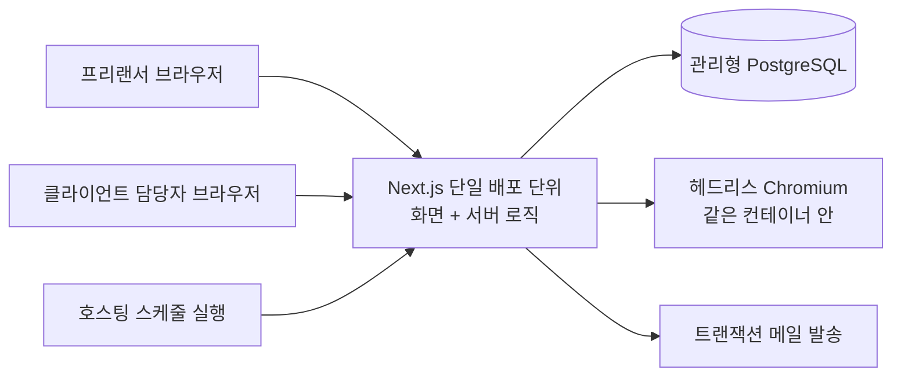

# 아키텍처 개요: Deskwork (가칭) — 프리랜서 디자이너용 계약·인보이스 통합 관리

- **버전**: 0.1 (초안)
- **작성일**: 2026-09-08
- **입력 문서**: docs/PRD.md (0.1), docs/TRD.md (0.1)
- **상태**: 사람 검토 대기
- **주의**: 사용자와 대화할 수 없는 조건에서 작성했다. 물었어야 할 것은 프로젝트 루트의 `questions.md` 에 그대로 남겼다. **PRD·TRD에 차단 미결이 남아 있는 상태로 진행했고**(OQ-001·OQ-007·OQ-009·OQ-010), 절차상 사용자가 골랐어야 할 두 선택지 중 ②(기본값으로 진행하되 영향 영역을 '잠정 설계'로 표시)를 가정으로 택했다. 영향받는 절에는 '바뀔 수 있는 지점'이 적혀 있다.

## 1. 이 문서의 범위

이 문서는 PRD가 약속한 것을 TRD가 고른 기술 **안에서 어떤 구조로 배치할 것인가**만 정한다. 개체와 테이블, 엔드포인트와 요청·응답 모양, 화면 목록과 라우팅, 계층과 의존 방향, 권한 검사 지점, 횡단 규칙이 여기서 처음 등장한다. TRD가 일부러 넘긴 것이므로 이건 이 레이어의 일이다.

정하지 **않는** 것: 요구사항의 신설·우선순위 변경(PRD), 기술 선택의 변경(TRD), 개발 순서·태스크 분할·phase·일정(Layer 3 마스터 플랜), 품질 게이트 구성·E2E가 덮을 흐름 목록·task validation 절차(Layer 4 하네스), 실제 코드·마이그레이션 파일(Layer 5).

설계 중에 요구사항이나 기술이 새로 필요해 보인 것은 문서에 몰래 넣지 않고 **7절의 충돌(CF)로 올려** PRD·TRD로 돌려보냈다.

## 2. 시스템 구성

| 구성 요소 | 책임 | 책임지지 않는 것 | 근거 |
|---|---|---|---|
| Next.js 단일 배포 단위 | 화면 렌더, HTTP 경계, 도메인 규칙, 데이터 접근, 세션 | 파일 보관(저장소 없음), 비동기 작업 큐 | TD-002, TD-006 |
| 관리형 PostgreSQL | 모든 영속 데이터(문서·세션·감사 이력·알림), 유일성·참조 무결성 | 집계 캐시, 전문 검색 | TD-003, TD-007 |
| 헤드리스 Chromium | HTML→PDF 렌더 | PDF 보관, 문서 데이터 해석 | TD-017, TD-006 |
| 트랜잭션 메일 발송(외부) | 재설정 메일·인보이스 링크 메일 전달 | 메일 본문에 첨부·개인정보 확장 | TD-009(잠정) |
| 호스팅 스케줄 실행 | 하루 1회 정기 작업 호출 | 연체 '판정'(조회 시점 파생이다) | TD-016(잠정), TD-005 |

**TRD에 없는 구성 요소를 그리지 않았다.** 캐시 서버·메시지 큐·오브젝트 스토리지·검색 엔진은 TRD 1.2절이 명시적으로 배제했고 이 설계도 쓰지 않는다.

## 3. 경계와 의존 방향

| 부르는 쪽 | 부르는 대상 | 허용 | 금지되는 방향 | 왜 |
|---|---|---|---|---|
| route (HTTP 경계) | service | 예 | route → data 직접 호출 금지 | 소유자 조건과 삭제 필터를 강제할 지점이 사라진다 (TD-012, TD-005) |
| service | data, adapter, 다른 모듈의 service | 예 | service → route, service → 다른 모듈의 data 금지 | 모듈 경계가 무너지면 소유 조건이 두 곳에서 다르게 걸린다 |
| data | DB | 예 | data → service 금지 | 순환이 생기면 트랜잭션 경계가 어디인지 알 수 없다 |
| adapter (메일·PDF) | 외부 | 예 | adapter → service, adapter → data 금지 | 외부 실패가 도메인 상태를 바꾸면 FR-017의 "상태는 바뀌지 않는다"가 깨진다 |
| 화면 컴포넌트 | 모듈별 API 클라이언트 함수 | 예 | 컴포넌트 → `fetch` 직접 호출 금지 | 오류 형식 해석이 화면마다 갈린다 (TD-008) |
| 화면 (서버 렌더) | service·data 직접 조회 | 예 | 자기 자신에게 HTTP 요청 금지 | 왕복이 늘어 NFR-001의 예산을 스스로 깎는다 |
| 인쇄 템플릿 | 서버가 준 값 | 예 | 계산 금지 | 금액 계산은 한 지점뿐이다 (TD-004, NFR-008) |

## 4. 핵심 흐름

### 4.1 프로젝트에서 인보이스를 만들어 발송하고 입금 표시까지 — US-006, US-008

프로젝트 상세(`frontend.md §3.3`) → `POST /api/projects/:id/invoices` → service가 소유 확인 → 회차 중복 검사(있으면 409, 확인 후 재요청) → 클라이언트 스냅샷 채움 → 채번(`database.md §3.7`) → 항목·금액 저장(`backend.md §3.7` 계산) → 인보이스 상세. 발송은 `POST /api/invoices/:id/status {to:'sent'}` → 항목 0개면 409 → 상태·발송일 기록 + 감사 이력 1건. 입금 표시는 같은 경로로 `{to:'paid'}`. 실패 시: 검증 실패는 해당 입력란 인라인 오류(`frontend.md §3.7`), 소유 위반은 404.

### 4.2 계약서를 만들어 공유 링크로 보내고 열람 기록을 확인 — US-003, US-004, US-005, US-014

프로젝트 상세 → 템플릿 선택 → `POST /api/projects/:id/contracts`(스냅샷 채움, 미입력 항목은 "[미입력]") → 조항 편집·저장 → `POST /api/contracts/:id/send` → `POST /api/share-links` → 토큰 원문 1회 표시·복사. 클라이언트가 `/s/:token` 을 열면 서버 렌더로 본문·당사자 정보·고지만 표시(JS 없이도 보인다) → 응답 후 `share.viewed` 이력 기록(소유자 본인이면 `actor='owner'` 로 남겨 횟수에서 제외). 실패 시: 폐기·삭제·부재가 모두 같은 안내 화면(`backend.md §3.11`).

### 4.3 로그인 직후 미수금과 연체를 본다 — US-009

로그인 → `/` 서버 렌더 → 질의 3개(합계 / 연체 목록 / 진행 중 프로젝트 + 프로젝트별 미수금)(`backend.md §3.8`). 연체는 저장 상태가 아니라 `status='sent' AND due_date < KST 오늘` 파생 조건(`database.md §3.12`). 연체 알림은 하루 1회 정기 작업이 UNIQUE 제약으로 중복 없이 생성한다. 실패 시: 데이터가 없으면 0원 + "클라이언트 등록부터 시작하세요"(`frontend.md §3.6`).

### 4.4 계약서와 인보이스를 한 화면에서 본다 — US-010

`/projects/:id` 서버 렌더 → 질의 3개 → 요약 4개 + 계약서 목록 + 인보이스 목록. 목록은 5건까지 직접 표시하고 그 이상은 목록 내부 스크롤(**CF-001 의 잠정 해석**). 문서 상세로 이동한 뒤 뒤로 가기로 같은 화면에 복귀한다.

### 4.5 PDF를 만들어 내려받는다 — US-004, US-014

`GET /api/contracts/:id/pdf`(또는 `/s/:token/pdf`) → **권한 확인 먼저** → 문서 조회 → 인쇄 템플릿 렌더 → 헤드리스 Chromium이 PDF 바이트 생성(동시 2건 제한) → `application/pdf` 응답. 파일로 저장하지 않는다. 3초를 넘으면 로그인 화면에서는 진행 표시가 뜬다 — **공유 화면은 JS 없이 동작해야 해서 진행 표시가 없다(CF-005)**. 실패 시: 남의 문서면 렌더 시작 전 404.

## 5. 횡단 규칙

| 규칙 | 내용 | 근거 |
|---|---|---|
| 오류 표현 | 모든 오류 응답이 `{error:{code,message,fields?}}` 단일 형식. 코드는 7개 이하. 403을 쓰지 않고 없음·권한 위반 모두 404 | TD-008, TD-012, NFR-004, FR-003·FR-004 |
| 시간·시간대 | 저장·전송은 UTC(`timestamptz`, ISO-8601). 표시와 **날짜 판정(연체 기한, 인보이스 번호의 연도)은 KST 기준** | TD-003, FR-013, FR-019, FR-010 |
| 금액·반올림 | 원 단위 정수(bigint)로만 저장·전달. 절사는 `backend.md §3.7` 의 계산 모듈 한 지점에서만. 화면·PDF·집계는 표시만. 통화 개념을 두지 않는다 | TD-004, NFR-008, NFR-016, FR-014 |
| 식별자 | 사용자에게 보이는 자원은 uuid(순차 노출 금지). 감사 이력만 bigserial. 인보이스 번호는 `YYYY-NNNN`(계정 내 유일). 공유 토큰은 128비트 CSPRNG, DB에는 해시만 | TD-011, NFR-005, FR-013 |
| 로깅 | **남긴다**: 요청 식별자·계정 uuid·경로·상태 코드·소요 시간·오류 코드. **남기지 않는다**: 비밀번호, 세션 id, 토큰 원문, 클라이언트 개인정보, 문서 본문, 금액 명세, 요청 본문 전체 | NFR-006, NFR-015, TD-016, `security.md §3.4` |
| 삭제 | 모든 조회는 `deleted_at IS NULL` 포함. 물리 파기는 정기 작업만. 감사 이력은 문서 삭제와 무관하게 1년 | TD-005, TD-007, NFR-007, NFR-009 |
| 소유 조건 | data 계층 함수는 첫 인자로 `accountId` 를 받고 질의에 조건을 넣는다. 예외는 `findByShareToken*` 과 `sweep*` 둘뿐 | TD-012, NFR-004 |
| 명명 | DB는 snake_case, API JSON은 camelCase, 날짜 `YYYY-MM-DD` | TD-003, TD-008 |

## 6. 문서 지도

| 파일 | 정하는 것 |
|---|---|
| `overview.md` (이 문서) | 시스템 구성, 경계와 의존 방향, 핵심 흐름, 횡단 규칙, 충돌 검토 결과, 추적표, 미결 |
| `frontend.md` | 화면 목록과 라우팅, 상태 배치, 서버와 주고받는 지점, 빈·오류·로딩 규칙, 반응형 기준, 인쇄 템플릿, 공유 열람 화면 |
| `backend.md` | 계층 구조와 모듈 분할, 엔드포인트 목록, 오류 규약, 트랜잭션 경계, 금액 계산, 상태 전이, PDF 생성 경로, 정기 작업, 검색, 감사 기록 지점 |
| `database.md` | 개체와 관계, 테이블·컬럼·제약, 채번, 인덱스와 근거 질의, 상태값과 전이, 집계 정의, 논리 삭제·파기, 마이그레이션 규칙 |
| `auth.md` | 가입·로그인·재설정·해지 흐름, 세션 저장과 쿠키, 권한 검사 지점, 비인증 경로 목록 |
| `security.md` | 신뢰 경계, 입력 검증 지점, 비밀값 경로, 정보 비노출 규칙, 로그 항목, 감사 이력 불변성, 개인정보 저장·전송 |

## 7. PRD·TRD 충돌 검토 결과

| ID | 무엇과 무엇이 | 종류 | 왜 충돌인가 | 선택지 | 지금 취한 조치 | 돌려보낼 곳 | P0 뼈대 |
|---|---|---|---|---|---|---|---|
| CF-001 | FR-005(뷰포트 900px에서 계약서·인보이스 목록과 집계가 **스크롤 없이** 한 화면) ↔ NFR-001이 전제한 데이터 규모(인보이스 1,000건) | 요구사항↔요구사항 | 프로젝트당 문서가 늘면 어떤 배치로도 전부를 900px에 담을 수 없다. 배치를 바꿔 푸는 문제가 아니라 기준 자체가 데이터량과 함께 늘어난다 | ① FR-005를 "요약 4개와 두 목록의 **첫 5건**이 스크롤 없이 보이고 그 이상은 목록 내부 스크롤"로 다시 쓴다 ② 목록을 접기/펼치기로 두고 기본은 요약만 표시 ③ 900px 기준을 삭제하고 "한 화면에서 함께 본다"만 남긴다 | ①로 잠정 설계 (`frontend.md §3.3`) | PRD | 아니오 |
| CF-002 | FR-005·FR-020의 "미수금 합계" ↔ FR-014(원천징수 시 **청구 금액**과 **실수령액**이 모두 존재) | 요구사항↔요구사항 | 원천징수 인보이스는 청구액과 실제 입금될 금액이 다른데, PRD는 미수금을 "발송·연체 인보이스 금액의 합"이라고만 적어 어느 금액인지 정해지지 않았다. 설계가 임의로 고르면 사용자가 보는 '못 받은 돈'의 정의를 설계자가 정하게 된다 | ① 실제로 들어올 돈(실수령액) 기준 ② 청구서에 적힌 금액(청구액) 기준 ③ 두 값을 나란히 표시 | ①로 잠정. 네 금액을 모두 컬럼으로 저장해 뒤집혀도 집계 질의 한 곳만 바뀌게 했다 (`database.md §3.6`, §3.10) | PRD | 아니오 |
| CF-003 | NFR-007("삭제한 문서는 30일간 **복구 가능** 영역에 있다") ↔ PRD 4절에 복구 기능 FR 없음 | 설계 유발 | 복구가 가능하려면 복구 경로(화면·API)가 있어야 하는데 어떤 FR도 그것을 정의하지 않았다. 설계가 복구 화면을 만들면 검토받지 않은 요구사항이 들어오고, 안 만들면 NFR-007이 문자 그대로는 거짓이 된다 | ① NFR-007을 "30일 유예 후 파기(복구는 운영자 수동 대응)"로 고친다 ② 복구 FR을 PRD에 신설한다(휴지통 화면 + 복원 경로) ③ 삭제 직후 되돌리기(undo)만 제공하도록 FR-023을 보강한다 | ①로 잠정 — 복구 경로를 만들지 않았다 (`database.md §3.13`) | PRD | 아니오 |
| CF-004 | FR-024 수용 기준("**계정 삭제 화면**에서 파기 시점이 표시된다")·NFR-007(계정 해지 30일 뒤 파기) ↔ 계정 해지를 정의한 FR 없음 | 설계 유발 | 해지 화면과 경로가 필요한데 해지 절차·확인 방식·해지 후 공유 링크 처리·철회 가능 여부를 정한 요구사항이 없다. 설계가 채우면 그 흐름 전체가 검토 없이 태스크가 된다 | ① 해지 FR을 PRD에 신설한다 ② 이번 버전은 해지를 문의 접수로 처리하고 FR-024의 해당 수용 기준을 고친다 ③ 현재 잠정 설계(비밀번호 재확인 → 해지 예약 → 링크 폐기 → 30일 뒤 파기, 철회 없음)를 그대로 FR로 승격한다 | ③에 해당하는 **최소** 흐름만 잠정 설계 (`auth.md §3.6`, `frontend.md §3.1`) | PRD | 아니오 |
| CF-005 | NFR-002("PDF 생성이 3초를 넘으면 **진행 표시가 노출된다**") ↔ TD-002의 검증 방법(공유 열람 화면은 **JS를 끈 브라우저에서도** 동작해야 한다) + NFR-012 | 요구사항↔기술 결정 | 진행 표시는 응답을 기다리는 동안 화면을 갱신해야 가능한데, JS 없이 동작해야 하는 공유 열람 화면에서는 어떤 구조로도 그것을 할 수 없다. 로그인 화면에는 적용할 수 있으므로 부분 위반이다 | ① NFR-002의 진행 표시 요건을 **로그인 사용자 화면에 한정**한다(PRD 수정) ② 공유 화면의 PDF 버튼만 JS 필수로 두고 TD-002의 무JS 보장 범위를 '문서 본문 표시'로 좁힌다(TRD 수정) ③ 공유 화면 PDF를 비동기 생성 + 완료 페이지로 바꾼다(FR-009·FR-016 수용 기준 수정) | ①로 잠정 — 공유 화면은 진행 표시 없이 즉시 다운로드 (`frontend.md §3.9`, `backend.md §3.10`) | PRD 또는 TRD | 아니오 |
| CF-006 | 사용자의 이번 요청 "**PRD랑 TRD 검토 다 끝났어. 이거 바탕으로 아키텍처 설계해줘**" ↔ PRD 8절·TRD 12절에 남아 있는 차단 미결 | 사용자 요청↔앞 문서 | 두 문서는 스스로를 "사람 검토 대기"로 표시하고 있고, **P0 요구사항을 차단하는 미결**이 남아 있다 — OQ-001(전자서명 제외 여부: FR-006·008·009·011 차단), OQ-007(템플릿 법적 검토: FR-006·FR-011 차단), OQ-009(공유 범위: FR-009·FR-016), OQ-010(개인정보 국내 저장: TD-016·TD-009을 잠정으로 만듦). 검토가 끝났다는 말과 문서 상태가 어긋나 있고, 이 중 OQ-001이 뒤집히면 계약서 개체·공유 경로 설계가 통째로 재작업된다 | ① 네 미결을 먼저 해소하고 PRD·TRD의 상태를 갱신한 뒤 아키텍처를 확정한다(권장) ② 기본값 그대로 확정하고 각 미결을 PRD·TRD에서 '해소(기본값 채택)'로 닫는다 ③ 현 상태로 Layer 3을 시작하되 영향 태스크를 `blocked` 로 둔다 | 대화가 불가능해 ③에 준하게 진행했다 — 기본값으로 설계하고 영향 절마다 '바뀔 수 있는 지점'을 표시했다. `questions.md` 에 물었어야 할 질문을 남겼다 | PRD·TRD | **예** |

> 검토 대상: PRD의 FR-001~FR-024, NFR-001~NFR-016, 8절 가정·미결 / TRD의 TD-001~TD-018, 10절 NFR 실현표, 12절 미결. **충돌 6건** (요구사항↔요구사항 2, 설계 유발 2, 요구사항↔기술 결정 1, 사용자 요청↔앞 문서 1). 기술 결정↔기술 결정 충돌은 0건이다.

**설계로 풀고 충돌로 올리지 않은 것** (어느 문서도 고치지 않고 구조로 해결됨): 인보이스 번호가 삭제 후에도 재사용되지 않는 것(별도 카운터 테이블), NFR-009의 이력 1년 보존과 NFR-007의 30일 파기(이력에 개인정보를 넣지 않음), 연체가 상태인가 파생인가(파생 + 알림만 저장), 단일 인스턴스에서 PDF 렌더와 화면 응답의 자원 경합(동시 2건 제한).

## 8. 요구사항 → 설계 추적표

| 요구사항 | 설계 단위 |
|---|---|
| FR-001 | `auth.md §3.1`, `auth.md §3.2`, `auth.md §3.3`, `frontend.md §3.2`, `database.md §3.2` |
| FR-002 | `auth.md §3.4`, `backend.md §3.12`, `frontend.md §3.1` |
| FR-003 | `database.md §3.3`, `backend.md §3.4`, `frontend.md §3.7`, `security.md §3.1` |
| FR-004 | `database.md §3.4`, `backend.md §3.6`, `frontend.md §3.7` |
| FR-005 | `database.md §3.10`, `backend.md §3.8`, `frontend.md §3.3` |
| FR-006 | `database.md §3.5`, `backend.md §3.3`, `frontend.md §3.1` |
| FR-007 | `database.md §3.5`, `backend.md §3.5`, `frontend.md §3.7` |
| FR-008 | `backend.md §3.10`, `frontend.md §3.9` |
| FR-009 | `database.md §3.8`, `backend.md §3.11`, `frontend.md §3.10`, `auth.md §3.7` |
| FR-010 | `database.md §3.9`, `backend.md §3.11`, `backend.md §3.15` |
| FR-011 | `frontend.md §3.12`, `frontend.md §3.9`, `backend.md §3.10` |
| FR-012 | `database.md §3.4`, `database.md §3.6`, `backend.md §3.9`, `backend.md §3.3` |
| FR-013 | `database.md §3.7`, `backend.md §3.9` |
| FR-014 | `database.md §3.6`, `backend.md §3.7`, `frontend.md §3.4` |
| FR-015 | `backend.md §3.10`, `frontend.md §3.9` |
| FR-016 | `database.md §3.8`, `backend.md §3.11`, `frontend.md §3.10` |
| FR-017 | `backend.md §3.12`, `frontend.md §3.7` |
| FR-018 | `database.md §3.12`, `backend.md §3.9`, `backend.md §3.15` |
| FR-019 | `database.md §3.12`, `backend.md §3.8`, `frontend.md §3.8` |
| FR-020 | `database.md §3.10`, `backend.md §3.8`, `frontend.md §3.6` |
| FR-021 | `database.md §3.11`, `backend.md §3.13`, `frontend.md §3.13` |
| FR-022 | `backend.md §3.14`, `database.md §3.14`, `frontend.md §3.6` |
| FR-023 | `database.md §3.13`, `backend.md §3.5`, `frontend.md §3.7` |
| FR-024 | `frontend.md §3.12`, `auth.md §3.1`, `auth.md §3.6`, `security.md §3.6` |
| NFR-001 | `database.md §3.10`, `database.md §3.14`, `backend.md §3.8`, `backend.md §3.10`, `frontend.md §3.5` |
| NFR-002 | `backend.md §3.10`, `frontend.md §3.9` |
| NFR-003 | `frontend.md §3.5`(왕복 최소화), `backend.md §3.9`(값 승계로 재입력 제거), `frontend.md §3.3` |
| NFR-004 | `backend.md §3.2`, `auth.md §3.5`, `database.md §3.1`, `security.md §3.2` |
| NFR-005 | `database.md §3.8`, `backend.md §3.11`, `security.md §3.3` |
| NFR-006 | `auth.md §3.1`, `auth.md §3.3`, `security.md §3.3`, `security.md §3.4` |
| NFR-007 | `database.md §3.13`, `backend.md §3.13`, `auth.md §3.6`, `security.md §3.6` |
| NFR-008 | `backend.md §3.7`, `database.md §3.6`, `frontend.md §3.4`, `frontend.md §3.8` |
| NFR-009 | `database.md §3.9`, `backend.md §3.15`, `security.md §3.5` |
| NFR-010 | `frontend.md §3.11` |
| NFR-011 | `frontend.md §3.11` |
| NFR-012 | `frontend.md §3.10`, `auth.md §3.7`, `backend.md §3.11` |
| NFR-013 | `database.md §3.15`(되돌릴 수 있는 마이그레이션), `backend.md §3.10`(동시 제한), `frontend.md §3.13`(폴링 없음) |
| NFR-014 | `frontend.md §3.12`, `frontend.md §3.9` |
| NFR-015 | `security.md §3.6`, `security.md §3.4`, `backend.md §3.12`, `database.md §3.9` |
| NFR-016 | `frontend.md §3.8`, `backend.md §3.7`, `database.md §3.6` |

> 모든 FR(24개)과 NFR(16개)이 최소 하나의 설계 단위에 걸려 있다. 어디에도 안 걸린 요구사항은 0건이다.

## 9. 미결 사항

번호는 TRD의 OQ-018에서 이어 붙인다.

| ID | 결정할 것 | 종류 | 차단하는 설계 | 해소 방법 | 미해소 시 기본값 | 되돌리기 비용 |
|---|---|---|---|---|---|---|
| OQ-019 | 미수금 합계가 실수령액 기준인가 청구액 기준인가 (CF-002) | 질문 | `database.md §3.10`, `backend.md §3.8`, `frontend.md §3.8` | `questions.md` Q2를 사용자에게 묻는다. 원천징수 인보이스가 있는 첫 화면 개발 전 | 실수령액(`net_amount`) 기준 | 낮음 — 네 금액을 모두 저장하므로 집계 질의와 표시 문구만 바뀐다 |
| OQ-020 | FR-005의 "스크롤 없이 한 화면"을 문서가 늘었을 때 어떻게 판정하는가 (CF-001) | 질문 | `frontend.md §3.3` | `questions.md` Q1 | 요약 4개 + 각 목록 5건까지 표시, 그 이상은 목록 내부 스크롤 | 낮음 — 프로젝트 상세 레이아웃 한 화면 |
| OQ-021 | 삭제 문서의 '복구 가능'을 기능으로 만들 것인가 (CF-003) | 질문 | `database.md §3.13`, `frontend.md §3.1` | `questions.md` Q3 | 복구 경로를 만들지 않고 NFR-007을 유예 기간으로 해석 | 중간 — 복구 FR이 생기면 휴지통 화면·복원 경로·권한 검사가 추가된다 |
| OQ-022 | 계정 해지 흐름의 범위 (재확인 방식·철회 가능 여부·해지 후 공유 링크 처리) (CF-004) | 질문 | `auth.md §3.6`, `frontend.md §3.1` | `questions.md` Q4 | 비밀번호 재확인 → 해지 예약 → 공유 링크 전부 폐기 → 30일 뒤 파기, 철회 없음 | 중간 — 철회를 넣으면 파기 작업과 로그인 경로가 함께 바뀐다 |
| OQ-023 | JS 없이 여는 공유 화면에서 PDF 진행 표시를 포기해도 되는가 (CF-005) | 질문 | `frontend.md §3.9`, `backend.md §3.10` | `questions.md` Q5 | 공유 화면은 진행 표시 없이 즉시 다운로드 | 낮음~중간 — ③(비동기 생성)을 고르면 PDF 경로와 두 FR의 수용 기준이 바뀐다 |
| OQ-024 | 인보이스 지급 기한의 기본값을 무엇으로 둘 것인가 | 질문 | `database.md §3.6`(`due_date` 는 NULL 허용), `frontend.md §3.1` | `questions.md` Q6. PRD가 기한을 필수로 정하지 않았고 FR-019는 기한이 없으면 연체 판정을 하지 않는다 — 기본값이 없으면 사용자가 비워 두고 연체 관리가 조용히 꺼진다 | 비워 둔다(사용자가 직접 입력). 기본값을 설계가 정하지 않는다 | 낮음 |

> TRD에서 이어지는 미결 중 이 설계에 걸린 것: **OQ-001**(전자서명 — 계약서 개체·공유 경로), **OQ-007**(템플릿 본문 — `database.md §3.5`, 고지 문안), **OQ-009**(공유 범위 — `backend.md §3.11`), **OQ-010**(개인정보 국내 저장 — `security.md §3.6`), **OQ-013·OQ-014**(호스팅·PDF 스파이크 — `backend.md §3.10`), **OQ-015**(집계 성능 — `database.md §3.10`), **OQ-004**(세금 범위 — `backend.md §3.7`), **OQ-011**(메일 도달 — `auth.md §3.4`).
