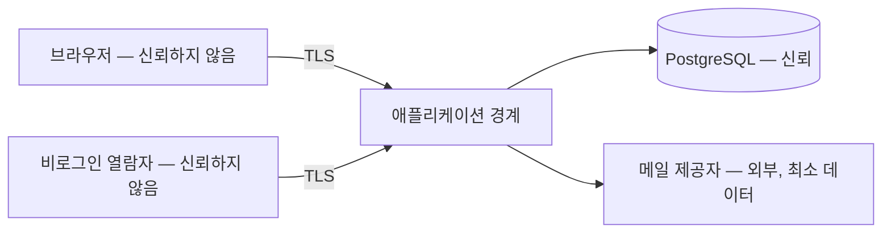

# 보안 아키텍처

- **근거 문서**: docs/PRD.md (0.1), docs/TRD.md (0.1)
- **관련 기술 결정**: TD-012(소유자 조건·404 통일), TD-013(경계 검증·비밀값 주입·TLS), TD-011(공유 토큰), TD-010(비밀번호 해시), TD-007(감사 이력), TD-016(호스팅·TLS·로그, 잠정), TD-009(메일, 잠정), TD-006(PDF 미저장)
- **잠정인 부분**: §3.6(개인정보 처리 위치)은 PRD OQ-010과 TD-016 잠정에 걸려 있다.

## 1. 이 문서가 정하는 것 / 정하지 않는 것

**정하는 것**: 신뢰 경계, 입력 검증 지점, 비밀값이 지나가는 경로, 감사 로그에 남기는 것과 남기지 않는 것, 민감 데이터의 저장·전송 형태.

**정하지 않는 것**: 인증 흐름과 세션(`auth.md`), 소유자 조건의 구현 위치(`backend.md §3.2`, `auth.md §3.5`), 호스팅 제공자 선택(TD-016·OQ-013), 취약점 점검 도구·보안 테스트 절차(Layer 4).

**이 문서에 없는 것은 하지 않는다는 뜻이다.** 요청 빈도 제한(rate limiting), WAF, 침입 탐지, 2단계 인증은 PRD·TRD 어디에도 근거가 없어 넣지 않았다. 필요하다고 판단되면 요구사항으로 PRD에 올린다.

## 2. 구조

신뢰 경계는 **애플리케이션 경계 한 곳**이다. 브라우저에서 온 것은 자기 계정의 화면에서 왔더라도 검증 대상이다.

## 3. 설계 단위

### 3.1 신뢰 경계와 입력 검증 지점

- **근거**: FR-003(사업자등록번호 형식), FR-004(합계·날짜·음수), FR-013(번호 중복), FR-014(음수 금지), NFR-008(금액 정수) / TD-013(서버 경계에서 스키마 검증), TD-001(스키마 공유)
- **설계**: 검증은 **route 계층 진입 직후 한 번**, 스키마로 한다. 통과한 값만 service에 들어간다. 화면 검증은 편의용이며 서버 검증을 대체하지 않는다(`frontend.md §3.7`). 스키마 정의는 화면과 서버가 같은 파일을 참조한다(TD-001). 검증이 잡는 것: 타입·필수·길이·형식(이메일, 사업자등록번호 10자리, 날짜)·범위(금액 ≥ 0, 정수). 검증이 잡지 않고 service가 잡는 것: 집합 규칙(대금 조건 합계 — `backend.md §3.6`), 상태 전이(`backend.md §3.9`), 유일성(DB 제약 — `database.md §3.7`). 사용자가 넣은 텍스트(조항 본문·메모)는 저장 시 가공하지 않고, 화면·PDF 렌더 시점에 이스케이프해 HTML로 해석되지 않게 한다.
- **왜 이 모양인가**: 검증 지점이 여럿이면 어디까지 신뢰된 값인지 아무도 모른다. "경계 하나"로 정하면 service 안의 값은 항상 검증된 값이다. 사용자 텍스트를 저장 시점에 가공하지 않는 이유는, 가공된 값이 PDF·화면·메일 세 곳에서 다르게 필요해질 때 원본이 이미 사라져 있기 때문이다.
- **검증 기준**: 화면을 거치지 않고 서버에 음수 단가를 보내면 저장되지 않고 400이 반환된다. 대금 조건 비율 합 90%인 요청이 거부된다. 조항 본문에 `` 를 저장한 뒤 편집 화면·공유 화면·PDF 세 곳에서 스크립트가 실행되지 않고 문자열 그대로 보인다. 스키마 검증을 거치지 않는 route가 0개다.
- **바뀔 수 있는 지점**: 없음

### 3.2 응답에서 정보가 새지 않게 하는 규칙

- **근거**: NFR-004(주소를 알아도 404), FR-001(로그인 실패 메시지 비구분), FR-002(미가입 이메일도 동일 안내), FR-009(문서 존재 여부 비노출) / TD-012, TD-008
- **설계**: 네 자리에서 응답을 같게 만든다. ①없는 자원과 남의 자원 → 동일한 404(403을 쓰지 않는다). ②로그인 실패 → 이메일·비밀번호 구분 없는 단일 메시지 + 유사한 응답 시간(`auth.md §3.2`). ③재설정 요청 → 가입 여부와 무관하게 동일 안내. ④공유 토큰 → 부재·폐기·문서 삭제가 모두 같은 화면(`backend.md §3.11`). 서버 오류 응답에 스택 추적·SQL·내부 식별자를 담지 않는다(`INTERNAL` 코드와 일반 메시지만).
- **왜 이 모양인가**: 이 네 가지는 각각 별개의 FR·NFR이 요구한 것이지만 실패 모양이 같다 — 응답의 차이가 존재를 알린다. 한 절에 모아 두면 새 경로를 만들 때 확인할 목록이 된다.
- **검증 기준**: 존재하지 않는 인보이스와 남의 인보이스의 응답이 상태 코드·본문 모두 같다. 존재하는 이메일+틀린 비밀번호와 없는 이메일의 로그인 응답이 같다. 폐기된 공유 링크와 없는 토큰의 화면이 같다. 서버에서 예외를 강제로 던지면 응답 본문에 스택 추적이 없다.
- **바뀔 수 있는 지점**: 없음

### 3.3 비밀값이 지나가는 경로

- **근거**: NFR-006(비밀번호 평문 저장·전송 금지, 전 구간 암호화), NFR-005(공유 토큰), FR-002 / TD-013(환경·시크릿으로만 주입), TD-010, TD-011, TD-016(TLS)
- **설계**: 비밀값은 네 종류다 — DB 접속 정보, 메일 제공자 키, 세션·토큰 생성에 쓰는 서버 키, 정기 작업 호출용 공유 비밀값. 전부 **환경변수/호스팅 시크릿으로만** 주입하고 저장소에 커밋하지 않는다. 예시 파일(`.env.example`)에는 키 이름만 두고 값을 두지 않는다(TD-018). 사용자 비밀번호는 Argon2id 해시로만 저장한다. 공유 토큰과 재설정 토큰은 원문을 저장하지 않고 해시만 둔다. 전송은 전 구간 TLS이며 평문 HTTP는 HTTPS로 리다이렉트한다. 토큰 원문이 존재하는 유일한 자리는 ①발급 응답 1회 ②메일 본문 ③사용자가 복사한 URL이다.
- **왜 이 모양인가**: "어디에 평문이 있는가"의 답을 세 자리로 줄여 두면, 로그·오류·이력 어디에 그것이 새면 안 되는지가 명확해진다(§3.4).
- **검증 기준**: 저장소 전체 검색에서 실제 비밀값 문자열이 발견되지 않는다. `.env.example` 에 값이 채워진 줄이 없다. HTTP로 접근하면 HTTPS로 이동한다. DB에서 공유 토큰 원문·재설정 토큰 원문·비밀번호 원문이 검색되지 않는다. 비밀값 환경변수가 없는 상태로 서버를 띄우면 요청을 받기 전에 기동에 실패한다.
- **바뀔 수 있는 지점**: TD-016 잠정(OQ-010·OQ-013) — 호스팅이 바뀌면 시크릿 주입 방식만 바뀐다.

### 3.4 로그에 남기는 것과 남기지 않는 것

- **근거**: NFR-006, NFR-015(개인정보 국외 이전 금지 — 로그 수집도 포함), NFR-009(감사 이력은 별도) / TD-016(구조화 JSON 로그·호스팅 수집), TD-007, TRD 9.4절
- **설계**: **남긴다**: 요청 식별자, 계정 식별자(uuid), 경로·메서드·상태 코드, 소요 시간, 오류 코드, 정기 작업 실행 결과. **남기지 않는다**: 비밀번호(입력값·해시 모두), 세션 id, 공유 토큰·재설정 토큰 원문, 클라이언트 개인정보(상호·담당자명·이메일·전화·사업자등록번호·주소), 계약서 조항 본문, 인보이스 금액 명세, 요청 본문 전체. 오류 로그에도 요청 본문을 통째로 넣지 않고 검증 실패 필드명만 남긴다.
- **왜 이 모양인가**: 로그는 호스팅의 수집 기능으로 흘러가고(TD-016) 보존 기간이 우리 파기 정책(NFR-007)과 무관하게 정해진다. 개인정보가 로그에 들어가는 순간 NFR-007의 파기 대상이 DB 밖으로 나가고, NFR-015의 처리 위치 제약도 로그 수집처까지 확대된다. 그래서 **로그에는 개인정보를 아예 넣지 않는 것**이 가장 싼 방법이다.
- **검증 기준**: 클라이언트를 등록하고 인보이스를 발송한 뒤 로그를 검색하면 상호·담당자명·이메일·사업자등록번호·금액 문자열이 발견되지 않는다. 검증 실패 로그에 필드명은 있고 값은 없다. 로그인 실패 로그에 입력한 비밀번호가 없다.
- **바뀔 수 있는 지점**: 없음

### 3.5 감사 이력의 불변성

- **근거**: NFR-009(1년 보존, 조회 가능), FR-010, FR-018 / TD-007(추가 전용)
- **설계**: `audit_events` 에 대한 INSERT는 `audit` 모듈에서만 하고(`backend.md §3.15`), UPDATE·DELETE 경로를 애플리케이션 코드에 만들지 않는다. 유일한 삭제는 정기 작업의 1년 경과분 정리다(`backend.md §3.13`). 애플리케이션이 쓰는 DB 계정에 이력 테이블 UPDATE 권한을 주지 않는 것도 함께 적용한다 — 코드 규약만으로는 실수를 막을 수 없다. 이력에 개인정보를 넣지 않는다(`database.md §3.9`).
- **왜 이 모양인가**: "추가 전용"을 코드 관례로만 두면 어느 태스크가 이력 한 줄을 고치는 것으로 버그를 우회할 수 있고, 그때 감사 이력의 의미가 사라진다. DB 권한으로 막으면 되돌릴 수 없다.
- **검증 기준**: 애플리케이션 DB 계정으로 `audit_events` 를 UPDATE 하면 권한 오류가 난다. 코드 전체에 이력 UPDATE·DELETE 구문이 정기 작업 한 곳 외에 없다. 상태를 3회 바꾸면 이력이 3건 남고 어느 것도 수정되지 않는다.
- **바뀔 수 있는 지점**: 없음

### 3.6 개인정보의 저장·전송 형태

- **근거**: NFR-015(클라이언트 개인정보 국외 이전 금지 — 잠정), NFR-007(파기), FR-024(수집 항목·보관 기간 명시), NFR-006 / TD-016(잠정), TD-009(잠정), TD-006(PDF 미저장), TD-005
- **설계**: 이 서비스가 보유하는 개인정보는 ①사용자 계정의 이메일 ②클라이언트의 상호·담당자명·이메일·전화·사업자등록번호·주소·메모 두 갈래뿐이다. 저장 위치는 DB 한 곳이며, 파일 저장소가 없다(TD-006). 개인정보가 애플리케이션 경계를 나가는 경로는 **정확히 세 개**다: ①사용자 본인의 화면·PDF ②공유 링크 열람자에게 보이는 해당 문서의 당사자 정보(FR-009가 요구한 범위) ③메일 제공자에게 전달되는 수신자 주소와 본문(`backend.md §3.12`, PDF 첨부 없음). 이 셋 외의 유출 경로를 만들지 않는다. 저장·백업·로그 수집의 처리 위치는 국내로 한정한다(TD-016). 처리방침(FR-024)에는 위 수집 항목과 §3.4의 로그 항목, 30일 파기(NFR-007)를 적는다.
- **왜 이 모양인가**: 개인정보가 나가는 경로를 열거해 두지 않으면 "지금 몇 군데로 나가는가"에 아무도 답할 수 없고, FR-024가 요구하는 처리방침을 사실과 맞게 쓸 수도 없다. 세 경로가 각각 어느 FR에서 왔는지 적어 두면 새 경로가 생길 때 그것이 요구사항인지 설계 유발인지 바로 판정된다.
- **검증 기준**: 개인정보 필드를 외부로 보내는 코드 경로가 메일 발송 1곳뿐이다(공유 열람과 본인 화면은 응답 렌더). 배포된 서비스·DB·백업의 리전이 국내로 표시된다. 처리방침 화면의 수집 항목이 `database.md §3.3` 의 컬럼 목록과 일치한다. 계정 해지 30일 뒤 파기 작업 실행 후 그 계정의 클라이언트 개인정보가 DB에서 검색되지 않는다.
- **바뀔 수 있는 지점**: **PRD OQ-010 미해소.** 국내 저장이 강제가 아니라고 판명되면 NFR-015가 삭제되고 TD-016의 후보가 넓어진다 — 그때 이 절의 처리 위치 제약과 처리방침 문구를 함께 고친다.

## 4. 이 영역이 만족시키는 요구사항

| 요구사항 | 설계 단위 |
|---|---|
| FR-001, FR-002 | §3.2 |
| FR-003, FR-004, FR-013, FR-014 | §3.1 |
| FR-009, FR-016 | §3.2, §3.6 |
| FR-010, FR-018 | §3.5 |
| FR-024 | §3.6 |
| NFR-004 | §3.2 |
| NFR-005 | §3.3 |
| NFR-006 | §3.3, §3.4 |
| NFR-007 | §3.6 |
| NFR-008 | §3.1 |
| NFR-009 | §3.5 |
| NFR-015 | §3.4, §3.6 |
