# 태스크 DAG

> **생성물이다 — 손으로 고치지 않는다.** `node harness_setup/scripts/dag-render.mjs` 의 출력이고 다음 실행에서 덮어써진다.
> 규칙·자원 충돌 처리·슬롯은 `loop_setup/LOOP.md` 8절에 있다. 태스크가 바뀌면 `loop-update` 가 이 스크립트를 다시 돌린다.

- 생성: 2026-09-23
- 태스크 문서: 61개 (노드 61개) · 실행 대상: 49개 · blocked: 12개 · blocked 후행: 0개
- 폭 최댓값(겹침 조정, 사용자 상한 적용 전): 6

## 1. 그래프

실선 = `depends_on` · 점선 = 의존 경로 없는 `files` 겹침(동시 금지) · 회색 점선 테두리 = `blocked`(흰 바탕 점선 = blocked 의 후행)

```mermaid
flowchart TB
  subgraph P01["phase-01"]
    direction TB
    p01t01["01-01 프로젝트 뼈대와 계층 경계"]
    p01t02["01-02 마이그레이션 러너와 되돌리기 규칙"]
    p01t03["01-03 오류 응답 단일 형식"]
    p01t04["01-04 서버 경계 입력 검증 스키마"]
    p01t05["01-05 금액·세액 계산 모듈"]
    p01t06["01-06 표시 규약 유틸 — 금액·날짜·사업자번호"]
    p01t07["01-07 비밀값 주입과 기동 검사"]
    p01t08["01-08 구조화 로그와 비노출 필드"]
    p01t09["01-09 스파이크 — 헤드리스 Chromium PDF 생성 시간 측정 (OQ-014)"]
    p01t10["01-10 스파이크 — 트랜잭션 메일 도달 확인 (OQ-011)"]
  end
  subgraph P02["phase-02"]
    direction TB
    p02t01["02-01 accounts·sessions 테이블과 data 계층"]
    p02t02["02-02 data 계층의 소유자 조건과 삭제 필터 규약"]
    p02t03["02-03 세션 생성·검증과 쿠키 속성"]
    p02t04["02-04 가입 — 이메일·비밀번호·처리방침 동의"]
    p02t05["02-05 로그인·로그아웃과 실패 응답 비구분"]
    p02t06["02-06 라우팅 접근 제어와 비인증 경로 닫힌 목록"]
    p02t07["02-07 로그인·가입 화면과 인라인 오류 표시"]
    p02t08["02-08 공통 레이아웃 — 빈·오류 상태와 반응형 기준"]
    p02t09["02-09 메일 발송 어댑터 인터페이스"]
    p02t10["02-10 비밀번호 재설정 — 토큰 발급과 완료"]
    p02t11["02-11 개인정보 처리방침 화면과 공통 하단 링크"]
  end
  subgraph P03["phase-03"]
    direction TB
    p03t01["03-01 clients 테이블과 data 계층"]
    p03t02["03-02 클라이언트 등록·수정·삭제 service·route"]
    p03t03["03-03 클라이언트 목록·상세 화면"]
    p03t04["03-04 projects·payment_terms 테이블과 data 계층"]
    p03t05["03-05 대금 조건 합계 검증"]
    p03t06["03-06 프로젝트 등록·수정 service·route"]
    p03t07["03-07 프로젝트 목록·등록 화면"]
  end
  subgraph P04["phase-04"]
    direction TB
    p04t01["04-01 invoices·invoice_items 테이블과 data 계층"]
    p04t02["04-02 인보이스 번호 원자적 채번"]
    p04t03["04-03 audit_events 테이블과 추가 전용 audit 모듈"]
    p04t04["04-04 인보이스 생성 — 값 승계와 회차 중복 확인"]
    p04t05["04-05 인보이스 항목·과세 저장 route"]
    p04t06["04-06 인보이스 상태 전이와 이력"]
    p04t07["04-07 연체 파생 조건과 초과 일수"]
    p04t08["04-08 인보이스 편집·상세 화면"]
    p04t09["04-09 헤드리스 렌더 어댑터와 동시 생성 2건 제한"]
    p04t10["04-10 인보이스 인쇄 템플릿과 PDF 응답"]
    p04t11["04-11 인보이스 메일 발송"]
  end
  subgraph P05["phase-05"]
    direction TB
    p05t01["05-01 스파이크 — 집계 질의 P95 측정 (OQ-015)"]
    p05t02["05-02 집계 정의 — 청구·입금·미수금"]
    p05t03["05-03 인덱스와 근거 질의"]
    p05t04["05-04 프로젝트 상세 — 한 화면 배치"]
    p05t05["05-05 미수금 대시보드"]
    p05t06["05-06 연체 알림 — 테이블·API·헤더 배지"]
    p05t07["05-07 문서 검색"]
    p05t08["05-08 논리 삭제와 프로젝트 동반 삭제"]
    p05t09["05-09 하루 1회 정기 작업"]
    p05t10["05-10 계정 해지와 파기 예정일 표시"]
  end
  subgraph P06["phase-06"]
    direction TB
    p06t01["06-01 contracts·contract_clauses·contract_templates 테이블"]
    p06t02["06-02 계약서 생성과 변수 자동 채움"]
    p06t03["06-03 계약서 템플릿 본문 등록"]
    p06t04["06-04 조항 편집·저장과 발송본 새 버전"]
    p06t05["06-05 계약서 편집 화면"]
    p06t06["06-06 법적 효력 고지 문구 상수와 세 자리 노출"]
    p06t07["06-07 계약서 인쇄 템플릿과 PDF 응답"]
    p06t08["06-08 share_links 테이블과 토큰 해시 저장"]
    p06t09["06-09 공유 링크 발급·폐기와 존재 여부 비노출"]
    p06t10["06-10 공유 열람 화면 — JS 없이 보이는 서버 렌더"]
    p06t11["06-11 공유 링크 열람 기록과 표시"]
    p06t12["06-12 개인정보 처리방침 문안"]
  end
  p01t01 --> p01t02
  p01t01 --> p01t03
  p01t03 --> p01t04
  p01t01 --> p01t05
  p01t01 --> p01t06
  p01t01 --> p01t07
  p01t07 --> p01t08
  p01t01 --> p01t09
  p01t07 --> p01t10
  p01t02 --> p02t01
  p02t01 --> p02t02
  p02t01 --> p02t03
  p01t07 --> p02t03
  p02t03 --> p02t04
  p01t04 --> p02t04
  p02t04 --> p02t05
  p02t03 --> p02t06
  p02t05 --> p02t07
  p02t06 --> p02t07
  p01t03 --> p02t07
  p02t07 --> p02t08
  p01t06 --> p02t08
  p01t07 --> p02t09
  p01t10 --> p02t09
  p02t09 --> p02t10
  p02t05 --> p02t10
  p02t08 --> p02t11
  p02t02 --> p03t01
  p03t01 --> p03t02
  p01t04 --> p03t02
  p03t02 --> p03t03
  p02t08 --> p03t03
  p03t01 --> p03t04
  p03t04 --> p03t05
  p01t05 --> p03t05
  p03t05 --> p03t06
  p03t02 --> p03t06
  p03t06 --> p03t07
  p03t03 --> p03t07
  p03t04 --> p04t01
  p01t05 --> p04t01
  p04t01 --> p04t02
  p02t01 --> p04t03
  p04t02 --> p04t04
  p03t06 --> p04t04
  p04t04 --> p04t05
  p01t05 --> p04t05
  p04t05 --> p04t06
  p04t03 --> p04t06
  p04t06 --> p04t07
  p04t07 --> p04t08
  p02t08 --> p04t08
  p01t06 --> p04t08
  p01t09 --> p04t09
  p02t02 --> p04t09
  p04t09 --> p04t10
  p04t08 --> p04t10
  p04t08 --> p04t11
  p02t09 --> p04t11
  p04t06 --> p05t01
  p05t01 --> p05t02
  p05t02 --> p05t03
  p05t03 --> p05t04
  p03t07 --> p05t04
  p04t08 --> p05t04
  p05t04 --> p05t05
  p04t07 --> p05t05
  p05t05 --> p05t06
  p05t05 --> p05t07
  p05t05 --> p05t08
  p05t08 --> p05t09
  p05t06 --> p05t09
  p04t03 --> p05t09
  p05t09 --> p05t10
  p02t11 --> p05t10
  p03t04 --> p06t01
  p06t01 --> p06t02
  p06t01 --> p06t03
  p06t02 --> p06t04
  p06t04 --> p06t05
  p06t06 --> p06t05
  p02t08 --> p06t06
  p06t05 --> p06t07
  p04t09 --> p06t07
  p06t06 --> p06t07
  p04t01 --> p06t08
  p06t08 --> p06t09
  p04t03 --> p06t09
  p06t09 --> p06t10
  p06t06 --> p06t10
  p02t06 --> p06t10
  p06t10 --> p06t11
  p04t03 --> p06t11
  p02t11 --> p06t12
  classDef blocked fill:#eeeeee,stroke:#999999,stroke-dasharray:4 3,color:#777777
  classDef blockedDesc stroke:#999999,stroke-dasharray:4 3
  class p06t01,p06t02,p06t03,p06t04,p06t05,p06t06,p06t07,p06t08,p06t09,p06t10,p06t11,p06t12 blocked
```

## 2. 구간별 폭

phase 는 앞 phase 가 `completed` 가 된 뒤에 열린다(LOOP.md 2절). 단계 = 같은 phase 안 선행 기준의 깊이. 앞 phase 선행은 끝난 것으로 본다.
실제 배정은 선행이 끝나는 대로 동적으로 열리므로 이 표는 상한의 근사다. 자원 그룹 직렬(LOOP.md 8절)은 여기 반영하지 않았다.

| phase | 단계 | 동시에 열리는 태스크 | 폭 | 겹침 조정 폭 |
|---|---|---|---|---|
| 01 | 1 | 01-01 | 1 | 1 |
| 01 | 2 | 01-02, 01-03, 01-05, 01-06, 01-07, 01-09 | 6 | 6 |
| 01 | 3 | 01-04, 01-08, 01-10 | 3 | 3 |
| 02 | 1 | 02-01, 02-09 | 2 | 2 |
| 02 | 2 | 02-02, 02-03 | 2 | 2 |
| 02 | 3 | 02-04, 02-06 | 2 | 2 |
| 02 | 4 | 02-05 | 1 | 1 |
| 02 | 5 | 02-07, 02-10 | 2 | 2 |
| 02 | 6 | 02-08 | 1 | 1 |
| 02 | 7 | 02-11 | 1 | 1 |
| 03 | 1 | 03-01 | 1 | 1 |
| 03 | 2 | 03-02, 03-04 | 2 | 2 |
| 03 | 3 | 03-03, 03-05 | 2 | 2 |
| 03 | 4 | 03-06 | 1 | 1 |
| 03 | 5 | 03-07 | 1 | 1 |
| 04 | 1 | 04-01, 04-03, 04-09 | 3 | 3 |
| 04 | 2 | 04-02 | 1 | 1 |
| 04 | 3 | 04-04 | 1 | 1 |
| 04 | 4 | 04-05 | 1 | 1 |
| 04 | 5 | 04-06 | 1 | 1 |
| 04 | 6 | 04-07 | 1 | 1 |
| 04 | 7 | 04-08 | 1 | 1 |
| 04 | 8 | 04-10, 04-11 | 2 | 2 |
| 05 | 1 | 05-01 | 1 | 1 |
| 05 | 2 | 05-02 | 1 | 1 |
| 05 | 3 | 05-03 | 1 | 1 |
| 05 | 4 | 05-04 | 1 | 1 |
| 05 | 5 | 05-05 | 1 | 1 |
| 05 | 6 | 05-06, 05-07, 05-08 | 3 | 3 |
| 05 | 7 | 05-09 | 1 | 1 |
| 05 | 8 | 05-10 | 1 | 1 |
| 06 | — | 실행 대상 0 (12개 전부 blocked 또는 그 후행) | 0 | 0 |

| phase | 폭 최댓값 |
|---|---|
| 01 | 6 |
| 02 | 2 |
| 03 | 2 |
| 04 | 3 |
| 05 | 3 |
| 06 | 0 |

## 3. 확인 결과

- 순환: 0건
- 없는 ID 를 가리키는 depends_on: 0건
- frontmatter 를 읽지 못한 문서: 0건
- blocked: 06-01, 06-02, 06-03, 06-04, 06-05, 06-06, 06-07, 06-08, 06-09, 06-10, 06-11, 06-12
- blocked 의 후행(실행 대상에서 제외): 0건
- 실행 대상 중 진입 차수 0(지금 열 수 있는 후보): 01-01

## 4. 의존 경로 없는 파일 겹침 쌍

0건

### 공유 런타임 자원 후보 (패턴 일치. 처리는 LOOP.md 8절 자원 충돌 표)

| 자원 그룹 | 종류 | 태스크 (파일) |
|---|---|---|
| migration | DB 스키마 (PostgreSQL) | 01-02 (`scripts/migrate.ts`, `migrations/0001_baseline.sql`) 02-01 (`migrations/0002_accounts_sessions.sql`) 02-10 (`migrations/0003_password_reset_tokens.sql`) 03-01 (`migrations/0004_clients.sql`) 03-04 (`migrations/0005_projects_payment_terms.sql`) 04-01 (`migrations/0006_invoices.sql`) 04-02 (`migrations/0007_invoice_number_counters.sql`) 04-03 (`migrations/0008_audit_events.sql`) 05-03 (`migrations/0009_indexes.sql`) 05-06 (`migrations/0010_notifications.sql`) 06-01 (`migrations/0011_contracts.sql`) 06-03 (`migrations/0011a_contract_templates_seed.sql`) 06-08 (`migrations/0012_share_links.sql`) |
| env-config | 환경 설정 (앱·local-dev) | 01-07 (`.env.example`) |
| deps-manifest | 의존성 매니페스트 (npm) | 01-01 (`package.json`) |
| test-config | 게이트 도구 설정 | 01-01 (`tsconfig.json`) |

### files 가 빈 태스크

0건
