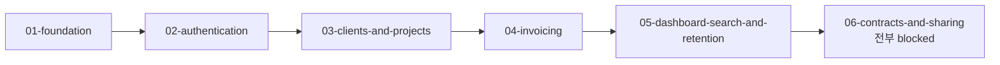

# 마스터 플랜: Deskwork (가칭) — 프리랜서 디자이너용 계약·인보이스 통합 관리

- **버전**: 0.1 (초안)
- **작성일**: 2026-09-08
- **입력 문서**: docs/PRD.md (0.1), docs/TRD.md (0.1), docs/ARCHITECTURE/ (0.1)
- **상태**: 사람 검토 대기
- **주의**: 사용자와 대화할 수 없는 조건에서 작성했다. 물었어야 할 것은 `questions.md` 에 그대로 남겼고, 그 자리에서 세운 가정도 함께 적었다.

## 1. 이 문서의 범위

이 문서는 PRD가 약속하고 TRD가 수단을 고르고 아키텍처가 모양을 정한 것을 **어떤 순서로, 어떤 단위로 만들 것인가**만 정한다. phase 여섯 개, 태스크 61개, 각 태스크의 의존 관계와 수용 기준이 여기서 처음 등장한다. 요구사항을 새로 만들거나 우선순위를 바꾸지 않고(PRD), 기술을 다시 고르지 않고(TRD), 테이블·엔드포인트·화면을 새로 정하지 않는다(아키텍처). 게이트의 실행 방법과 E2E가 덮을 흐름 목록은 Layer 4 하네스가, 실제 코드와 STATE·LOG의 갱신은 Layer 5 루프가 한다. **날짜·기간·공수를 정하지 않는다** — 이 플랜을 실행하는 것은 한 태스크에 한 세션을 쓰는 에이전트이고, 그 세션이 몇 분 걸릴지는 아무도 모른다. 진척은 `STATE.md` 와 `LOG.md` 가 말한다.

## 2. 전체 구성

| Phase | 이름 | 무엇을 완성하는가 | 태스크 수 | 선행 Phase |
|---|---|---|---|---|
| 01 | foundation | 공통 규약(계층·오류·검증·금액·표시·비밀값·로그)과 설계를 뒤집을 두 실험의 판정 | 10 | — |
| 02 | authentication | 계정·세션·소유자 조건·라우팅 접근 제어. 자기 데이터만 보이는 상태 | 11 | phase-01 |
| 03 | clients-and-projects | 클라이언트와 프로젝트, 대금 조건. 모든 문서가 매달릴 중심 개체 | 7 | phase-02 |
| 04 | invoicing | 인보이스 생성·채번·세액·상태 전이·연체·PDF·메일. 청구 한 바퀴 | 11 | phase-03 |
| 05 | dashboard-search-and-retention | 대시보드·프로젝트 상세 한 화면·검색·알림·삭제·파기. **차단되지 않은 P0가 여기서 전부 끝난다** | 10 | phase-04 |
| 06 | contracts-and-sharing | 계약서·템플릿·고지·공유 링크·열람 기록·처리방침 문안. **12개 전부 `blocked`** | 12 | phase-05 |

> **P0 요구사항이 전부 완료되는 지점은 phase-06 이다. 그런데 phase-06 은 태스크 12개가 전부 `blocked` 다.**
> 차단되지 않은 P0(FR-001·003·004·005·012·013·014·015·018·019·020과 FR-024의 접근 경로)는 **phase-05 에서 전부 완료된다.**
> 즉 지금 상태로 끝까지 실행하면 '계약→청구→입금 한 바퀴' 중 **청구·입금 쪽만 돌고 계약서와 공유가 비어 있다.** 5절을 보라.

## 3. Phase 의존 그래프

## 4. 태스크 색인

| ID | Phase | 제목 | 파일 | status | 우선순위 |
|---|---|---|---|---|---|
| phase-01-task-01 | 01 | 프로젝트 뼈대와 계층 경계 | `phase-01/phase-01-tasks/phase-01-task-01.md` | pending | P0 |
| phase-01-task-02 | 01 | 마이그레이션 러너와 되돌리기 규칙 | `phase-01/phase-01-tasks/phase-01-task-02.md` | pending | P0 |
| phase-01-task-03 | 01 | 오류 응답 단일 형식 | `phase-01/phase-01-tasks/phase-01-task-03.md` | pending | P0 |
| phase-01-task-04 | 01 | 서버 경계 입력 검증 스키마 | `phase-01/phase-01-tasks/phase-01-task-04.md` | pending | P0 |
| phase-01-task-05 | 01 | 금액·세액 계산 모듈 | `phase-01/phase-01-tasks/phase-01-task-05.md` | pending | P0 |
| phase-01-task-06 | 01 | 표시 규약 유틸 — 금액·날짜·사업자번호 | `phase-01/phase-01-tasks/phase-01-task-06.md` | pending | P0 |
| phase-01-task-07 | 01 | 비밀값 주입과 기동 검사 | `phase-01/phase-01-tasks/phase-01-task-07.md` | pending | P0 |
| phase-01-task-08 | 01 | 구조화 로그와 비노출 필드 | `phase-01/phase-01-tasks/phase-01-task-08.md` | pending | P0 |
| phase-01-task-09 | 01 | 스파이크 — 헤드리스 Chromium PDF 생성 시간 측정 (OQ-014) | `phase-01/phase-01-tasks/phase-01-task-09.md` | pending | P0 |
| phase-01-task-10 | 01 | 스파이크 — 트랜잭션 메일 도달 확인 (OQ-011) | `phase-01/phase-01-tasks/phase-01-task-10.md` | pending | P1 |
| phase-02-task-01 | 02 | accounts·sessions 테이블과 data 계층 | `phase-02/phase-02-tasks/phase-02-task-01.md` | pending | P0 |
| phase-02-task-02 | 02 | data 계층의 소유자 조건과 삭제 필터 규약 | `phase-02/phase-02-tasks/phase-02-task-02.md` | pending | P0 |
| phase-02-task-03 | 02 | 세션 생성·검증과 쿠키 속성 | `phase-02/phase-02-tasks/phase-02-task-03.md` | pending | P0 |
| phase-02-task-04 | 02 | 가입 — 이메일·비밀번호·처리방침 동의 | `phase-02/phase-02-tasks/phase-02-task-04.md` | pending | P0 |
| phase-02-task-05 | 02 | 로그인·로그아웃과 실패 응답 비구분 | `phase-02/phase-02-tasks/phase-02-task-05.md` | pending | P0 |
| phase-02-task-06 | 02 | 라우팅 접근 제어와 비인증 경로 닫힌 목록 | `phase-02/phase-02-tasks/phase-02-task-06.md` | pending | P0 |
| phase-02-task-07 | 02 | 로그인·가입 화면과 인라인 오류 표시 | `phase-02/phase-02-tasks/phase-02-task-07.md` | pending | P0 |
| phase-02-task-08 | 02 | 공통 레이아웃 — 빈·오류 상태와 반응형 기준 | `phase-02/phase-02-tasks/phase-02-task-08.md` | pending | P0 |
| phase-02-task-09 | 02 | 메일 발송 어댑터 인터페이스 | `phase-02/phase-02-tasks/phase-02-task-09.md` | pending | P1 |
| phase-02-task-10 | 02 | 비밀번호 재설정 — 토큰 발급과 완료 | `phase-02/phase-02-tasks/phase-02-task-10.md` | pending | P1 |
| phase-02-task-11 | 02 | 개인정보 처리방침 화면과 공통 하단 링크 | `phase-02/phase-02-tasks/phase-02-task-11.md` | pending | P0 |
| phase-03-task-01 | 03 | clients 테이블과 data 계층 | `phase-03/phase-03-tasks/phase-03-task-01.md` | pending | P0 |
| phase-03-task-02 | 03 | 클라이언트 등록·수정·삭제 service·route | `phase-03/phase-03-tasks/phase-03-task-02.md` | pending | P0 |
| phase-03-task-03 | 03 | 클라이언트 목록·상세 화면 | `phase-03/phase-03-tasks/phase-03-task-03.md` | pending | P0 |
| phase-03-task-04 | 03 | projects·payment_terms 테이블과 data 계층 | `phase-03/phase-03-tasks/phase-03-task-04.md` | pending | P0 |
| phase-03-task-05 | 03 | 대금 조건 합계 검증 | `phase-03/phase-03-tasks/phase-03-task-05.md` | pending | P0 |
| phase-03-task-06 | 03 | 프로젝트 등록·수정 service·route | `phase-03/phase-03-tasks/phase-03-task-06.md` | pending | P0 |
| phase-03-task-07 | 03 | 프로젝트 목록·등록 화면 | `phase-03/phase-03-tasks/phase-03-task-07.md` | pending | P0 |
| phase-04-task-01 | 04 | invoices·invoice_items 테이블과 data 계층 | `phase-04/phase-04-tasks/phase-04-task-01.md` | pending | P0 |
| phase-04-task-02 | 04 | 인보이스 번호 원자적 채번 | `phase-04/phase-04-tasks/phase-04-task-02.md` | pending | P0 |
| phase-04-task-03 | 04 | audit_events 테이블과 추가 전용 audit 모듈 | `phase-04/phase-04-tasks/phase-04-task-03.md` | pending | P0 |
| phase-04-task-04 | 04 | 인보이스 생성 — 값 승계와 회차 중복 확인 | `phase-04/phase-04-tasks/phase-04-task-04.md` | pending | P0 |
| phase-04-task-05 | 04 | 인보이스 항목·과세 저장 route | `phase-04/phase-04-tasks/phase-04-task-05.md` | pending | P0 |
| phase-04-task-06 | 04 | 인보이스 상태 전이와 이력 | `phase-04/phase-04-tasks/phase-04-task-06.md` | pending | P0 |
| phase-04-task-07 | 04 | 연체 파생 조건과 초과 일수 | `phase-04/phase-04-tasks/phase-04-task-07.md` | pending | P0 |
| phase-04-task-08 | 04 | 인보이스 편집·상세 화면 | `phase-04/phase-04-tasks/phase-04-task-08.md` | pending | P0 |
| phase-04-task-09 | 04 | 헤드리스 렌더 어댑터와 동시 생성 2건 제한 | `phase-04/phase-04-tasks/phase-04-task-09.md` | pending | P0 |
| phase-04-task-10 | 04 | 인보이스 인쇄 템플릿과 PDF 응답 | `phase-04/phase-04-tasks/phase-04-task-10.md` | pending | P0 |
| phase-04-task-11 | 04 | 인보이스 메일 발송 | `phase-04/phase-04-tasks/phase-04-task-11.md` | pending | P1 |
| phase-05-task-01 | 05 | 스파이크 — 집계 질의 P95 측정 (OQ-015) | `phase-05/phase-05-tasks/phase-05-task-01.md` | pending | P0 |
| phase-05-task-02 | 05 | 집계 정의 — 청구·입금·미수금 | `phase-05/phase-05-tasks/phase-05-task-02.md` | pending | P0 |
| phase-05-task-03 | 05 | 인덱스와 근거 질의 | `phase-05/phase-05-tasks/phase-05-task-03.md` | pending | P0 |
| phase-05-task-04 | 05 | 프로젝트 상세 — 한 화면 배치 | `phase-05/phase-05-tasks/phase-05-task-04.md` | pending | P0 |
| phase-05-task-05 | 05 | 미수금 대시보드 | `phase-05/phase-05-tasks/phase-05-task-05.md` | pending | P0 |
| phase-05-task-06 | 05 | 연체 알림 — 테이블·API·헤더 배지 | `phase-05/phase-05-tasks/phase-05-task-06.md` | pending | P1 |
| phase-05-task-07 | 05 | 문서 검색 | `phase-05/phase-05-tasks/phase-05-task-07.md` | pending | P1 |
| phase-05-task-08 | 05 | 논리 삭제와 프로젝트 동반 삭제 | `phase-05/phase-05-tasks/phase-05-task-08.md` | pending | P1 |
| phase-05-task-09 | 05 | 하루 1회 정기 작업 | `phase-05/phase-05-tasks/phase-05-task-09.md` | pending | P0 |
| phase-05-task-10 | 05 | 계정 해지와 파기 예정일 표시 | `phase-05/phase-05-tasks/phase-05-task-10.md` | pending | P0 |
| phase-06-task-01 | 06 | contracts·contract_clauses·contract_templates 테이블 | `phase-06/phase-06-tasks/phase-06-task-01.md` | blocked | P0 |
| phase-06-task-02 | 06 | 계약서 생성과 변수 자동 채움 | `phase-06/phase-06-tasks/phase-06-task-02.md` | blocked | P0 |
| phase-06-task-03 | 06 | 계약서 템플릿 본문 등록 | `phase-06/phase-06-tasks/phase-06-task-03.md` | blocked | P0 |
| phase-06-task-04 | 06 | 조항 편집·저장과 발송본 새 버전 | `phase-06/phase-06-tasks/phase-06-task-04.md` | blocked | P0 |
| phase-06-task-05 | 06 | 계약서 편집 화면 | `phase-06/phase-06-tasks/phase-06-task-05.md` | blocked | P0 |
| phase-06-task-06 | 06 | 법적 효력 고지 문구 상수와 세 자리 노출 | `phase-06/phase-06-tasks/phase-06-task-06.md` | blocked | P0 |
| phase-06-task-07 | 06 | 계약서 인쇄 템플릿과 PDF 응답 | `phase-06/phase-06-tasks/phase-06-task-07.md` | blocked | P0 |
| phase-06-task-08 | 06 | share_links 테이블과 토큰 해시 저장 | `phase-06/phase-06-tasks/phase-06-task-08.md` | blocked | P0 |
| phase-06-task-09 | 06 | 공유 링크 발급·폐기와 존재 여부 비노출 | `phase-06/phase-06-tasks/phase-06-task-09.md` | blocked | P0 |
| phase-06-task-10 | 06 | 공유 열람 화면 — JS 없이 보이는 서버 렌더 | `phase-06/phase-06-tasks/phase-06-task-10.md` | blocked | P0 |
| phase-06-task-11 | 06 | 공유 링크 열람 기록과 표시 | `phase-06/phase-06-tasks/phase-06-task-11.md` | blocked | P1 |
| phase-06-task-12 | 06 | 개인정보 처리방침 문안 | `phase-06/phase-06-tasks/phase-06-task-12.md` | blocked | P0 |

## 5. 차단된 태스크

| 태스크 | 차단 원인 | 무엇이 정해지면 풀리는가 | 함께 막히는 태스크 |
|---|---|---|---|
| phase-06-task-01 | OQ-001, OQ-007, CF-006 | 전자서명 제외 여부와 템플릿 법적 검토 범위 | phase-06 의 계약서 줄기 전부(task-02·03·04·05·07) |
| phase-06-task-02 | OQ-001, OQ-007, CF-006 | 위와 같음 | task-04, task-05, task-07 |
| phase-06-task-03 | OQ-007, CF-006 | 공개 표준계약서를 그대로 쓸 수 있는가 | 없음(잎) |
| phase-06-task-04 | OQ-001, CF-006 | 전자서명 제외 여부 | task-05, task-07 |
| phase-06-task-05 | OQ-001, OQ-007, CF-006 | 위 둘 | task-07 |
| phase-06-task-06 | OQ-007, CF-006 | 고지 문안이 어디까지 법적 검토를 받는가 | task-05, task-07, task-10 (고지가 세 자리에 다 필요하다) |
| phase-06-task-07 | OQ-001, OQ-007, CF-006 | 위 둘 | 없음(잎) |
| phase-06-task-08 | OQ-009, CF-006 | 클라이언트가 링크에서 무엇까지 할 수 있는가 | task-09, task-10, task-11 |
| phase-06-task-09 | OQ-009, CF-006 | 위와 같음 | task-10, task-11 |
| phase-06-task-10 | OQ-009, CF-006 | 위와 같음 | task-11 |
| phase-06-task-11 | OQ-009, CF-006 | 위와 같음 | 없음(잎) |
| phase-06-task-12 | OQ-010, CF-006 | 개인정보 국내 저장이 법적으로 강제되는가 | 없음(잎) |

> **차단 12건.** 전부 phase-06 에 있고 그 phase의 태스크 전부다. 원인은 `overview.md §7` 의 **CF-006(`P0 뼈대: 예`, 미해소)** 과 그것이 묶고 있는 PRD 미결 네 건(OQ-001·OQ-007·OQ-009·OQ-010)이다. CF-006은 정의상 계약서 개체와 공유 경로 위에 있어 의존 사슬의 끝으로 옮길 수 없다 — 그래서 phase 하나가 통째로 선다. 이건 플랜의 결함이 아니라 **앞 문서가 아직 안 끝났다는 신호**다.

## 6. 요구사항 → 태스크 추적표

| 요구사항 | 우선순위 | 담당 태스크 |
|---|---|---|
| FR-001 | P0 | phase-02-task-01, phase-02-task-03, phase-02-task-04, phase-02-task-05, phase-02-task-06, phase-02-task-07 |
| FR-002 | P1 | phase-01-task-10, phase-02-task-09, phase-02-task-10 |
| FR-003 | P0 | phase-03-task-01, phase-03-task-02, phase-03-task-03 |
| FR-004 | P0 | phase-03-task-04, phase-03-task-05, phase-03-task-06, phase-03-task-07 |
| FR-005 | P0 | phase-05-task-02, phase-05-task-04 |
| FR-006 | P0 | phase-06-task-01, phase-06-task-02, phase-06-task-03, phase-06-task-05 **(전부 차단)** |
| FR-007 | P0 | phase-06-task-01, phase-06-task-04, phase-06-task-05 **(전부 차단)** |
| FR-008 | P0 | phase-06-task-07 **(전부 차단)** |
| FR-009 | P0 | phase-06-task-08, phase-06-task-09, phase-06-task-10 **(전부 차단)** |
| FR-010 | P1 | phase-06-task-11 **(전부 차단)** |
| FR-011 | P0 | phase-06-task-05, phase-06-task-06 **(전부 차단)** |
| FR-012 | P0 | phase-04-task-04, phase-04-task-08 |
| FR-013 | P0 | phase-04-task-02 |
| FR-014 | P0 | phase-01-task-05, phase-04-task-05, phase-04-task-08 |
| FR-015 | P0 | phase-04-task-09, phase-04-task-10 |
| FR-016 | P0 | phase-06-task-08, phase-06-task-09, phase-06-task-10 **(전부 차단)** |
| FR-017 | P1 | phase-01-task-10, phase-04-task-11 |
| FR-018 | P0 | phase-04-task-03, phase-04-task-06 |
| FR-019 | P0 | phase-04-task-07, phase-05-task-05 |
| FR-020 | P0 | phase-05-task-02, phase-05-task-05 |
| FR-021 | P1 | phase-05-task-06, phase-05-task-09 |
| FR-022 | P1 | phase-05-task-07 |
| FR-023 | P1 | phase-05-task-08 |
| FR-024 | P0 | phase-02-task-04, phase-02-task-11, phase-05-task-10, phase-06-task-12 **(전부 차단)** |
| NFR-001 | — | phase-05-task-01, phase-05-task-02, phase-05-task-03, phase-05-task-04, phase-05-task-05 |
| NFR-002 | — | phase-01-task-09, phase-04-task-09, phase-04-task-10, phase-06-task-07 |
| NFR-003 | — | (태스크 없음 — 7절의 Layer 4 위임) |
| NFR-004 | — | phase-02-task-02, phase-02-task-06, phase-03-task-02, phase-03-task-06, phase-04-task-05 |
| NFR-005 | — | phase-06-task-08 **(일부 차단)** |
| NFR-006 | — | phase-01-task-07, phase-02-task-01, phase-02-task-03, phase-02-task-04, phase-02-task-05 |
| NFR-007 | — | phase-05-task-08, phase-05-task-09, phase-05-task-10 |
| NFR-008 | — | phase-01-task-05, phase-01-task-06, phase-04-task-01, phase-05-task-02 |
| NFR-009 | — | phase-04-task-03, phase-04-task-06, phase-05-task-09 |
| NFR-010 | — | phase-02-task-08 |
| NFR-011 | — | phase-02-task-08, phase-04-task-08, phase-06-task-10 |
| NFR-012 | — | phase-02-task-06, phase-06-task-10 **(일부 차단)** |
| NFR-013 | — | phase-01-task-02, phase-04-task-09, phase-05-task-06 |
| NFR-014 | — | phase-06-task-06 **(일부 차단)** |
| NFR-015 | — | phase-01-task-08, phase-04-task-11, phase-06-task-12 |
| NFR-016 | — | phase-01-task-05, phase-01-task-06, phase-04-task-01 |

> FR 24개·NFR 16개 중 어느 태스크에도 걸리지 않은 것은 **NFR-003 하나**이며 7절에서 Layer 4로 넘겼다.

## 7. Layer 4로 넘기는 검증

| 요구사항 | 왜 태스크로 담기지 않는가 |
|---|---|
| NFR-003 (첫 사용 흐름 10분, 5회 측정 중앙값) | 한 태스크의 결과가 아니라 **가입→클라이언트→프로젝트→계약서 PDF→인보이스 발송 전 구간의 합**이다. 어느 태스크의 수용 기준에 넣어도 그 태스크만으로는 판정되지 않는다. 하네스가 이 흐름을 E2E로 잡고 시간을 재야 한다. **다만 계약서 PDF가 차단되어 있어 이 흐름은 phase-06 이 풀리기 전에는 끝까지 측정할 수 없다.** |
| NFR-010 (Chromium 2종·WebKit 1종 최신 2개 버전) | 브라우저 3종을 실제로 실행하는 것은 **테스트 실행 구성**이지 구현 파일 하나의 수정이 아니다. phase-02-task-08 이 화면 쪽 조건(브레이크포인트 하나·표준 웹 기술)을 만들고, 3종에서 같은 스위트를 돌리는 것은 하네스가 한다. |
| NFR-013 (월간 가동률 99% 측정) | 가동률은 **배포된 서비스를 외부에서 관찰해야** 나오는 값이다. 코드 쪽 조건(되돌릴 수 있는 마이그레이션·PDF 동시 제한·폴링 없음)은 phase-01-task-02·phase-04-task-09·phase-05-task-06 이 만들고, 가동 확인 서비스 연결과 월간 집계는 하네스·운영 소관이다. |
