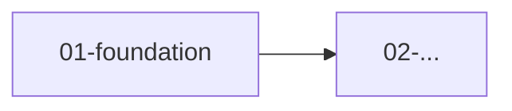

# 마스터 플랜 작성 (Layer 3)

## 이 스킬의 목적

마스터 플랜은 **"정해진 구조를 어떤 순서로, 어떤 단위로 만들 것인가"**에 대한 합의문이다.
PRD가 약속이고 TRD가 수단이고 아키텍처가 모양이라면, 플랜은 그것을 **실행 가능한 조각으로 자른 것**이다.
여기서 만든 것이 뒤에서 이렇게 쓰인다.

```
태스크 하나 (phase-02-task-03.md)
   → 하네스가 이 태스크를 무엇으로 검증할지 정한다           (Layer 4)
   → 루프가 이 파일 하나를 열어 한 세션 동안 구현한다        (Layer 5)
   → STATE.md 가 갱신되고 LOG.md 에 한 줄이 쌓인다          (Layer 5)
```

그래서 이 문서의 품질은 "계획이 그럴듯한가"가 아니라 세 가지로 판정된다.

1. **태스크 하나가 한 세션에서 끝나고 혼자 검증되는 크기인가**
2. **의존 관계가 정확해서 순서대로 따라가면 막히지 않는가**
3. **아직 정해지지 않은 것 위에 세워진 태스크가 `blocked` 로 드러나 있는가**

세 번째를 놓치면 루프가 그 태스크를 집어 들고, 요구사항이 모호한 채로 구현하고, 검증에서 세 번 실패하고 멈춘다.
**그때 드는 비용은 여기서 `blocked` 한 줄을 쓰는 비용의 수십 배다.**

### 여기서 하는 일과 하지 않는 일

| 하지 않는 것 | 어디서 하는가 |
|---|---|
| 요구사항을 새로 만들거나 우선순위를 바꾸는 것 | PRD (`prd-generator`) — 돌아가서 고친다 |
| 기술을 새로 고르거나 바꾸는 것 | TRD (`trd-generator`) — 돌아가서 고친다 |
| 구조를 정하는 것 (테이블·엔드포인트·화면·계층) | Layer 2 아키텍처 (`architecture-generator`) — 없으면 만들어 오지 말고 되돌려 보낸다 |
| lint·unit test·E2E·task validation의 **구체적 구성**과 실행 방법 | Layer 4 하네스 (`harness-setup`) |
| 루프의 실행 규칙, 실패 재시도 횟수, 워크트리 운용 | Layer 5 (`loop-setup`) |
| 실제 코드 작성, STATE.md·LOG.md의 **갱신** | Layer 5 개발 루프 (예외: 10단계 부분 갱신에서 `Task Status` 행 추가·`Next Action`·LOG 한 줄) |
| **날짜·기간·공수 추정 (몇 주, 몇 시간, 스프린트)** | 아무 데서도 하지 않는다 — 아래를 보라 |

**일정을 만들지 않는다.** 계획을 세우라는 말을 들으면 주차별 일정표를 쓰고 싶어진다. 그러나 이 플랜을 실행하는 것은
사람이 아니라 **한 태스크에 한 세션을 쓰는 에이전트**이고, 그 세션이 몇 분 걸릴지는 아무도 모른다.
문서에 적힌 "2주"는 아무것도 조정하지 못하면서 **틀렸을 때 실패처럼 보이는 숫자**만 남긴다.
순서와 의존은 정하되 시간은 적지 않는다. 진척은 STATE.md 와 LOG.md 가 말한다.

**되돌리기 비용과 미결 해소 비용도 기간으로 적지 않는다.** "이 미결이 뒤집히면 2주" 대신
**"무엇을 다시 해야 하는가"**로 적는다 — "계약서 개체와 공유 경로 설계를 다시 그리고 phase-06 태스크 7개를 다시 쓴다".
앞 레이어가 되돌리기 비용을 그렇게 적어 온 이유와 같다. 기간은 누가 하느냐에 따라 달라지지만 **다시 해야 할 일의 목록은 변하지 않고**,
사용자가 판단할 때 실제로 필요한 것도 그쪽이다.

**구조를 새로 정하지 않는다.** 태스크를 쓰다 보면 아키텍처에 없는 것이 필요해진다 — "여기 캐시 계층이 있어야 하는데".
그렇게 본문에 들어간 설계는 아무도 검토하지 않았고 다른 태스크와 맞지 않는다.
**아키텍처의 빈칸은 태스크로 채우지 말고 8단계의 보고로 올린다.**

### 아키텍처와 플랜의 경계

| 아키텍처 (무엇을 만드는가) | 플랜 (어떤 순서로 자르는가) |
|---|---|
| `invoices` 테이블에 어떤 컬럼과 인덱스를 두는가 | 그 테이블을 만드는 것이 몇 번째 태스크이고 무엇 뒤에 오는가 |
| 소유권 검사를 어느 계층에서 강제하는가 | 그 계층을 세우는 태스크가 인증 태스크에 의존하는가 |
| 오류 응답이 정확히 어떤 모양인가 | 그 규약을 적용하는 태스크가 첫 엔드포인트보다 앞인가 |

**설계 단위(`database.md §3.2`)가 태스크의 씨앗이다.** 아키텍처는 이미 "절 하나가 태스크 몇 개로 나뉠 크기인가"를 점검해 두었다.
그러니 태스크를 처음부터 상상하지 말고, **설계 단위 목록에서 출발한다.**

---

## 1단계. 입력 확보와 사전 점검

세 곳을 **전문으로 읽는다.** 요약본으로 대체하지 않는다.

| 입력 | 무엇을 얻는가 |
|---|---|
| `docs/PRD.md` | FR·NFR 목록, 우선순위(P0/P1/P2), 8절 미결과 **차단 여부**, 9절 추적표(여기 `담당 태스크` 열을 채운다) |
| `docs/TRD.md` | TD 목록과 **확정도**(확정 / 잠정 / 스파이크 필요), 12절 미결 |
| `docs/ARCHITECTURE/*.md` | **설계 단위 전부**(각 파일의 번호 절), overview.md 의 의존 방향·핵심 흐름·CF 표·추적표 |

**아키텍처가 없으면 플랜을 쓰지 않는다.** 설계 없이 자른 태스크는 "무엇을 만드는가"를 태스크 안에서 즉흥적으로 정하게 되고,
그렇게 정해진 것들은 서로 맞지 않는다. `architecture-generator` 를 먼저 제안한다.
PRD·TRD 중 하나가 없으면 우선순위와 확정도를 알 수 없어 순서를 정할 근거가 사라진다. 마찬가지로 되돌려 보낸다.

읽으면서 네 목록을 먼저 만든다. 이후 모든 판단의 재료다.

1. **설계 단위 목록** — `파일명 §절번호`와 그 절의 근거 FR·NFR·TD. overview.md 8절 추적표가 지름길이다
2. **차단 후보 목록** — PRD 9절의 `차단 미결`·`상태` 두 열, PRD 8절·TRD 12절의 미결 표(종류·기본값·되돌리기 비용),
   overview.md 7절 CF 표의 `P0 뼈대` 열. **여기서는 후보만 모은다. 실제로 무엇이 막는지는 2단계에서 판정한다**
3. **의존 재료** — overview.md 3절(경계와 의존 방향), 4절(핵심 흐름). 흐름의 순서가 곧 태스크의 순서다
4. **우선순위** — PRD 9절의 P0/P1/P2. 태스크가 그대로 물려받는다

## 2단계. 차단 판정 — 어떤 태스크가 `blocked` 로 태어나는가

**이 판정을 태스크를 만든 뒤가 아니라 먼저 한다.** 나중에 하면 이미 만든 태스크를 다시 훑게 되고, 그때 몇 개는 빠진다.

두 가지가 태스크를 `blocked` 로 만든다.

| 원인 | 어디서 읽는가 | 어느 태스크가 걸리는가 |
|---|---|---|
| **차단 미결 (OQ)** | PRD 9절 추적표의 `차단 미결`·`상태` 열, PRD 8절·TRD 12절 | 아래 판정을 통과한 FR을 구현하는 태스크 전부 |
| **미해소 충돌 (CF) 중 `P0 뼈대: 예`** | `overview.md` 7절 CF 표 | 그 충돌이 걸린 설계 단위를 구현하는 태스크 전부 |

둘은 같은 취급이다. **아직 사용자가 정하지 않은 것 위에 코드를 얹지 않는다**는 한 가지 이유에서 나왔기 때문이다.
미결은 "아직 안 정한 것", 충돌은 "이미 어긋나 있는 것"이라 성격은 다르지만, 그 위에서 구현을 시작하면 결과는 똑같다 —
나중에 답이 오면 코드를 버린다.

### 어떤 미결(OQ)이 실제로 막는가

**PRD가 신호를 둘 준다.** 9절 `차단 미결` 열에 OQ가 적혀 있는 것과, 9절 `상태` 열이 `정의됨 (차단)` 인 것이다.
PRD 스킬은 두 열을 짝으로 쓰도록 정해 두었지만, **사람이 손으로 고친 PRD에서는 어긋날 수 있다** —
8절 미결 표의 열 이름이 "차단하는 요구사항"이라 거기 적힌 FR이 전부 차단으로 읽히는데,
9절 `상태` 는 그중 일부에만 `(차단)` 이 붙어 있는 식이다. 어긋난 채로 두면 같은 PRD로 두 번 만든 플랜이 서로 다르게 막힌다.

그래서 이렇게 판정한다.

1. **`상태` 열이 `정의됨 (차단)` 이면 무조건 막는다.** PRD 작성자가 내린 명시적 판정이고, Layer 3이 그것을 뒤집지 않는다
2. **PRD가 판정하지 않은 것**(`차단 미결` 열에는 OQ가 있는데 `상태` 는 그냥 `정의됨`)은 두 가지를 묻는다.
   **둘 중 하나라도 "아니오"면 막는다.**

| 물을 것 | 막는 경우 |
|---|---|
| **기본값만으로 이 태스크의 수용 기준을 지금 쓸 수 있는가?** | 못 쓰면 막는다. 예 — 기본값이 "공개 표준계약서 기반으로 작성"인데 그 본문이 아직 없으면 템플릿 태스크의 판정 기준을 쓸 수 없다 |
| **기본값이 뒤집혔을 때 이 태스크만 다시 쓰면 되는가?** | phase가 통째로 재작업이면 막는다. 8절 미결 표의 `되돌리기 비용` 칸이 그 답이다 |

**이 두 질문에서 규칙을 뽑은 이유**가 있다. `blocked` 는 형식이 아니라 **"나중에 버릴 코드를 지금 쓰지 않는다"**를 위한 것이다.
기본값으로 끝까지 만들고 검증할 수 있고 뒤집혀도 그 태스크만 고치면 되는 미결은, 막아 봐야 진행만 멈추고 아무것도 아끼지 못한다.
반대로 수용 기준조차 못 쓰는 태스크를 열어 두면 루프가 그것을 집어 들고 추측으로 구현한다.

**막지 않은 것은 그냥 넘기지 않는다.** 그 태스크의 '바뀔 수 있는 지점'에 해당 OQ를 적는다 —
`P0 뼈대: 아니오` 인 CF를 다루는 방식과 같다. 뒤집혔을 때 무엇을 되돌릴지 알아야 한다.

**종류가 '실험'인 미결은 스파이크 태스크로 만든다.** 해봐야 아는 것이라 물어서 풀리지 않는다.
관련 태스크는 그 스파이크에 `depends_on` 으로 건다. PRD·TRD가 해소 방법에 "Layer 3에서 검증 태스크로 생성"이라고
직접 적어 둔 미결이 특히 그렇다.

**두 신호가 어긋난 것 자체를 9단계 보고에 올린다.** 어느 쪽으로 판정했는지와 근거를 함께 적는다.
PRD의 내부 불일치를 Layer 3이 조용히 한쪽으로 정리하면, 사용자는 자기 문서가 어긋나 있다는 것을 끝내 모른다.

### 어떤 충돌(CF)이 실제로 막는가

**`P0 뼈대: 예` 인 미해소 충돌만 막는다.** 아키텍처가 그 열에 이미 판정을 적어 두었으므로 여기서 다시 판정하지 않는다.
`아니오` 인 충돌은 잠정 설계로 진행할 수 있고 뒤집혀도 태스크 한두 개만 다시 쓰면 된다 —
대신 그 태스크 본문의 **바뀔 수 있는 지점**에 어느 CF 때문인지 적는다. 미결에서 막지 않은 것을 다루는 방식과 같다.

### blocked 태스크를 만들되, 빠뜨리지 않는다

막혔다고 태스크를 안 만들면 그 요구사항은 플랜에서 사라지고, 미결이 풀린 뒤에도 아무도 그것을 다시 넣지 않는다.
**만들되 `status: blocked` 로 만들고, `blocked_by` 에 OQ·CF ID를 적고, 본문에 "무엇이 정해지면 풀리는가"를 적는다.**

`blocked` 는 셋 다 있어야 쓸모가 있다. 상태만 있으면 루프가 건너뛸 줄은 알아도 **누구에게 무엇을 물어야 풀리는지**를 모른다.

### 막힌 것이 뼈대에 있으면 그 사실 자체를 보고한다

blocked 태스크가 다른 태스크의 `depends_on` 에 들어가면 **그 뒤가 전부 실행 불가**가 된다.
가능하면 차단된 부분을 의존 사슬의 끝(잎)에 두어 나머지가 흐르게 한다.

그런데 `P0 뼈대: 예` 인 충돌은 정의상 개체·관계, 인증 모델, 요청 처리 경로 위에 있어서 **끝으로 옮길 수 없다.**
그러면 phase 하나가 통째로 막힌다. 그건 플랜의 결함이 아니라 **앞 문서가 아직 안 끝났다는 신호**이므로,
억지로 우회 태스크를 만들지 말고 9단계 보고의 맨 앞에 올린다. 사용자가 미결 하나를 푸는 것이 태스크 열 개를 우회하는 것보다 싸다.

## 3단계. 태스크 도출 — 설계 단위에서 태스크로

### 태스크 하나의 크기

원본 사양이 정한 기준은 **"가능한 파일 하나의 수정이며, 하나의 검증 가능한 작업 단위"**다. 두 조건을 다 만족해야 한다.

- **파일 하나** — 손대는 구현 파일은 하나를 목표로 한다. 여러 개가 불가피하면 본문에 이유를 적는다
  (스키마 파일과 그 마이그레이션은 따로 두면 어느 쪽도 혼자 검증되지 않는다)
- **딸린 테스트 파일은 같은 태스크에 둔다** — 떼어 놓으면 구현 태스크가 **검증 없이 completed** 가 된다.
  완료 조건은 "코드를 다 썼다"가 아니라 "테스트를 통과했다"이므로, 검증 수단이 없는 태스크는 완료될 수 없다
- **검증 가능** — 그 태스크만 끝난 상태에서 관찰할 수 있는 결과가 있어야 한다. "기반을 마련한다"는 태스크가 아니다

너무 크면 한 세션에 안 끝나고, 검증이 통째로 실패해 어디가 틀렸는지 모른 채 3회 재시도 뒤 멈춘다.
너무 작으면 태스크마다 세션 준비 비용이 붙고 의존 그래프가 읽을 수 없게 커진다.
의심스러우면 **수용 기준을 써 보는 것**이 가장 빠른 판정이다 — 한 줄이 안 나오면 너무 크거나(여러 개가 섞였다) 아무것도 안 하는 태스크다.

### 설계 단위에서 자른다

설계 단위 하나가 태스크 하나가 되는 경우가 가장 흔하지만, 항상 그렇지는 않다.

| 상황 | 어떻게 자르는가 |
|---|---|
| 설계 단위가 파일 하나에 대응한다 | 태스크 하나 |
| 설계 단위가 여러 파일에 걸친다 (예: 엔드포인트 + service + data) | **계층별로 자른다.** 의존 방향(overview.md §3)이 곧 태스크 순서다 |
| 설계 단위가 너무 작다 (규칙 두어 줄) | 그것을 쓰는 태스크에 흡수한다. 태스크 본문의 Architecture 에 절 번호를 함께 적는다 |
| 여러 설계 단위가 파일 하나를 공유한다 | 합칠지 나눌지는 **검증 단위**로 정한다. 따로 검증할 수 있으면 따로 |

**설계 단위를 가리킬 때 파일 이름만 적지 않는다.** `database.md` 가 아니라 `database.md §3.2` 다.
파일 이름만 적으면 루프가 어느 절을 말하는지 다시 추측하고, 추측한 범위는 대개 실제보다 넓어서 태스크가 옆 설계까지 건드린다.

### `files` 의 경로는 어디까지 플랜이 정하는가

태스크가 파일 하나의 수정인 이상 경로를 적어야 하는데, 아키텍처가 계층과 모듈만 정하고 경로까지는 안 정한 경우가 많다.
**아키텍처가 정한 계층·모듈 안에서 파일을 하나 지정하는 것은 플랜의 일이다.** 그건 순서를 정하는 데 필요한 최소한이다.

| 플랜이 정해도 되는 것 | 정하면 침범인 것 |
|---|---|
| 아키텍처가 정한 계층 안의 파일 이름과 위치 (`src/data/invoice-number.ts`) | 아키텍처에 없는 **계층·모듈·구성 요소**를 새로 만드는 것 (`src/cache/`, 워커 프로세스) |
| 그 파일에 딸린 테스트 파일 | 아키텍처에 없는 화면·엔드포인트·테이블에 해당하는 파일 |

**구분 기준 하나 — 그 경로를 지우면 설계가 달라지는가?** 달라지면 그건 설계이고, 아키텍처로 돌려보낼 일이다.
파일을 어디에 두든 설계가 그대로면 그건 배치이고, 플랜이 정하면 된다.
기존 코드베이스가 있으면 추측하지 말고 실제 경로를 확인한다 — 없는 경로를 적으면 루프가 첫 태스크에서 헤맨다.

### 어떤 요구사항도 태스크 없이 남기지 않는다

overview.md 8절 추적표의 모든 FR·NFR이 최소 하나의 태스크에 걸려야 한다.
**NFR을 빠뜨리기 쉽다** — 화면과 엔드포인트는 자연히 태스크가 되지만, "PDF 10초", "감사 이력 1년 보존" 같은 것은
어느 설계 단위에 흡수되어 있어서 태스크 목록에서 사라진다. 그러면 아무도 그것을 만족시키지 않는다.

NFR은 셋 중 하나로 처리한다 — ①어느 태스크의 수용 기준에 들어간다 ②전용 태스크가 된다(성능 예산, 인덱스, 보존 작업)
③Layer 4의 검증 대상으로 넘긴다(그때는 그 사실을 PLAN.md 에 적는다).

### 의존 관계

`depends_on` 에는 **그것이 없으면 이 태스크를 검증할 수 없는 것만** 적는다.
"먼저 하는 게 자연스럽다" 정도는 의존이 아니라 순서 취향이고, 그것까지 넣으면 그래프가 한 줄로 늘어서서 병렬이 불가능해진다.

- **순환이 있으면 안 된다.** Layer 5가 멀티 에이전트로 갈 때 이 그래프를 DAG로 읽는다. 순환은 그 자리에서 교착이 된다
- **phase를 넘는 의존은 뒤에서 앞으로만** — phase-03의 태스크가 phase-02에 의존하는 것은 정상이고, 그 반대는 phase 분할이 틀렸다는 뜻이다
- **blocked 태스크에 의존하는 태스크는 실질적으로 함께 막힌다.** 2단계에서 본 대로, 이걸 알고 배치한다

## 4단계. phase 구성

phase는 폴더가 아니라 **태스크보다 큰 검증 가능한 단위**다. 한 phase의 태스크가 전부 완료되면 phase 완료가 **자동 판정**되어야 하는데,
그러려면 phase에도 관찰 가능한 수용 기준이 있어야 한다. "기반이 마련됨"으로는 자동 판정이 안 된다.

**의존 방향으로 나눈다.** 시간이나 팀이 아니다.

```
뼈대(프로젝트 구성·스키마·공통 규약) → 인증 → 핵심 도메인 → 부가 기능·운영
```

이 순서를 지키는 이유는 앞의 것이 뒤의 것 없이 검증되지만 그 반대는 안 되기 때문이다.
인증 없이 도메인 로직을 만들면 소유권 검사를 나중에 전부 다시 끼워 넣게 된다.

phase 구성의 판단 기준 넷.

- **P0가 어디서 끝나는가** — P0 태스크가 전부 완료되는 phase가 "일단 돌아가는 지점"이다. PLAN.md 에 그 지점을 표시한다
- **개수에 상한을 두지 않는다** — 보통 10개 미만에 들어오지만, 프로젝트가 크면 더 많아도 된다.
  **개수를 맞추려고 성격이 다른 것을 한 phase에 묶지 않는다** — 그러면 phase 수용 기준이 "이것과 저것이 된다"가 되어 자동 판정을 못 한다.
  phase가 늘어나는 것 자체는 비용이 아니다. 무엇이 끝났고 무엇이 남았는지는 STATE.md 와 LOG.md 가 언제든 말해 준다
- **phase 이름은 그 phase가 무엇을 완성하는가** — `foundation`, `authentication`, `core-domain`, `dashboard`.
  원본 사양의 `phase-01-foundation` 에서 `foundation` 이 그 자리다
- **막힌 것을 한 phase에 모으지 않는다** — blocked 태스크가 한 phase에 몰리면 그 phase에서 진행이 통째로 선다
- **첫 phase 의 수용 기준은 "명령이 돌고 응답이 온다"로 쓴다** — 코드가 0줄인 구간에는 하네스의 게이트가 전부 미활성이라
  자동 판정이 없다. 그래서 첫 phase 의 태스크·phase 수용 기준은 검증자가 셸에서 확인할 수 있는 것
  (설치 명령이 0으로 끝난다, 서버가 뜨고 상태 응답이 200이다, 마이그레이션이 적용되어 테이블이 있다)으로 쓴다.
  "구조가 잡혔다"류는 이 구간에서 아무도 판정하지 못한다

## 5단계. 파일 쓰기

`plan_setup/` 아래에 만든다. **원본 사양이 그린 구조가 이것이고, 경로와 파일 이름을 그대로 따른다.**

```
project_name/plan_setup/
├── PLAN.md
├── STATE.md
├── LOG.md
├── phase-01/
│   ├── phase-01-foundation.md
│   └── phase-01-tasks/
│       ├── phase-01-task-01.md
│       ├── phase-01-task-02.md
│       └── phase-01-task-03.md
└── phase-02/
    ├── phase-02-core.md
    └── phase-02-tasks/
        ├── phase-02-task-01.md
        └── phase-02-task-02.md
```

`foundation`·`core` 는 예시 단어다. 그 자리에 phase가 무엇을 완성하는지를 넣는다.

### 태스크 ID는 파일 이름과 같다

`id` 는 확장자를 뗀 파일 이름을 그대로 쓴다. `phase-02-task-03.md` 의 `id` 는 `phase-02-task-03` 이다.
STATE.md·LOG.md·`depends_on` 도 전부 같은 문자열을 쓴다.

**변환이 없어야 하기 때문이다.** 루프는 매 세션 STATE.md 를 먼저 읽고 그 태스크 문서를 연다.
ID와 파일 이름이 다르면 그 사이에 대응표가 필요하고, 표는 태스크가 늘거나 줄 때 낡는다.
낡은 표는 루프가 **엉뚱한 파일을 여는** 형태로 드러나므로, 대응표를 두지 않는 편이 낫다.

**번호는 순서가 아니라 이름이다.** 나중에 태스크를 추가할 때 중간에 끼워 넣지 않고 **그 phase의 끝번호에 붙인다**
(12개가 있으면 다음은 `phase-02-task-13`). 실행 순서는 `depends_on` 이 정하므로 번호까지 순서일 필요가 없다.
중간 삽입으로 뒤 번호를 밀면, LOG.md 에 이미 적힌 이름이 다른 태스크를 가리키게 되어 **통과한 적 없는 것이 통과했다고 남는다.**

### 태스크 문서의 YAML frontmatter

**원본 사양이 제시한 8개 필드를 그 상대 순서대로 쓰고**, 원본 본문이 언급한 `title`·`priority` 와 뒤 레이어가 기계로 읽어야 하는 `architecture`·`blocked_by` 넷을 사이에 끼운다.

```yaml
---
id: phase-02-task-03
phase: "02"
title: 인보이스 번호 채번
priority: P0
goal: 인보이스 번호 채번을 원자적 연산 한 지점으로 구현한다
depends_on: [phase-01-task-09, phase-02-task-01]
files: [src/data/invoice-number.ts, src/data/invoice-number.test.ts]
architecture: [database.md §3.7, backend.md §3.9]
acceptance_criteria:
  - 한 계정에서 인보이스 20건을 동시에 생성하면 번호 20개가 모두 다르고 빈 번호가 없다
  - 마지막 인보이스를 삭제한 뒤 새로 만들면 삭제된 번호가 아니라 다음 번호가 부여된다
  - 이미 존재하는 번호를 수동 입력해 저장하면 거부되고 사유가 반환된다
status: pending
verification: [lint, unit, e2e, task_validation]
blocked_by: []
---
```

| 필드 | 무엇을 적는가 |
|---|---|
| `id` | 확장자를 뗀 파일 이름 |
| `phase` | 상위 phase 번호. **반드시 따옴표를 씌운다** — `02` 는 YAML에서 정수 `2` 가 되어 파일 이름과 어긋난다 |
| `title` | 짧은 이름. 표와 색인에 쓰인다 |
| `priority` | PRD의 `P0`/`P1`/`P2` 를 그대로 물려받는다. 차단이 여럿일 때 무엇부터 풀지의 근거다 |
| `goal` | 한 문장. 무엇을 만드는가 |
| `depends_on` | 없으면 `[]`. 빈칸으로 두지 않는다 — 빈칸은 "아직 안 정했다"로 읽힌다 |
| `files` | 만들거나 고칠 파일 경로. **마이그레이션·시드·스키마·환경 설정·포트 설정처럼 여러 태스크가 나눠 쓰는 자원 파일도 빠뜨리지 않는다** — Layer 5가 이 목록으로 병렬 실행 전 자원 충돌을 검사하므로, 빠지면 두 워커가 같은 파일을 동시에 고친다. 코드를 쓰는 태스크는 `[]` 로 두지 않는다 |
| `architecture` | 이 태스크가 구현하는 설계 단위. **`파일명 §절번호` 로 적는다.** 본문에도 설명이 있지만, 루프가 "무엇을 건드려도 되는가"를 판정할 때 본문을 해석하지 않고 이 줄만 읽는다 |
| `acceptance_criteria` | 관찰 가능한 기준. 아래 규칙을 따른다 |
| `status` | `pending` / `in_progress` / `blocked` / `failed` / `completed`. **생성 시점에는 `pending` 또는 `blocked` 뿐이다.** `blocked` 를 `pending` 으로 되돌리는 것은 Layer 5 루프의 차단 해소 절차이고, 그때 수용 기준을 다시 써야 하면 여기로 돌아온다 |
| `verification` | 아래를 보라 |
| `blocked_by` | 막혀 있지 않으면 `[]`. 막혔으면 `[OQ-007, CF-006]`. **상태만 있고 이유가 없으면 아무도 그것을 풀 수 없다** |

### `verification` — 네 게이트는 모든 태스크에 다 돈다

태스크 하나는 파일 하나의 수정이고, 그 수정 하나가 **lint(문법) → unit(수정된 단위) → e2e(사용자 흐름) → task_validation(수정 사항의 엄격한 검증)**
네 단계를 전부 통과해야 완료된다. 그래서 기본값은 `[lint, unit, e2e, task_validation]` 이고, 이걸 그대로 적는다.

값이 거의 고정인 필드를 굳이 두는 이유가 있다. **줄어든 태스크가 한눈에 보이기 때문이다.**
네 개가 아닌 태스크는 "왜 이건 덜 검증하는가"를 묻게 되고, 그 질문이 나오는 것이 이 필드의 쓸모다.
줄이려면 태스크 본문에 이유를 적는다. 게이트를 빼는 것은 검증을 포기하는 것이라 조용히 일어나면 안 된다.

**아직 화면이 없어 e2e 로 확인할 것이 없는 태스크에서도 e2e 를 빼지 않는다.** 그때 e2e 는 회귀로 돈다 —
"이 수정이 이미 되던 흐름을 깨지 않았다"를 확인하는 것이고, 그게 파일 하나를 고칠 때마다 필요한 일이다.

`verification` 에는 **게이트 이름만** 적는다. 그 게이트가 어떤 명령이고 무엇을 검사하는지는 Layer 4가 정한다.
여기에 실행 방법까지 적으면 하네스가 만들어질 때 두 곳에 다른 내용이 남고, 한쪽이 반드시 낡는다.

### 수용 기준은 분리된 세션이 판정한다

task validation 은 **그 태스크를 구현한 세션과 분리된 세션에서** 돈다. 구현 중 형성된 판단이 검증에 새지 않게 하려는 것이다.
그 검증자에게는 태스크 문서에 적힌 문장이 정보의 전부다 — **관찰 가능한 것만**("잘 동작한다"는 판정 불가),
**실패 경로 최소 하나**(권한 없는 접근·잘못된 입력·중복 요청), **필요한 곳엔 숫자**, **한 기준은 한 가지만**.

아키텍처의 설계 단위에 이미 **검증 기준**이 적혀 있다. 그것을 태스크 크기로 잘라 쓰는 것이 새로 지어내는 것보다 정확하다.

## 6단계. STATE.md 와 LOG.md 초기화

**여기서는 초기 상태만 만든다. 이후 갱신은 Layer 5 루프의 일이다.**
플랜을 만드는 세션이 진행 상황을 상상해 채우면, 루프가 처음 읽을 때 이미 틀린 문서를 읽는다.

`STATE.md` 는 **원본 사양의 형식을 그대로 따른다** — 헤딩 레벨, 불릿 모양, 구분선까지.
루프가 매 태스크마다 이 파일을 고쳐 쓰므로, 형식이 흔들리면 갱신이 어긋난다. 초기값은 이렇다.

**이 규칙은 Layer 3이 초기화할 때의 것이다.** 뒤 레이어가 이 파일에 절을 더해야 할 수도 있다
(예: 재시도 횟수처럼 세션이 끊겨도 남아야 하는 값). **그건 Layer 5의 판단이고, 여기서 막을 일이 아니다** —
원본의 다섯 절은 형식을 보여주는 예시이지 절 목록의 상한이 아니다.
Layer 3이 할 일은 **초기값을 그 형식으로 만드는 것까지**이고, 더할지 말지는 루프를 세우는 쪽이 정해 보고한다.

- **Current Phase** — 1
- **Current Task** — 첫 실행 가능 태스크(`pending` 이면서 `depends_on` 이 비었거나 전부 완료 가능한 것)
- **Phase Overview** — 전부 `pending`
- **Task Status** — **현재 phase의 태스크 전부.** 전체 태스크를 다 나열하면 이 파일의 목적(한눈에 보기)이 사라진다.
  다른 phase의 진행은 Phase Overview 가 보여 준다. 루프가 phase를 넘어갈 때 이 절을 갈아 끼운다
- **Last Verification** — 아직 없으므로 `—`
- **Next Action** — 첫 태스크를 무엇으로 시작하는지 한 줄. **차단된 것이 있으면 그것을 먼저 적는다**

`LOG.md` 는 append-only 다. 초기에는 헤더와 플랜 생성 기록 한 줄이면 된다.
**과거를 지어내지 않는다.** 아직 아무 일도 일어나지 않았다.

## 7단계. PRD 추적표 갱신

PRD 9절 추적표에는 `요구사항 | 관련 스토리 | 우선순위 | 차단 미결 | 담당 태스크 | 상태` 열이 있고,
`담당 태스크` 는 `(Layer 3에서 채움)` 으로 비어 있다. **그 칸을 채우는 것이 이 스킬이다.**

- 각 FR·NFR에 대해 그 요구사항을 구현하는 태스크 ID를 전부 적는다 — `phase-02-task-03, phase-04-task-01`
- **`상태` 열도 함께 올린다** — 태스크가 붙었으면 `정의됨` → `계획됨`, 그 태스크가 차단이면 `계획됨 (차단)` (PRD의 `정의됨 (차단)` 과 같은 표기 — 괄호 앞 공백 하나).
  이 두 열은 짝이라, 담당만 채우고 상태를 두면 태스크가 있는데도 `정의됨` 으로 남아 표가 스스로와 어긋난다
- **`docs/PRD.md` 파일을 실제로 고친다.** 플랜 문서에만 적어 두면 PRD를 읽는 사람은 여전히 빈칸을 본다
- 고치는 것은 **그 두 열뿐이다.** 요구사항 문장, 우선순위, 차단 미결 열은 건드리지 않는다. 그건 PRD의 소관이다
- 어느 태스크에도 안 걸린 요구사항이 남으면 채우지 말고 **9단계 보고로 올린다.** 빈칸을 그럴듯하게 채우면
  그 요구사항은 만들어지지 않은 채로 "담당 있음"이 되어 아무도 다시 보지 않는다

**`상태` 열은 여기까지만 움직인다.** 구현이 진행되는 동안의 상태는 STATE.md 가 말하고, 루프는 PRD를 읽지도 고치지도 않는다.
이 열을 `완료` 까지 끌고 가려 하면 갱신할 사람이 없어 반드시 낡는다. `정의됨 → 계획됨` 한 칸이 이 표가 감당할 수 있는 전부다.

## 8단계. 자체 점검

파일을 다 쓴 뒤 처음부터 다시 읽으면서 확인한다.

| 확인할 것 | 통과 조건 | 걸렸을 때 |
|---|---|---|
| 요구사항 누락 | 어떤 태스크에도 안 걸린 FR·NFR이 0개 | 태스크를 만든다. 만들 수 없으면 보고한다 |
| NFR 처리 | 모든 NFR이 수용 기준·전용 태스크·Layer 4 위임 중 하나로 처리됨 | 채운다 |
| 설계 참조 | 모든 태스크의 `architecture` 가 설계 단위를 `파일명 §절번호` 로 가리킴 | 절 번호를 채운다. 파일 이름만으로는 범위가 정해지지 않는다 |
| ID 일치 | 모든 태스크의 `id` 가 확장자를 뗀 자기 파일 이름과 같음 | 맞춘다. 어긋나면 루프가 파일을 못 찾는다 |
| phase 표기 | `phase` 값이 따옴표로 묶인 두 자리 문자열 | 씌운다. `02` 는 정수 `2` 가 된다 |
| 파일 경로 | 아키텍처에 없는 계층·모듈이 `files` 에 등장한 곳이 0건 | 지우고 보고한다 |
| 아키텍처에 없는 것 | 설계에 없는 구조를 태스크가 새로 정한 곳이 0건 | 지우고 보고한다. 아키텍처로 돌려보낼 일이다 |
| 차단 표시 | 2단계 판정으로 막힌 태스크가 전부 `blocked` 이고 `blocked_by` 가 있음 | 표시한다 |
| 막지 않은 미결 | 막지 않기로 한 OQ·CF가 해당 태스크의 '바뀔 수 있는 지점'에 전부 적혀 있음 | 채운다. 안 적으면 뒤집혔을 때 무엇을 되돌릴지 모른다 |
| 상태 초기값 | 처음 만들 때는 `pending` 과 `blocked` 외의 상태가 0건. 10단계 부분 갱신에서는 기존 `completed`·`in_progress`·`failed` 를 건드린 곳이 0건 | 되돌린다. 진행은 루프가 기록한다 |
| 게이트 | `verification` 이 네 게이트 전부인가, 아니면 줄인 이유가 본문에 있는가 | 채운다. 검증을 빼는 것은 조용히 일어나면 안 된다 |
| 의존 순환 | 순환 0건 | 끊는다. DAG가 아니면 멀티 에이전트가 교착한다 |
| 의존 방향 | phase 번호가 작은 쪽이 큰 쪽에 의존하는 곳이 0건 | phase 분할을 고친다 |
| 태스크 크기 | 수용 기준을 관찰 가능하게 쓸 수 없는 태스크가 0개 | 나누거나 합친다 |
| 파일 충돌 | 서로 의존하지 않는 두 태스크가 같은 파일을 고치는 곳 | 의존을 넣거나 합친다. 병렬 실행에서 충돌한다 |
| 수용 기준 | 모든 태스크에 실패 경로가 최소 하나 | 채운다 |
| phase 자동 판정 | 모든 phase의 수용 기준이 관찰 가능함 | 다시 쓴다. 판정 못 하면 다음 phase로 못 넘어간다 |
| ID 색인 | PLAN.md 색인이 실제 태스크 파일 전부를 담고, 없는 파일을 가리키지 않음 | 맞춘다 |
| STATE.md 형식 | 원본 예시의 절 이름·헤딩 레벨·불릿 모양과 같음 (**초기화 시점 기준**. 뒤 레이어의 절 추가는 여기서 막지 않는다) | 맞춘다. 루프가 이 형식을 갱신한다 |
| PRD 추적표 | `담당 태스크` 와 `상태` 두 열만 갱신됐고, 나머지 열은 그대로임 | 채운다 / 되돌린다 |
| 일정 침범 | 날짜·기간·공수 추정이 0건 | 지운다 |
| 하네스 침범 | 게이트의 실행 방법·설정 파일 내용이 0건 | 지우고 Layer 4로 넘긴다 |

**자체 점검 결과를 플랜 문서 안에 남기지 않는다.** 점검은 작업 기록이고 문서는 산출물이다.
문서에 남기면 나중에 태스크가 바뀌어도 점검표는 그대로 남아 통과한 적 없는 상태를 통과했다고 말하게 된다. **결과는 9단계의 보고로 간다.**

**고칠 것과 보고할 것이 다르다.** 형식 문제(빠진 절 번호, 색인 불일치, 잘못된 초기 상태)는 고친다.
**범위 판단은 보고한다** — 태스크 개수가 많다고 조용히 P1 기능을 빼거나, 막힌 태스크를 없애거나,
아키텍처에 없는 것을 태스크로 채우는 것은 사용자가 요청한 것을 사용자 모르게 줄이는 일이다.

## 9단계. 작성 후 보고

이 순서로 보고한다.

1. **차단된 태스크 — 이게 보고의 맨 앞이다.** 어느 태스크가 어느 OQ·CF 때문에 막혔고, 그것이 풀리면 무엇이 풀리는지.
   막힌 것이 phase 전체를 세우고 있으면 그 사실을 명시한다. 0건이면 "0건"이라고 적는다
2. **막을지 말지가 갈렸던 미결** — PRD의 두 신호가 어긋난 것(`차단 미결` 열에는 OQ가 있는데 `상태` 는 `정의됨`)을
   어느 쪽으로 판정했는지와 근거. **판정이 틀렸을 때 무엇이 함께 서는지**도 적는다.
   조용히 한쪽으로 정리하면 사용자는 자기 PRD가 어긋나 있다는 것을 끝내 모른다. 0건이면 적지 않는다
3. phase 구성과 각 phase가 무엇을 완성하는지 한 줄씩. **P0가 전부 끝나는 지점**을 표시한다
4. 태스크 총 개수와 phase별 분포
5. PRD 추적표를 갱신했다는 사실과, **어느 태스크에도 안 걸린 요구사항**(있으면)
6. 자체 점검에서 걸렸지만 임의로 고치지 않은 것 — 아키텍처에 없어서 태스크로 만들 수 없었던 것을 포함해서
7. 다음 단계 안내: "검토하시고, 괜찮으면 하네스 세팅으로 넘어갈까요? (`harness-setup`)"

**사용자 검토 전에 Layer 4로 넘어가지 않는다.** 플랜이 틀린 채로 하네스를 세우면 게이트가 틀린 태스크를 검증하게 되고,
그때는 문서 한 장이 아니라 phase 하나를 다시 쓴다.

차단이 남아 있으면 **그것부터 해소할 것을 권한다.** 미결 하나를 지금 푸는 비용은 5분이고,
루프가 그 태스크를 집어 들고 세 번 실패한 뒤 푸는 비용은 그 수십 배다.

## 10단계. 이미 `plan_setup/` 이 있을 때 — 부분 갱신

플랜은 한 번 만들고 끝나지 않는다. 루프가 돌다 보면 **이 스킬로 돌아오는 일**이 생긴다.
그때 1~9단계를 처음부터 다시 돌리면 `STATE.md`·`LOG.md` 에 쌓인 진행이 초기값으로 덮이고, 완료된 태스크가 `pending` 으로 돌아간다.
그래서 `plan_setup/` 이 이미 있으면 **이 단계만 한다.** 이 절이 없던 동안은 루프가 돌려보낸 것을 아무도 받지 않았다.

### 언제 돌아오는가

| 루프가 돌려보낸 것 | 무엇을 고치는가 |
|---|---|
| `판정 불가` — 수용 기준이 관찰 가능하게 쓰이지 않았다 | 그 태스크의 `acceptance_criteria` 와 본문. frontmatter 와 본문을 함께 |
| 차단 해소의 답이 수용 기준을 바꿨다 (루프의 차단 해소 절차 4번) | 위와 같고, 끝나면 `blocked_by` 를 비우고 `status: pending` 으로 |
| 태스크마다 `files` 밖의 파일을 고쳐야 통과한다 | 그 파일을 어느 태스크의 `files` 에 넣을지, 아니면 새 태스크인지 |
| 아키텍처에 없는 것이 필요해졌다 | **여기서 채우지 않는다.** 아키텍처를 먼저 고치고(사용자와), 그 설계 단위에서 태스크를 자른다 |
| PRD·TRD·아키텍처가 바뀌었다 | 바뀐 설계 단위에 걸린 태스크만 다시 자른다. 나머지는 건드리지 않는다 |
| 아키텍처가 설계 단위를 "폐기 — 대체: §3.y" 로 표시했다 (architecture-generator 9단계) | 그 절을 `architecture` 로 가리키는 **미완료** 태스크는 대체 절로 옮기거나 폐기한다. **완료** 태스크는 건드리지 않고 색인에 "(설계 §3.x 폐기 → §3.y)" 를 병기한다 — 통과 기록은 그때의 절을 가리키는 것이 맞다 |

### 지킬 것

- **태스크 추가는 그 phase 의 끝번호에 붙인다.** 5단계의 규칙 그대로다 — 중간에 끼우면 LOG 의 이름이 다른 태스크를 가리킨다.
  **이미 `completed` 인 phase 에는 붙이지 않는다** — `Phase Overview` 를 되돌릴 주인이 없어 완료된 phase 에 `pending` 태스크가 생긴다.
  그 일은 현재 phase 의 끝이나 새 phase(끝번호)에 둔다. **새 phase 를 만들었으면 `STATE.md` 의 `Phase Overview` 에 그 phase 행을 `pending` 으로 더한다** —
  아래 "STATE.md 는 행 추가까지만" 규칙의 일부다. 루프는 이 목록으로 다음 phase 를 여닫으므로, 행이 없는 phase 는 영원히 열리지 않는다
- **폐기한 태스크는 frontmatter 도 바꾼다** — `status: blocked`, `blocked_by: [폐기]`. 루프는 frontmatter 만 읽으므로 색인에만 적으면 그 태스크를 그대로 집는다.
  `blocked` 라 실행 대상에서 빠지고, 루프는 phase 완료 판정과 차단 보고에서 `[폐기]` 를 없는 것으로 친다. 다시 살리는 것은 이 단계의 일이다.
  **폐기 뒤에는 `harness-update` 를 부른다** — 그 태스크만 덮던 흐름·커버 영역이 하네스에 `대기` 로 남아 있고, 그것을 빼는 것은 약화(③)라 승인이 필요하다
- **태스크는 지우지 않는다.** 필요 없어진 태스크는 파일을 남기고 `status: completed` 가 아닌 것을 확인한 뒤 PLAN.md 색인에서
  "폐기" 로 표시하고 `LOG.md` 에 한 줄 남긴다. `depends_on` 에서 그 ID를 지운다. 상태값 다섯에 '폐기'가 없으므로 색인이 그 자리다
- **`completed`·`in_progress`·`failed` 인 태스크는 건드리지 않는다.** 이미 검증된 것을 다시 쓰면 통과 기록이 낡은 기준을 가리킨다.
  고쳐야 하면 새 태스크를 만든다
- **`STATE.md` 는 `Task Status` 에 행을 더하거나 `Next Action` 을 고치는 것까지만.** 다른 절과 값은 루프의 것이다.
  `LOG.md` 에는 "플랜 갱신 — 태스크 n개 추가, m개 폐기, 이유" 한 줄. **멀티 에이전트로 운용 중이면 이 둘은 직접 쓰지 않고 orchestration 에 넘긴다**
- **PLAN.md 색인과 phase 문서 `## Tasks` 표의 `status` 열은 생성·갱신 시점의 스냅샷이다.** 진행 상태는 태스크 문서와 `STATE.md` 만 말한다.
  이 표들을 매 태스크마다 갱신하는 스킬은 없고, 어긋나 보여도 태스크 문서가 이긴다
- **PRD 9절 `담당 태스크`·`상태` 열을 함께 갱신한다.** 7단계와 같다
- **의존 순환·`files` 겹침·phase 방향을 다시 확인한다.** 8단계의 그 세 행이다. 태스크 하나를 더해도 그래프는 바뀐다
- 갱신 뒤 `harness-update` 와 `loop-update` 가 필요한지 보고에 적는다 — 새 태스크는 활성 시점·흐름 목록·DAG 폭을 바꾼다

부분 갱신도 **9단계의 보고**를 한다. 무엇을 왜 더하고 폐기했는지, 어느 요구사항의 담당이 바뀌었는지.

---

## 산출물 템플릿

### `plan_setup/PLAN.md`

````markdown
# 마스터 플랜: (제품 이름)

- **버전**: 0.1 (초안)
- **작성일**: YYYY-MM-DD
- **입력 문서**: docs/PRD.md (0.1), docs/TRD.md (0.1), docs/ARCHITECTURE/ (0.1)
- **상태**: 사람 검토 대기

## 1. 이 문서의 범위
(무엇을 정하고 무엇을 정하지 않는가. 일정을 정하지 않는다는 것을 포함해 한 문단으로.)

> **태스크가 하나 끝날 때마다 `STATE.md` 가 갱신되고 `LOG.md` 에 기록이 쌓인다.**
> 이 플랜을 실행하는 쪽이 지켜야 하는 규칙이고, 세션이 끊겨도 그 둘만 읽으면 이어서 할 수 있게 하는 근거다.

## 2. 전체 구성
| Phase | 이름 | 무엇을 완성하는가 | 태스크 수 | 선행 Phase |
|---|---|---|---|---|
| 01 | foundation | | | — |

> P0 요구사항은 phase-0N 까지에서 전부 완료된다.

## 3. Phase 의존 그래프


## 4. 태스크 색인
| ID | Phase | 제목 | 파일 | status | 우선순위 |
|---|---|---|---|---|---|
| phase-01-task-01 | 01 | | `phase-01/phase-01-tasks/phase-01-task-01.md` | pending | P0 |

## 5. 차단된 태스크
| 태스크 | 차단 원인 | 무엇이 정해지면 풀리는가 | 함께 막히는 태스크 |
|---|---|---|---|
| phase-0N-task-MM | OQ-007 | | |

> 차단 n건. 0건이면 '0건'이라고 적는다.

## 6. 요구사항 → 태스크 추적표
| 요구사항 | 우선순위 | 담당 태스크 |
|---|---|---|
| FR-001 | P0 | phase-01-task-03, phase-02-task-01 |

## 7. Layer 4로 넘기는 검증
(태스크의 수용 기준으로 담지 못하고 하네스가 확인해야 하는 NFR 목록.)
| 요구사항 | 왜 태스크로 담기지 않는가 |
|---|---|
````

### `plan_setup/phase-NN/phase-NN-<이름>.md`

```markdown
# Phase NN — (이름)

- **Goal**: (이 phase가 끝나면 무엇이 가능해지는가. 한 문단)
- **Dependencies**: (선행 phase. 없으면 '없음')
- **Status**: pending

## Acceptance Criteria
(관찰 가능하게. 이 기준으로 phase 완료가 자동 판정된다. 실패 경로 최소 1개.)
1.
2.

## Tasks
| ID | 파일 | Goal | depends_on | status |
|---|---|---|---|---|
| phase-NN-task-01 | `phase-NN-tasks/phase-NN-task-01.md` | | [] | pending |

## 태스크 간 관계
(어느 태스크가 왜 앞서야 하는가. 병렬 가능한 묶음이 있으면 표시한다.)

## 근거 문서
- 요구사항: FR-00x, NFR-00x
- 설계: `backend.md §3.x`, `database.md §3.y`
```

### `plan_setup/phase-NN/phase-NN-tasks/phase-NN-task-MM.md`

````markdown
---
id: phase-NN-task-MM
phase: "NN"
title:
priority: P0
goal:
depends_on: []
files: []
architecture: []
acceptance_criteria:
  -
status: pending
verification: [lint, unit, e2e, task_validation]
blocked_by: []
---

# phase-NN-task-MM — (제목)

## Goal
(한 문단. 무엇을 만드는가.)

## Context
(왜 지금 이것인가. 앞 태스크가 무엇을 남겨 놓았는가.)

## PRD 근거
- FR-00x: (요구사항 문장을 그대로 인용)
- NFR-00x:

## TRD 근거
- TD-00x: (관련 기술 결정. 확정도가 '잠정'이면 표시)

## Scope
### In Scope
-
### Out of Scope
- (이 태스크에서 하지 않을 것. 어느 태스크가 하는지 함께 적는다)

## Architecture
- `database.md §3.2` — (그 절이 정한 것 중 이 태스크가 구현하는 부분)

## Acceptance Criteria
1. (관찰 가능하게. frontmatter 와 같은 내용)
2. (실패 경로 최소 1개)

## Dependencies
- phase-NN-task-MM — (무엇이 필요한가)

## Files
- `path/to/file` — (만드는가 고치는가)

## 바뀔 수 있는 지점
(잠정 TD나 미해소 CF 위에 세운 것이면 적는다. 없으면 '없음')
````

### `plan_setup/STATE.md`

**원본 사양의 형식을 그대로 쓴다.** 루프가 이 형식을 갱신한다.

```markdown
# Current Status
* **Current Phase:** 1
* **Current Task:** phase-01-task-01

---

# Phase Overview
* **01-foundation:** pending
* **02-authentication:** pending

---

# Task Status
* **phase-01-task-01:** pending
* **phase-01-task-02:** pending

---

# Last Verification
* **Task:** —
* **Result:** —
* **Reason:** —

---

# Next Action
* phase-01-task-01 부터 시작한다.
```

### `plan_setup/LOG.md`

```markdown
# Development Log
## YYYY-MM-DD

### 마스터 플랜 생성 — phase N개, 태스크 M개, blocked K건.
```

`###` 자리에는 원본 예시처럼 **태스크 ID로 시작하는 한 줄**이 온다(`### phase-01-task-01 Started.`).
첫 줄만은 태스크가 아직 없으므로 ID 없이 쓴다. **없는 ID를 지어내지 않는다** — 루프가 LOG를 훑을 때 그것을 태스크로 읽는다.

---

## 에이전트별 참고

- Claude Code에서 실행 중이면: `references/claude-code.md`
- Codex에서 실행 중이면: `references/codex.md`
